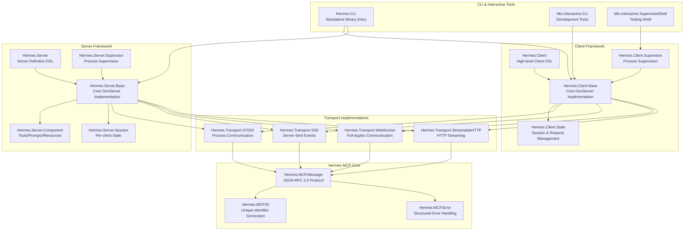
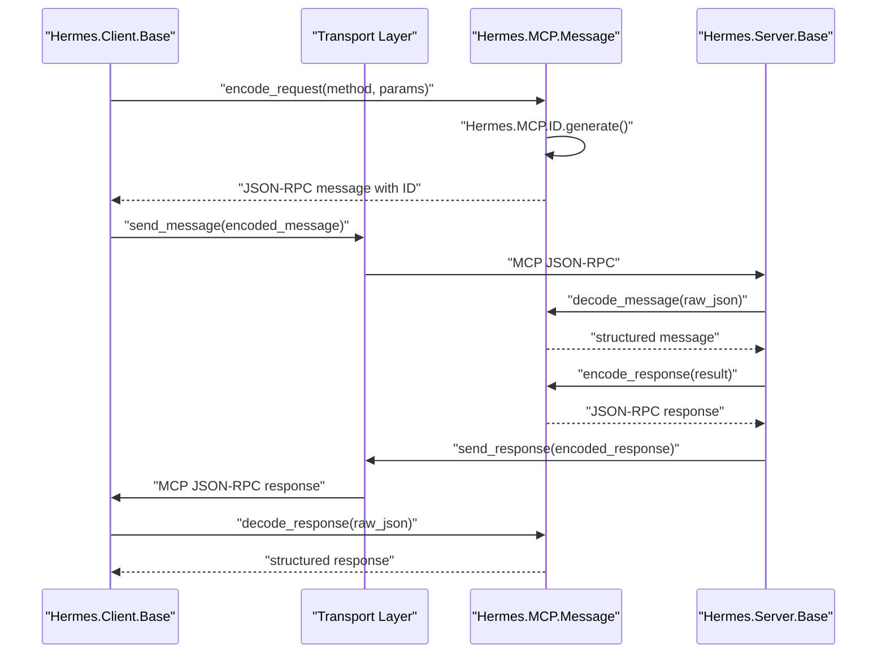
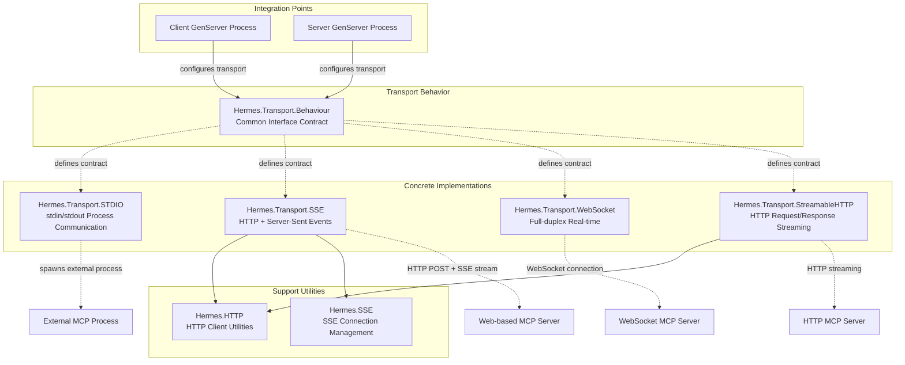
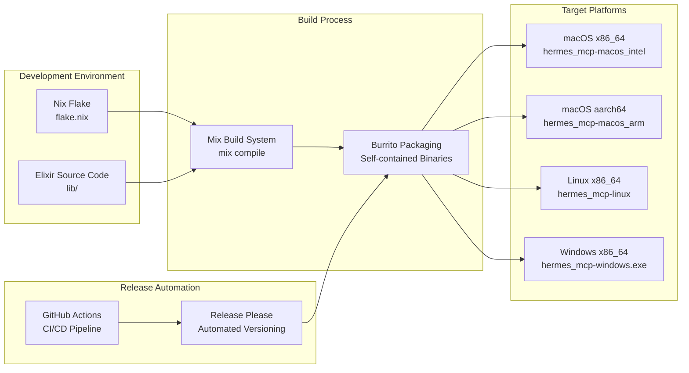

# Overview

<details>
<summary>Relevant source files</summary>

The following files were used as context for generating this wiki page:

- [CHANGELOG.md](https://github.com/cloudwalk/hermes-mcp/blob/8db7a927/CHANGELOG.md)
- [README.md](https://github.com/cloudwalk/hermes-mcp/blob/8db7a927/README.md)
- [mix.exs](https://github.com/cloudwalk/hermes-mcp/blob/8db7a927/mix.exs)
- [pages/installation.md](https://github.com/cloudwalk/hermes-mcp/blob/8db7a927/pages/installation.md)

</details>


This document provides a comprehensive overview of the hermes-mcp system, an Elixir SDK implementation of the Model Context Protocol (MCP). It covers the system's dual nature as both a library for integration into Elixir applications and a standalone CLI tool, explaining the core architecture, transport mechanisms, and component systems that enable communication between Large Language Models and external tools.

For specific implementation details about building clients, see [Client Usage](#4.1). For server development guidance, see [Server Components](#4.2). For development environment setup, see [Build System](#5.1).

## What is Hermes MCP

Hermes MCP is a comprehensive Elixir implementation of the [Model Context Protocol](https://spec.modelcontextprotocol.io/), providing both client and server capabilities for enabling Large Language Models to interact with external tools, prompts, and resources. The system serves as a messenger between AI systems and data sources, hence the name "Hermes" after the Greek god of boundaries and communication.

The system operates in two primary modes:

1. **Library Integration**: As an Elixir dependency (`{:hermes_mcp, "~> 0.10.0"}`) for embedding MCP capabilities into existing applications
2. **Standalone CLI**: As a cross-platform binary for direct command-line usage and testing

**System Architecture Overview**



Sources: [mix.exs:1-166](https://github.com/cloudwalk/hermes-mcp/blob/8db7a927/mix.exs#L1-L166), [README.md:1-104](https://github.com/cloudwalk/hermes-mcp/blob/8db7a927/README.md#L1-L104), [CHANGELOG.md:1-272](https://github.com/cloudwalk/hermes-mcp/blob/8db7a927/CHANGELOG.md#L1-L272)

## Core Protocol Implementation

The system implements the Model Context Protocol as a JSON-RPC 2.0 based communication layer. The core protocol components handle message serialization, unique identifier generation, and structured error responses.

**Protocol Message Flow**



The `Hermes.MCP.Message` module handles all protocol-level concerns including request correlation, batch operations, and notification handling. The `Hermes.MCP.ID` module ensures unique identifier generation across concurrent operations, while `Hermes.MCP.Error` provides standardized error response formatting.

Sources: [mix.exs:33-38](https://github.com/cloudwalk/hermes-mcp/blob/8db7a927/mix.exs#L33-L38), [CHANGELOG.md:10-13](https://github.com/cloudwalk/hermes-mcp/blob/8db7a927/CHANGELOG.md#L10-L13)

## Transport Layer Architecture

Hermes MCP supports multiple transport mechanisms through a unified abstraction layer, enabling communication across different deployment scenarios and integration patterns.

**Transport Implementation Hierarchy**



Each transport implementation follows the `Hermes.Transport.Behaviour` contract, providing consistent APIs while handling transport-specific connection management, message framing, and error recovery.

Sources: [mix.exs:41-58](https://github.com/cloudwalk/hermes-mcp/blob/8db7a927/mix.exs#L41-L58), [pages/installation.md:75-81](https://github.com/cloudwalk/hermes-mcp/blob/8db7a927/pages/installation.md#L75-L81)

## Client and Server Frameworks

The system provides high-level DSLs for both MCP clients and servers, abstracting the complexity of protocol handling and transport management into declarative interfaces.

### Client Framework

Clients are defined using the `Hermes.Client` DSL and implemented as supervised GenServer processes:

```elixir
defmodule MyApp.MCPClient do
  use Hermes.Client,
    name: "MyApp",
    version: "1.0.0", 
    protocol_version: "2024-11-05",
    capabilities: [:roots, :sampling]
end
```

The client framework handles initialization, capability negotiation, request correlation, and automatic reconnection through the `Hermes.Client.Base` GenServer implementation.

### Server Framework

Servers use the `Hermes.Server` DSL with a component-based architecture:

```elixir
defmodule MyApp.MCPServer do
  use Hermes.Server,
    name: "My Server",
    version: "1.0.0",
    capabilities: [:tools]
  
  component MyApp.MCPServer.EchoTool
end
```

Server components (tools, prompts, resources) are defined using `Hermes.Server.Component` with JSON schema validation and automatic registration through `Hermes.Server.Registry`.

Sources: [README.md:70-91](https://github.com/cloudwalk/hermes-mcp/blob/8db7a927/README.md#L70-L91), [pages/installation.md:25-54](https://github.com/cloudwalk/hermes-mcp/blob/8db7a927/pages/installation.md#L25-L54)

## Binary Distribution and CLI

The system compiles to self-contained binaries using Burrito for cross-platform distribution. The `Hermes.CLI` module serves as the entry point for standalone usage, providing interactive testing capabilities and development tools.

**Build and Release Pipeline**



The CLI provides commands for interactive testing of MCP servers across different transports, state inspection, and development workflow integration.

Sources: [mix.exs:60-82](https://github.com/cloudwalk/hermes-mcp/blob/8db7a927/mix.exs#L60-L82), [CHANGELOG.md:120-126](https://github.com/cloudwalk/hermes-mcp/blob/8db7a927/CHANGELOG.md#L120-L126)

## Observability and Development Tools

The system includes comprehensive observability through structured logging (`Hermes.Logging`) and telemetry events (`Hermes.Telemetry`). Development tools include interactive Mix tasks for testing MCP implementations:

- `Mix.Interactive.CLI` - Interactive client testing
- `Mix.Interactive.SupervisedShell` - Supervised shell for testing
- `mix stdio.interactive` - STDIO transport testing
- `mix sse.interactive` - SSE transport testing

These tools enable real-time inspection of MCP message flows, transport state, and protocol compliance during development.