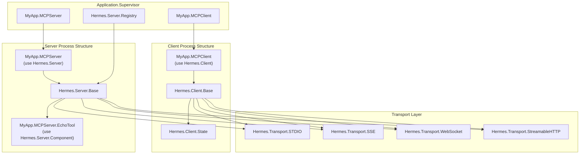
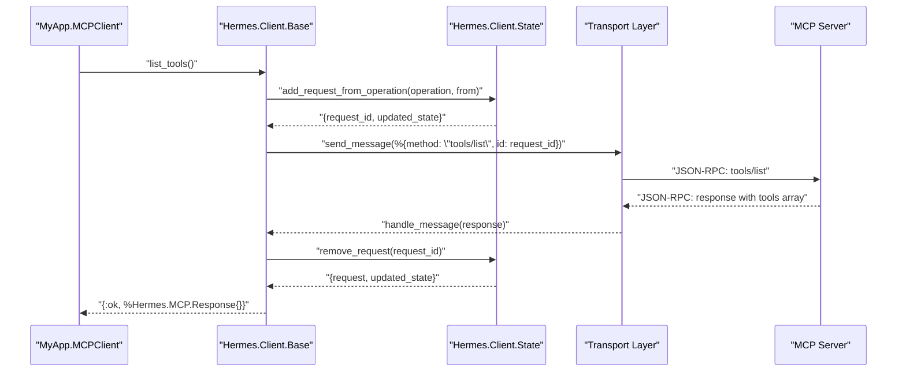

# Getting Started

<details>
<summary>Relevant source files</summary>

The following files were used as context for generating this wiki page:

- [README.md](https://github.com/cloudwalk/hermes-mcp/blob/8db7a927/README.md)
- [flake.nix](https://github.com/cloudwalk/hermes-mcp/blob/8db7a927/flake.nix)
- [pages/client_usage.md](https://github.com/cloudwalk/hermes-mcp/blob/8db7a927/pages/client_usage.md)
- [pages/error_handling.md](https://github.com/cloudwalk/hermes-mcp/blob/8db7a927/pages/error_handling.md)
- [pages/installation.md](https://github.com/cloudwalk/hermes-mcp/blob/8db7a927/pages/installation.md)
- [pages/progress_tracking.md](https://github.com/cloudwalk/hermes-mcp/blob/8db7a927/pages/progress_tracking.md)
- [test/hermes/client/state_test.exs](https://github.com/cloudwalk/hermes-mcp/blob/8db7a927/test/hermes/client/state_test.exs)

</details>


This guide walks you through installing Hermes MCP and creating your first Model Context Protocol client and server implementations. By the end, you'll have a working MCP setup that demonstrates tool execution, resource access, and prompt templates.

For advanced usage patterns and configuration options, see [Usage Guide](#4). For understanding the underlying system architecture, see [Architecture](#3).

## Installation

Add Hermes MCP to your Elixir project dependencies:

```elixir
def deps do
  [
    {:hermes_mcp, "~> 0.10.0"}
  ]
end
```

Then fetch dependencies:

```bash
mix deps.get
```

Sources: [README.md:15-21](https://github.com/cloudwalk/hermes-mcp/blob/8db7a927/README.md#L15-L21)

## Your First MCP Client

Create a client module that connects to an external MCP server using the `Hermes.Client` DSL:

```elixir
defmodule MyApp.MCPClient do
  use Hermes.Client,
    name: "MyApp",
    version: "1.0.0",
    protocol_version: "2024-11-05",
    capabilities: [:roots, :sampling]
end
```

Add the client to your application supervision tree:

```elixir
defmodule MyApp.Application do
  use Application

  def start(_type, _args) do
    children = [
      {MyApp.MCPClient, 
       transport: {:stdio, command: "python", args: ["-m", "mcp.server", "example"]}}
    ]

    opts = [strategy: :one_for_all, name: MyApp.Supervisor]
    Supervisor.start_link(children, opts)
  end
end
```

Test your client connection:

```elixir
# Check server connectivity  
:pong = MyApp.MCPClient.ping()

# List available tools
{:ok, response} = MyApp.MCPClient.list_tools()
tools = response.result["tools"]

# Call a tool
{:ok, result} = MyApp.MCPClient.call_tool("search", %{query: "elixir"})
```

Sources: [README.md:72-91](https://github.com/cloudwalk/hermes-mcp/blob/8db7a927/README.md#L72-L91), [pages/installation.md:25-54](https://github.com/cloudwalk/hermes-mcp/blob/8db7a927/pages/installation.md#L25-L54), [pages/client_usage.md:15-24](https://github.com/cloudwalk/hermes-mcp/blob/8db7a927/pages/client_usage.md#L15-L24)

## Your First MCP Server

Create a server module with the `Hermes.Server` DSL:

```elixir
defmodule MyApp.MCPServer do
  use Hermes.Server, 
    name: "My Server", 
    version: "1.0.0", 
    capabilities: [:tools]

  def start_link(opts) do
    Hermes.Server.start_link(__MODULE__, :ok, opts)
  end

  component MyApp.MCPServer.EchoTool

  @impl true
  def init(:ok, frame), do: {:ok, frame}
end
```

Define a tool component using the `Hermes.Server.Component` DSL:

```elixir
defmodule MyApp.MCPServer.EchoTool do
  @moduledoc "This tool echoes everything the user says to the LLM"

  use Hermes.Server.Component, type: :tool

  alias Hermes.Server.Response

  schema do
    field :text, {:required, {:string, {:max, 500}}}, 
      description: "The text to be echoed, max of 500 chars"
  end

  @impl true
  def execute(%{text: text}, frame) do
    {:reply, Response.text(Response.tool(), text), frame}
  end
end
```

Add the server to your supervision tree:

```elixir
children = [
  Hermes.Server.Registry,
  {MyApp.MCPServer, transport: :stdio}
]
```

Sources: [README.md:27-67](https://github.com/cloudwalk/hermes-mcp/blob/8db7a927/README.md#L27-L67)

## Client-Server Architecture Overview

The following diagram shows how the key code entities work together in a typical MCP setup:

**MCP Client-Server Process Architecture**


Sources: [README.md:29-43](https://github.com/cloudwalk/hermes-mcp/blob/8db7a927/README.md#L29-L43), [lib/hermes/client.ex](https://github.com/cloudwalk/hermes-mcp/blob/8db7a927/lib/hermes/client.ex), [lib/hermes/server.ex](https://github.com/cloudwalk/hermes-mcp/blob/8db7a927/lib/hermes/server.ex), [lib/hermes/server/component.ex](https://github.com/cloudwalk/hermes-mcp/blob/8db7a927/lib/hermes/server/component.ex)

## MCP Protocol Method Mapping

This diagram shows how client API calls map to MCP protocol methods and server handlers:

**Client API to Protocol Method Flow**


Sources: [lib/hermes/client/base.ex](https://github.com/cloudwalk/hermes-mcp/blob/8db7a927/lib/hermes/client/base.ex), [lib/hermes/client/state.ex](https://github.com/cloudwalk/hermes-mcp/blob/8db7a927/lib/hermes/client/state.ex), [test/hermes/client/state_test.exs:30-53](https://github.com/cloudwalk/hermes-mcp/blob/8db7a927/test/hermes/client/state_test.exs#L30-L53)

## Running Your Examples

### Testing the Client

Once your client is running in the supervision tree:

```elixir
# Test basic connectivity
iex> MyApp.MCPClient.ping()
:pong

# List server capabilities  
iex> MyApp.MCPClient.get_server_capabilities()
%{"tools" => %{}, "resources" => %{}}

# Get available tools
iex> {:ok, response} = MyApp.MCPClient.list_tools()
iex> tools = response.result["tools"]
[%{"name" => "search", "description" => "Search for information"}]

# Execute a tool
iex> {:ok, result} = MyApp.MCPClient.call_tool("search", %{query: "elixir"})
iex> result.result
%{"content" => [%{"type" => "text", "text" => "Found 42 results about elixir"}]}
```

Sources: [pages/client_usage.md:16-35](https://github.com/cloudwalk/hermes-mcp/blob/8db7a927/pages/client_usage.md#L16-L35)

### Testing the Server

Your server automatically handles incoming MCP requests when started with a transport. For STDIO transport, it communicates via standard input/output:

| Transport Type | Configuration | Use Case |
|----------------|---------------|----------|
| `:stdio` | `transport: :stdio` | Process-to-process communication |
| `:sse` | `transport: {:sse, port: 4000}` | HTTP Server-Sent Events |
| `:websocket` | `transport: {:websocket, port: 4001}` | WebSocket connections |
| `:streamable_http` | `transport: {:streamable_http, port: 4002}` | HTTP streaming |

Sources: [README.md:64-67](https://github.com/cloudwalk/hermes-mcp/blob/8db7a927/README.md#L64-L67), [lib/hermes/transport](https://github.com/cloudwalk/hermes-mcp/blob/8db7a927/lib/hermes/transport)

## Development and Testing Tools

Hermes provides interactive development tools for testing your MCP implementations:

### Interactive CLI

Use the built-in interactive shell to test MCP servers:

```bash
# Start interactive shell with STDIO transport
mix hermes.interactive --transport stdio --command "python" --args "-m,mcp.server,example"

# Test SSE transport  
mix hermes.interactive --transport sse --base-url "http://localhost:8000"

# Test WebSocket transport
mix hermes.interactive --transport websocket --url "ws://localhost:8000/ws"
```

### Standalone CLI

You can also build and use the standalone CLI tool:

```bash
# Build the CLI (requires Nix environment)
nix build .#default

# Run the built CLI
./result/bin/hermes_mcp --help
```

Sources: [flake.nix:52-120](https://github.com/cloudwalk/hermes-mcp/blob/8db7a927/flake.nix#L52-L120), [lib/mix/tasks](https://github.com/cloudwalk/hermes-mcp/blob/8db7a927/lib/mix/tasks)

## Key Configuration Options

### Client Configuration

When using `Hermes.Client`, these options are available:

| Option | Type | Description | Required |
|--------|------|-------------|----------|
| `:name` | `string` | Client identification name | Yes |
| `:version` | `string` | Client version string | Yes |  
| `:protocol_version` | `string` | MCP protocol version | Yes |
| `:capabilities` | `list` | Supported capabilities (`:roots`, `:sampling`) | Yes |

### Server Configuration

When using `Hermes.Server`, these options are available:

| Option | Type | Description | Required |
|--------|------|-------------|----------|
| `:name` | `string` | Server identification name | Yes |
| `:version` | `string` | Server version string | Yes |
| `:capabilities` | `list` | Supported capabilities (`:tools`, `:resources`, `:prompts`) | Yes |

Sources: [pages/installation.md:62-81](https://github.com/cloudwalk/hermes-mcp/blob/8db7a927/pages/installation.md#L62-L81), [README.md:30-33](https://github.com/cloudwalk/hermes-mcp/blob/8db7a927/README.md#L30-L33)

## Next Steps

Now that you have basic MCP client and server implementations running:

1. **Explore Client Operations**: Learn about advanced client features like progress tracking, error handling, and resource management in [Client Usage](#4.1)

2. **Build Server Components**: Create tools, prompts, and resources for your server in [Server Components](#4.2) 

3. **Understand Transports**: Learn how different transport layers work and when to use each in [Transport Layer](#3.2)

4. **Interactive Development**: Use the development tools for testing and debugging in [Interactive Development](#4.3)

5. **Production Deployment**: Learn about building and deploying MCP applications in [Build System](#5.1)