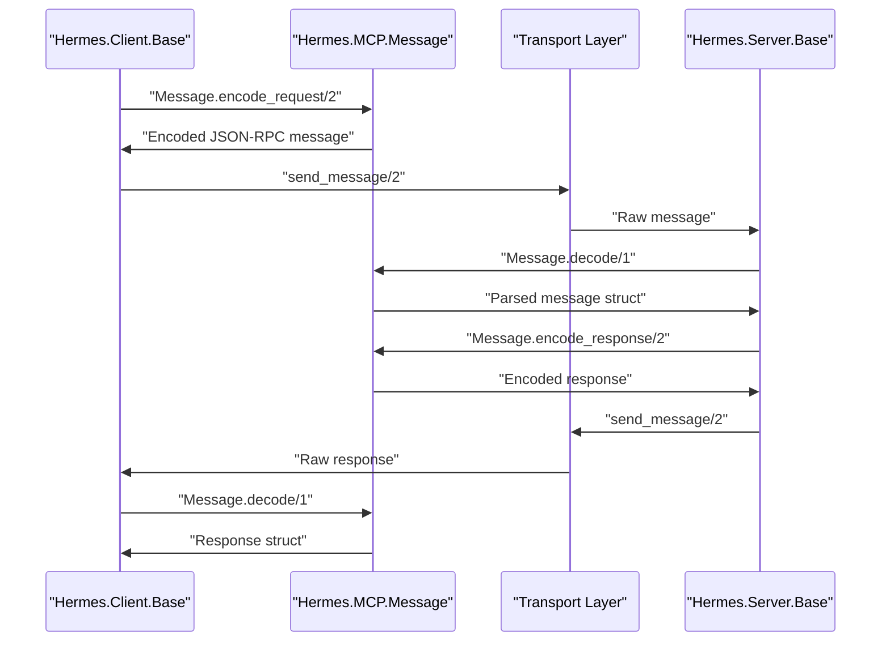
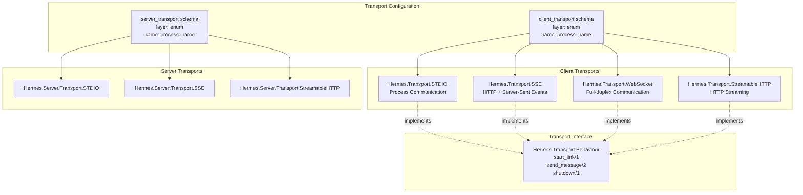
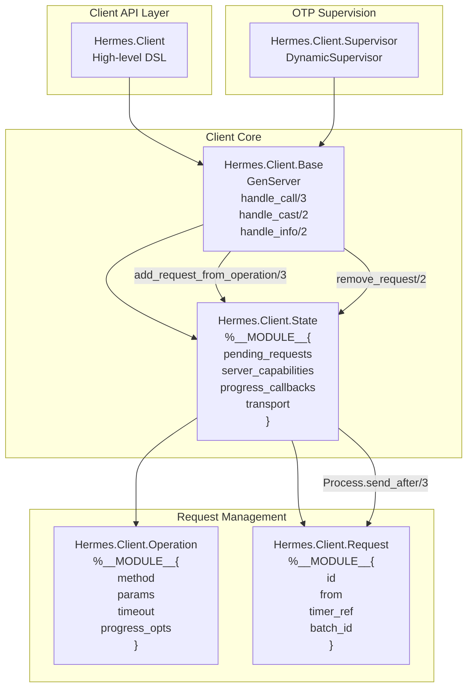
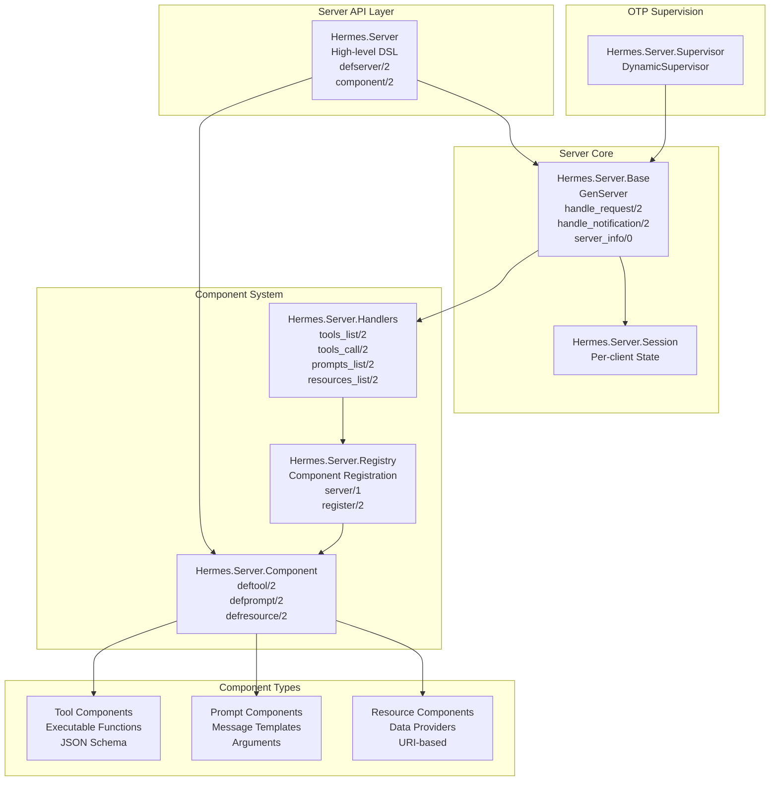
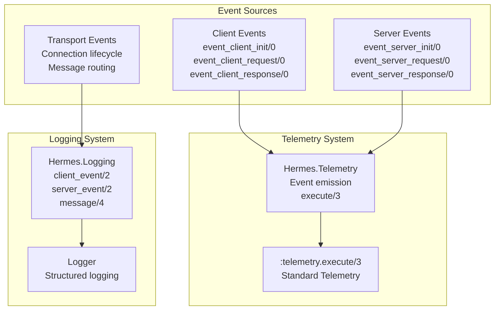

# Architecture

Relevant source files

The following files were used as context for generating this wiki page:

- [CHANGELOG.md](https://github.com/cloudwalk/hermes-mcp/blob/8db7a927/CHANGELOG.md)
- [CLAUDE.md](https://github.com/cloudwalk/hermes-mcp/blob/8db7a927/CLAUDE.md)
- [lib/hermes.ex](https://github.com/cloudwalk/hermes-mcp/blob/8db7a927/lib/hermes.ex)
- [lib/hermes/client/state.ex](https://github.com/cloudwalk/hermes-mcp/blob/8db7a927/lib/hermes/client/state.ex)
- [mix.exs](https://github.com/cloudwalk/hermes-mcp/blob/8db7a927/mix.exs)
- [test/support/stub_transport.ex](https://github.com/cloudwalk/hermes-mcp/blob/8db7a927/test/support/stub_transport.ex)
- [test/test_helper.exs](https://github.com/cloudwalk/hermes-mcp/blob/8db7a927/test/test_helper.exs)

This document provides a comprehensive overview of the hermes-mcp system architecture, covering the core protocol implementation, transport abstractions, client/server frameworks, and supporting infrastructure. 

For detailed information about specific architectural components, see [MCP Protocol](#3.1), [Transport Layer](#3.2), [Client Architecture](#3.3), and [Server Architecture](#3.4).

## System Overview

Hermes-mcp implements the Model Context Protocol (MCP) specification as an Elixir/OTP application. The system is designed around a layered architecture that separates protocol concerns from transport mechanisms and provides high-level abstractions for building both MCP clients and servers.

### High-Level System Architecture

```mermaid
graph TB
    subgraph "Application Layer"
        HermesClient["Hermes.Client<br/>High-level Client DSL"]
        HermesServer["Hermes.Server<br/>High-level Server DSL"]
        HermesCLI["Hermes.CLI<br/>Standalone Binary"]
    end
    
    subgraph "Core Framework"
        ClientBase["Hermes.Client.Base<br/>GenServer Implementation"]
        ServerBase["Hermes.Server.Base<br/>GenServer Implementation"]
        ClientState["Hermes.Client.State<br/>Request/Session Management"]
        ServerSession["Hermes.Server.Session<br/>Per-client State"]
    end
    
    subgraph "MCP Protocol Layer"
        MCPMessage["Hermes.MCP.Message<br/>JSON-RPC 2.0 Protocol"]
        MCPID["Hermes.MCP.ID<br/>Unique ID Generation"]
        MCPError["Hermes.MCP.Error<br/>Standardized Errors"]
    end
    
    subgraph "Transport Abstraction"
        TransportBehaviour["Hermes.Transport.Behaviour<br/>Common Interface"]
        ClientSTDIO["Hermes.Transport.STDIO"]
        ClientSSE["Hermes.Transport.SSE"]
        ClientWS["Hermes.Transport.WebSocket"]
        ClientHTTP["Hermes.Transport.StreamableHTTP"]
    end
    
    subgraph "Server Components"
        ServerComponent["Hermes.Server.Component<br/>Tools/Prompts/Resources"]
        ServerHandlers["Hermes.Server.Handlers<br/>Request Processing"]
        ServerRegistry["Hermes.Server.Registry<br/>Component Registration"]
    end
    
    subgraph "OTP Supervision"
        ClientSup["Hermes.Client.Supervisor"]
        ServerSup["Hermes.Server.Supervisor"]
        HermesApp["Hermes.Application<br/>Root Supervisor"]
    end
    
    subgraph "Observability"
        HermesTelemetry["Hermes.Telemetry<br/>Event Emission"]
        HermesLogging["Hermes.Logging<br/>Structured Logging"]
    end
    
    %% Application to Framework
    HermesClient --> ClientBase
    HermesServer --> ServerBase
    HermesCLI --> ClientBase
    HermesCLI --> ServerBase
    
    %% Framework internals
    ClientBase --> ClientState
    ServerBase --> ServerSession
    ClientBase --> MCPMessage
    ServerBase --> MCPMessage
    
    %% Protocol layer
    MCPMessage --> MCPID
    MCPMessage --> MCPError
    
    %% Transport connections
    ClientBase --> TransportBehaviour
    ServerBase --> TransportBehaviour
    TransportBehaviour --> ClientSTDIO
    TransportBehaviour --> ClientSSE
    TransportBehaviour --> ClientWS
    TransportBehaviour --> ClientHTTP
    
    %% Server components
    ServerBase --> ServerComponent
    ServerBase --> ServerHandlers
    ServerBase --> ServerRegistry
    
    %% Supervision
    ClientSup --> ClientBase
    ServerSup --> ServerBase
    HermesApp --> ClientSup
    HermesApp --> ServerSup
    
    %% Observability
    ClientBase --> HermesTelemetry
    ServerBase --> HermesTelemetry
    ClientSTDIO --> HermesLogging
    ClientSSE --> HermesLogging
```

Sources: [lib/hermes.ex:1-47](https://github.com/cloudwalk/hermes-mcp/blob/8db7a927/lib/hermes.ex#L1-L47), [mix.exs:1-166](https://github.com/cloudwalk/hermes-mcp/blob/8db7a927/mix.exs#L1-L166), [lib/hermes/client/state.ex:1-706](https://github.com/cloudwalk/hermes-mcp/blob/8db7a927/lib/hermes/client/state.ex#L1-L706)

## Core Protocol Implementation

The MCP protocol implementation forms the foundation of the system, handling JSON-RPC 2.0 message encoding/decoding, unique ID generation, and standardized error handling.

### Protocol Message Flow

The protocol layer provides these key abstractions:
- **Message Encoding/Decoding**: `Hermes.MCP.Message` handles all JSON-RPC 2.0 serialization
- **ID Management**: `Hermes.MCP.ID` generates unique request and session identifiers
- **Error Standardization**: `Hermes.MCP.Error` provides consistent error representations

Sources: [CLAUDE.md:32-40](https://github.com/cloudwalk/hermes-mcp/blob/8db7a927/CLAUDE.md#L32-L40), [lib/hermes/client/state.ex:42-47](https://github.com/cloudwalk/hermes-mcp/blob/8db7a927/lib/hermes/client/state.ex#L42-L47)

## Transport Abstraction Layer

The transport layer provides a common interface for different communication mechanisms while maintaining protocol independence.

### Transport Architecture

Each transport implementation provides:
- **Process Management**: OTP-compliant GenServer lifecycle
- **Message Routing**: Bidirectional communication with client/server processes
- **Connection Handling**: Transport-specific connection management and recovery

Sources: [lib/hermes.ex:21-28](https://github.com/cloudwalk/hermes-mcp/blob/8db7a927/lib/hermes.ex#L21-L28), [CLAUDE.md:42-48](https://github.com/cloudwalk/hermes-mcp/blob/8db7a927/CLAUDE.md#L42-L48)

## Client Framework Architecture

The client framework provides a stateful, high-level interface for MCP operations with automatic request tracking and capability validation.

### Client Component Relationships

Key client framework features:
- **State Management**: `Hermes.Client.State` tracks pending requests, server capabilities, and progress callbacks
- **Request Lifecycle**: Automatic timeout handling and request correlation
- **Capability Validation**: Server capability checking before operation execution
- **Progress Tracking**: Support for MCP progress notifications with user callbacks

Sources: [lib/hermes/client/state.ex:1-706](https://github.com/cloudwalk/hermes-mcp/blob/8db7a927/lib/hermes/client/state.ex#L1-L706), [CLAUDE.md:50-59](https://github.com/cloudwalk/hermes-mcp/blob/8db7a927/CLAUDE.md#L50-L59)

## Server Framework Architecture

The server framework provides a component-based system for implementing MCP servers with tools, prompts, and resources.

### Server Component System

Server framework capabilities:
- **Component Definition**: High-level DSL for defining tools, prompts, and resources
- **JSON Schema Generation**: Automatic schema creation for component parameters
- **Request Dispatch**: Automatic routing of MCP requests to appropriate handlers
- **Session Management**: Per-client state isolation and management

Sources: [CLAUDE.md:61-68](https://github.com/cloudwalk/hermes-mcp/blob/8db7a927/CLAUDE.md#L61-L68), [lib/hermes.ex:25-28](https://github.com/cloudwalk/hermes-mcp/blob/8db7a927/lib/hermes.ex#L25-L28)

## Build and Release Architecture

The system includes a comprehensive build pipeline using Nix for reproducible builds and cross-platform binary distribution.

### Build System Components

| Component | Purpose | Configuration |
|-----------|---------|---------------|
| **Nix Flake** | Reproducible development environment | Development dependencies, Elixir/Erlang versions |
| **Mix Project** | Elixir build configuration | Dependencies, releases, compilation paths |
| **Burrito** | Binary packaging | Cross-platform standalone executables |
| **GitHub Actions** | CI/CD pipeline | Testing, linting, release automation |
| **Release Please** | Automated versioning | Changelog generation, semantic versioning |

The build system supports:
- **Cross-platform Targets**: macOS (Intel/ARM), Linux, Windows
- **Standalone Binaries**: Self-contained executables via Burrito
- **Development Tools**: Interactive CLI for testing MCP implementations

Sources: [mix.exs:60-82](https://github.com/cloudwalk/hermes-mcp/blob/8db7a927/mix.exs#L60-L82), [CHANGELOG.md:1-271](https://github.com/cloudwalk/hermes-mcp/blob/8db7a927/CHANGELOG.md#L1-L271)

## Observability and Monitoring

### Telemetry Architecture

The observability system provides:
- **Structured Events**: Standardized telemetry events for client/server operations
- **Request Tracing**: Correlation of requests across transport boundaries
- **Performance Metrics**: Timing and throughput measurements
- **Error Tracking**: Comprehensive error classification and reporting