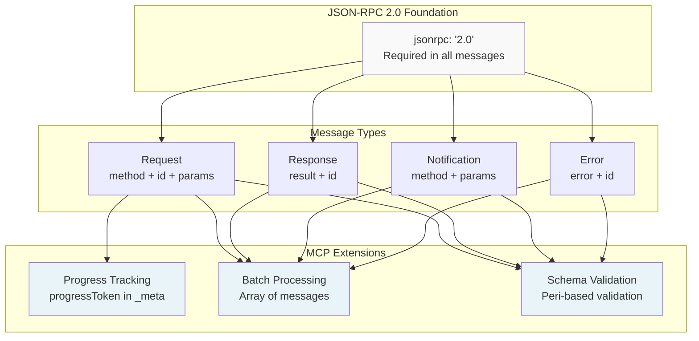
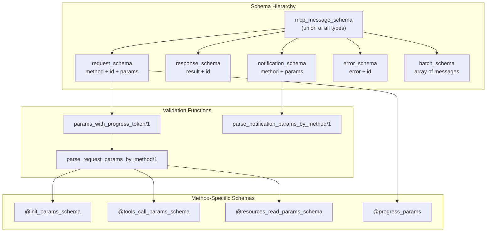
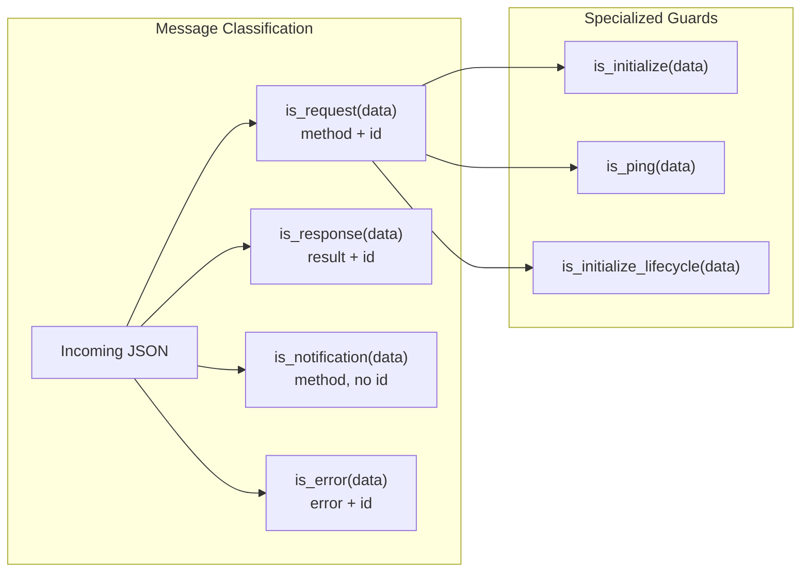
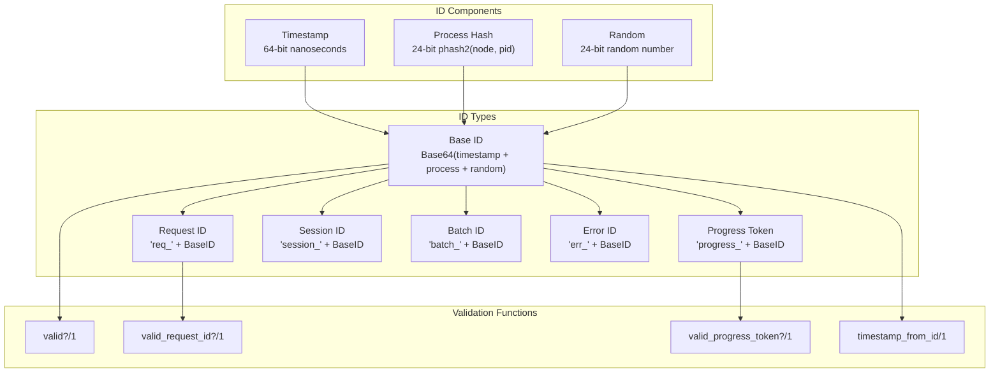
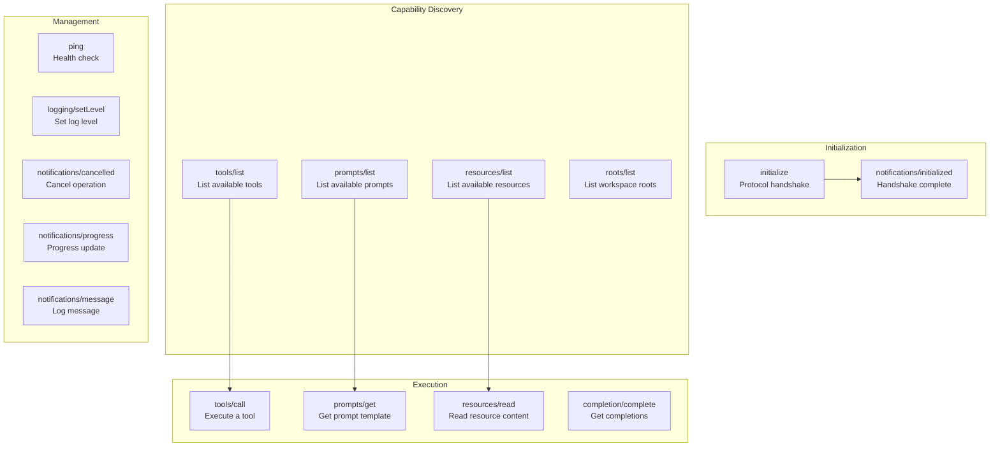
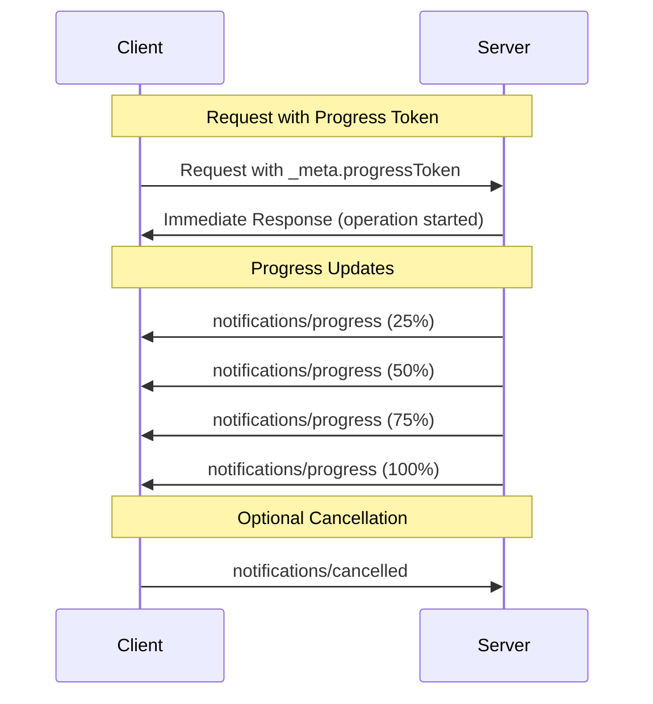
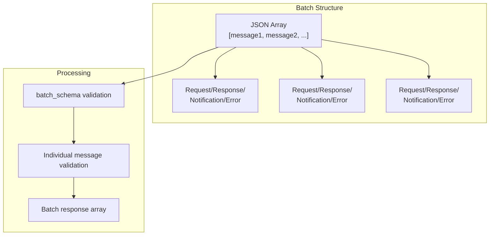
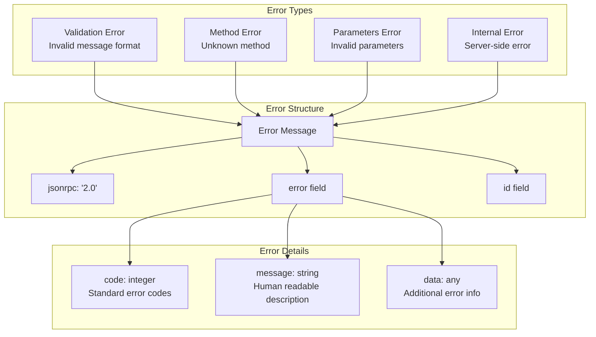
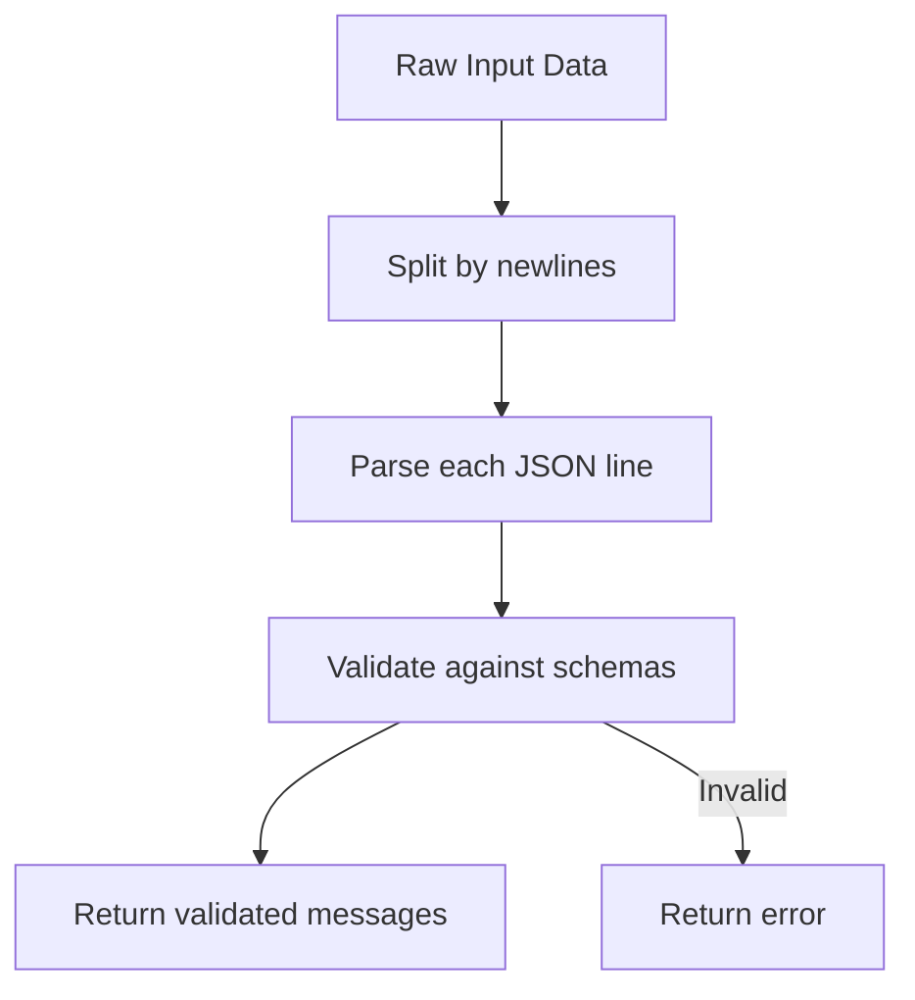

# MCP Protocol

Relevant source files

The following files were used as context for generating this wiki page:

- [.github/workflows/ci.yml](https://github.com/cloudwalk/hermes-mcp/blob/8db7a927/.github/workflows/ci.yml)
- [lib/hermes/client/operation.ex](https://github.com/cloudwalk/hermes-mcp/blob/8db7a927/lib/hermes/client/operation.ex)
- [lib/hermes/client/request.ex](https://github.com/cloudwalk/hermes-mcp/blob/8db7a927/lib/hermes/client/request.ex)
- [lib/hermes/mcp/id.ex](https://github.com/cloudwalk/hermes-mcp/blob/8db7a927/lib/hermes/mcp/id.ex)
- [lib/hermes/mcp/message.ex](https://github.com/cloudwalk/hermes-mcp/blob/8db7a927/lib/hermes/mcp/message.ex)

This document covers the Model Context Protocol implementation in hermes-mcp, including message handling, validation, ID generation, and error management. The MCP protocol is built on JSON-RPC 2.0 and provides a standardized way for AI assistants to communicate with external systems.

For information about transport layer implementations that carry MCP messages, see [Transport Layer](#3.2). For client-side protocol usage, see [Client Architecture](#3.3).

## Protocol Overview

The MCP protocol implementation centers around the `Hermes.MCP.Message` module, which provides JSON-RPC 2.0 compliant message handling with MCP-specific extensions. The protocol supports four primary message types: requests, responses, notifications, and errors.

Sources: [lib/hermes/mcp/message.ex:1-625](https://github.com/cloudwalk/hermes-mcp/blob/8db7a927/lib/hermes/mcp/message.ex#L1-L625)

## Message Schema System

The protocol uses the Peri library for comprehensive schema validation. Each message type has specific validation rules based on the method being called.

### Core Message Schemas

The schema system dynamically selects parameter validation based on the method field, ensuring type safety for all MCP operations.

Sources: [lib/hermes/mcp/message.ex:83-183](https://github.com/cloudwalk/hermes-mcp/blob/8db7a927/lib/hermes/mcp/message.ex#L83-L183), [lib/hermes/mcp/message.ex:90-108](https://github.com/cloudwalk/hermes-mcp/blob/8db7a927/lib/hermes/mcp/message.ex#L90-L108)

## Message Types and Guards

The protocol provides guard functions to classify messages efficiently during processing:

| Guard Function | Purpose | Condition |
|----------------|---------|-----------|
| `is_request/1` | Identifies requests | Has `method` and `id` fields |
| `is_response/1` | Identifies responses | Has `result` and `id` fields |
| `is_notification/1` | Identifies notifications | Has `method` but no `id` field |
| `is_error/1` | Identifies errors | Has `error` and `id` fields |
| `is_initialize/1` | Identifies init requests | Request with `method` = "initialize" |
| `is_ping/1` | Identifies ping requests | Request with `method` = "ping" |

Sources: [lib/hermes/mcp/message.ex:204-247](https://github.com/cloudwalk/hermes-mcp/blob/8db7a927/lib/hermes/mcp/message.ex#L204-L247), [lib/hermes/mcp/message.ex:260-294](https://github.com/cloudwalk/hermes-mcp/blob/8db7a927/lib/hermes/mcp/message.ex#L260-L294)

## ID Generation System

The `Hermes.MCP.ID` module provides cryptographically unique identifiers for protocol messages. IDs contain temporal, process, and random components to ensure uniqueness across distributed systems.

### ID Structure

The ID generation functions ensure uniqueness through:
- **Temporal uniqueness**: Nanosecond timestamps prevent time-based collisions
- **Process uniqueness**: Hash of node and PID prevents process-based collisions  
- **Random uniqueness**: 24-bit random component prevents algorithmic collisions

Sources: [lib/hermes/mcp/id.ex:1-244](https://github.com/cloudwalk/hermes-mcp/blob/8db7a927/lib/hermes/mcp/id.ex#L1-L244)

## Protocol Methods

The MCP protocol defines specific methods for different types of operations:

### Core Methods

Each method has specific parameter schemas enforced by the validation system.

Sources: [lib/hermes/mcp/message.ex:12-13](https://github.com/cloudwalk/hermes-mcp/blob/8db7a927/lib/hermes/mcp/message.ex#L12-L13), [lib/hermes/mcp/message.ex:97-108](https://github.com/cloudwalk/hermes-mcp/blob/8db7a927/lib/hermes/mcp/message.ex#L97-L108)

## Progress Tracking

The protocol supports progress tracking for long-running operations through progress tokens and notifications.

### Progress Token Flow

Progress notifications can include optional `message` field for descriptive updates (2025-03-26 specification).

Sources: [lib/hermes/mcp/message.ex:77-81](https://github.com/cloudwalk/hermes-mcp/blob/8db7a927/lib/hermes/mcp/message.ex#L77-L81), [lib/hermes/mcp/message.ex:115-127](https://github.com/cloudwalk/hermes-mcp/blob/8db7a927/lib/hermes/mcp/message.ex#L115-L127), [lib/hermes/mcp/message.ex:419-432](https://github.com/cloudwalk/hermes-mcp/blob/8db7a927/lib/hermes/mcp/message.ex#L419-L432)

## Batch Processing

The protocol supports JSON-RPC batch processing for sending multiple messages in a single transmission:

Batch processing enables efficient communication by reducing round-trips and allowing parallel processing of multiple operations.

Sources: [lib/hermes/mcp/message.ex:184-185](https://github.com/cloudwalk/hermes-mcp/blob/8db7a927/lib/hermes/mcp/message.ex#L184-L185), [lib/hermes/mcp/message.ex:544-553](https://github.com/cloudwalk/hermes-mcp/blob/8db7a927/lib/hermes/mcp/message.ex#L544-L553)

## Error Handling

The protocol implements comprehensive error handling following JSON-RPC 2.0 specifications:

Sources: [lib/hermes/mcp/message.ex:165-173](https://github.com/cloudwalk/hermes-mcp/blob/8db7a927/lib/hermes/mcp/message.ex#L165-L173), [lib/hermes/mcp/message.ex:493-500](https://github.com/cloudwalk/hermes-mcp/blob/8db7a927/lib/hermes/mcp/message.ex#L493-L500)

## Message Encoding and Decoding

The protocol provides comprehensive encoding and decoding functions with schema validation:

### Encoding Functions

| Function | Purpose | Output |
|----------|---------|---------|
| `encode_request/2` | Encode request messages | JSON string with newline |
| `encode_response/2` | Encode response messages | JSON string with newline |
| `encode_notification/1` | Encode notifications | JSON string with newline |
| `encode_error/2` | Encode error messages | JSON string with newline |
| `encode_batch/1` | Encode batch messages | JSON array with newline |
| `encode_progress_notification/1` | Encode progress updates | JSON string with newline |

### Decoding Process

All encoding functions append newline characters for compatibility with line-based transport protocols.