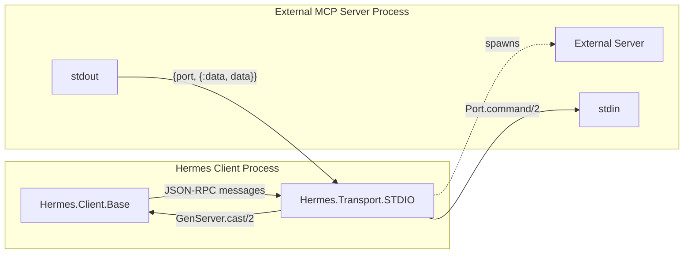
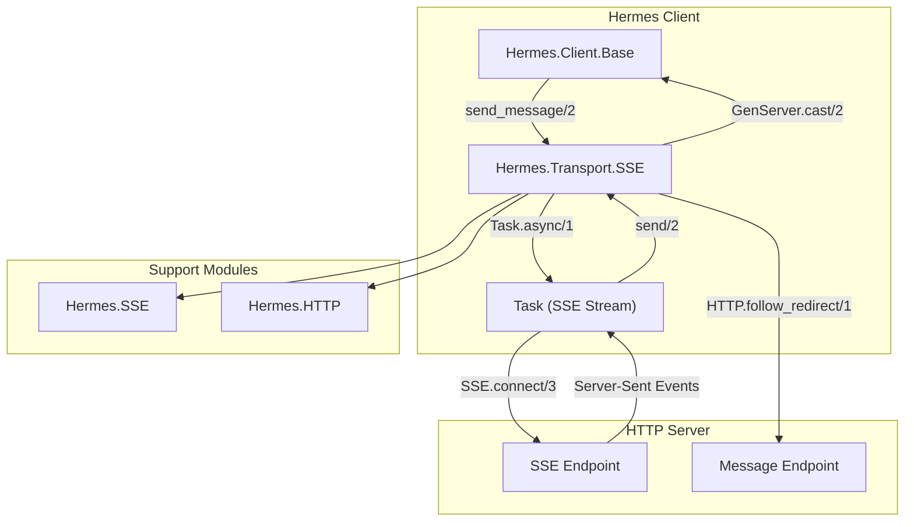
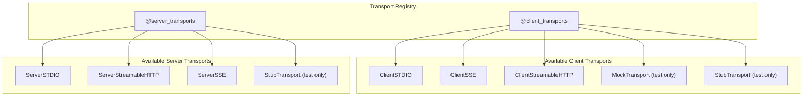

# Transport Layer

Relevant source files

The following files were used as context for generating this wiki page:

- [lib/hermes.ex](https://github.com/cloudwalk/hermes-mcp/blob/8db7a927/lib/hermes.ex)
- [lib/hermes/transport/sse.ex](https://github.com/cloudwalk/hermes-mcp/blob/8db7a927/lib/hermes/transport/sse.ex)
- [lib/hermes/transport/stdio.ex](https://github.com/cloudwalk/hermes-mcp/blob/8db7a927/lib/hermes/transport/stdio.ex)
- [test/support/stub_transport.ex](https://github.com/cloudwalk/hermes-mcp/blob/8db7a927/test/support/stub_transport.ex)
- [test/test_helper.exs](https://github.com/cloudwalk/hermes-mcp/blob/8db7a927/test/test_helper.exs)

The Transport Layer provides the communication infrastructure for the Model Context Protocol (MCP) in hermes-mcp. It defines a common interface for different transport mechanisms and implements multiple transport protocols to enable flexible communication between MCP clients and servers. For information about the MCP protocol messages themselves, see [MCP Protocol](#3.1). For client and server architecture details, see [Client Architecture](#3.3) and [Server Architecture](#3.4).

## Transport Architecture Overview

The transport layer implements a pluggable architecture where different transport protocols can be used interchangeably through a common behavior interface.

```mermaid
graph TB
    subgraph "Transport Behaviour Interface"
        Behaviour["Hermes.Transport.Behaviour"]
    end
    
    subgraph "Client Transport Implementations"
        ClientSTDIO["Hermes.Transport.STDIO"]
        ClientSSE["Hermes.Transport.SSE"]
        ClientStreamableHTTP["Hermes.Transport.StreamableHTTP"]
        ClientWebSocket["Hermes.Transport.WebSocket"]
    end
    
    subgraph "Server Transport Implementations"
        ServerSTDIO["Hermes.Server.Transport.STDIO"]
        ServerSSE["Hermes.Server.Transport.SSE"]
        ServerStreamableHTTP["Hermes.Server.Transport.StreamableHTTP"]
    end
    
    subgraph "Core Protocol Layer"
        MCPMessage["Hermes.MCP.Message"]
        ClientBase["Hermes.Client.Base"]
        ServerBase["Hermes.Server.Base"]
    end
    
    subgraph "Support Utilities"
        HTTPUtil["Hermes.HTTP"]
        SSEUtil["Hermes.SSE"]
        TelemetryUtil["Hermes.Telemetry"]
        LoggingUtil["Hermes.Logging"]
    end
    
    ClientSTDIO -.->|"implements"| Behaviour
    ClientSSE -.->|"implements"| Behaviour
    ClientStreamableHTTP -.->|"implements"| Behaviour
    ClientWebSocket -.->|"implements"| Behaviour
    
    ServerSTDIO -.->|"implements"| Behaviour
    ServerSSE -.->|"implements"| Behaviour
    ServerStreamableHTTP -.->|"implements"| Behaviour
    
    ClientBase -->|"configures"| Behaviour
    ServerBase -->|"configures"| Behaviour
    
    ClientSSE --> HTTPUtil
    ClientSSE --> SSEUtil
    ClientStreamableHTTP --> HTTPUtil
    
    ClientSTDIO --> TelemetryUtil
    ClientSSE --> TelemetryUtil
    ClientSTDIO --> LoggingUtil
    ClientSSE --> LoggingUtil
```

Sources: [lib/hermes.ex:13-19](https://github.com/cloudwalk/hermes-mcp/blob/8db7a927/lib/hermes.ex#L13-L19), [lib/hermes/transport/stdio.ex:11](https://github.com/cloudwalk/hermes-mcp/blob/8db7a927/lib/hermes/transport/stdio.ex#L11), [lib/hermes/transport/sse.ex:12](https://github.com/cloudwalk/hermes-mcp/blob/8db7a927/lib/hermes/transport/sse.ex#L12)

## Transport Behaviour Interface

All transport implementations must implement the `Hermes.Transport.Behaviour` interface, which defines the standard contract for transport layers.

### Core Behaviour Functions

| Function | Description | Return Type |
|----------|-------------|-------------|
| `start_link/1` | Start the transport GenServer process | `GenServer.on_start()` |
| `send_message/2` | Send a message through the transport | `:ok \| {:error, term()}` |
| `shutdown/1` | Gracefully shutdown the transport | `:ok` |
| `supported_protocol_versions/0` | List supported MCP protocol versions | `[String.t()]` |

Sources: [lib/hermes/transport/stdio.ex:70-89](https://github.com/cloudwalk/hermes-mcp/blob/8db7a927/lib/hermes/transport/stdio.ex#L70-L89), [lib/hermes/transport/sse.ex:81-101](https://github.com/cloudwalk/hermes-mcp/blob/8db7a927/lib/hermes/transport/sse.ex#L81-L101)

## STDIO Transport Implementation

The STDIO transport (`Hermes.Transport.STDIO`) enables communication with external MCP processes through standard input/output streams.

### Key Configuration Options

- `:command` - Executable command to run
- `:args` - Command line arguments  
- `:env` - Environment variables
- `:cwd` - Working directory
- `:client` - Target client process

### Process Lifecycle

The STDIO transport spawns an external process using `Port.open/2` and monitors it for data, closure, and exit events. Messages are sent using `Port.command/2` and received through port data messages.

Sources: [lib/hermes/transport/stdio.ex:1-295](https://github.com/cloudwalk/hermes-mcp/blob/8db7a927/lib/hermes/transport/stdio.ex#L1-L295), [lib/hermes/transport/stdio.ex:46-53](https://github.com/cloudwalk/hermes-mcp/blob/8db7a927/lib/hermes/transport/stdio.ex#L46-L53), [lib/hermes/transport/stdio.ex:266-278](https://github.com/cloudwalk/hermes-mcp/blob/8db7a927/lib/hermes/transport/stdio.ex#L266-L278)

## SSE Transport Implementation  

The SSE transport (`Hermes.Transport.SSE`) implements a hybrid approach using Server-Sent Events for receiving messages and HTTP POST requests for sending messages.

### SSE Event Types

The SSE transport handles several event types:

| Event Type | Purpose | Handler |
|------------|---------|---------|
| `endpoint` | Provides message endpoint URL | Sets `message_url` in state |
| `message` | Delivers MCP protocol messages | Forwards to client |
| `ping` | Keep-alive mechanism | Logged only |
| `reconnect` | Server-initiated reconnection | Logged with reason |

### Configuration Options

- `:base_url` - Server base URL (required)
- `:base_path` - API base path (default: "/")  
- `:sse_path` - SSE endpoint path (default: "/sse")
- `:headers` - HTTP headers for requests
- `:transport_opts` - Underlying HTTP transport options
- `:http_options` - HTTP client options

Sources: [lib/hermes/transport/sse.ex:1-343](https://github.com/cloudwalk/hermes-mcp/blob/8db7a927/lib/hermes/transport/sse.ex#L1-L343), [lib/hermes/transport/sse.ex:27-59](https://github.com/cloudwalk/hermes-mcp/blob/8db7a927/lib/hermes/transport/sse.ex#L27-L59), [lib/hermes/transport/sse.ex:168-201](https://github.com/cloudwalk/hermes-mcp/blob/8db7a927/lib/hermes/transport/sse.ex#L168-L201)

## StreamableHTTP and WebSocket Transports

The `Hermes.Transport.StreamableHTTP` and `Hermes.Transport.WebSocket` implementations provide additional transport options for different network architectures and requirements.

### Transport Selection

Transport selection is configured through the client and server schemas:

Sources: [lib/hermes.ex:13-19](https://github.com/cloudwalk/hermes-mcp/blob/8db7a927/lib/hermes.ex#L13-L19), [lib/hermes.ex:21-27](https://github.com/cloudwalk/hermes-mcp/blob/8db7a927/lib/hermes.ex#L21-L27)

## Testing Infrastructure

The transport layer includes comprehensive testing infrastructure with mock and stub implementations.

### StubTransport

The `StubTransport` provides a complete mock implementation for testing MCP protocol interactions without external dependencies.

#### Key Features

- Message recording and inspection
- Bidirectional communication simulation  
- Integration with test server infrastructure
- Session ID generation and management

#### Testing Interface

| Function | Purpose |
|----------|---------|
| `get_messages/1` | Retrieve all recorded messages |
| `get_last_message/1` | Get the most recent message |
| `clear/1` | Reset message history |
| `send_to_client/2` | Simulate server responses |

### MockTransport

The `MockTransport` is defined using the Mox library for more controlled testing scenarios where specific behaviors need to be mocked.

Sources: [test/support/stub_transport.ex:1-154](https://github.com/cloudwalk/hermes-mcp/blob/8db7a927/test/support/stub_transport.ex#L1-L154), [test/test_helper.exs:3](https://github.com/cloudwalk/hermes-mcp/blob/8db7a927/test/test_helper.exs#L3), [test/support/stub_transport.ex:41-72](https://github.com/cloudwalk/hermes-mcp/blob/8db7a927/test/support/stub_transport.ex#L41-L72)

## Protocol Version Support

Each transport implementation declares its supported MCP protocol versions:

| Transport | Supported Versions |
|-----------|-------------------|
| STDIO | `["2024-11-05", "2025-03-26"]` |
| SSE | `["2024-11-05"]` |
| StubTransport | `["2024-11-05", "2025-03-26"]` |

The `supported_protocol_versions/0` callback enables protocol negotiation during client-server handshake.