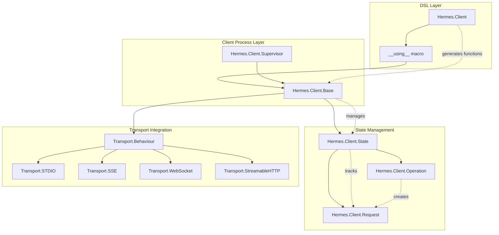
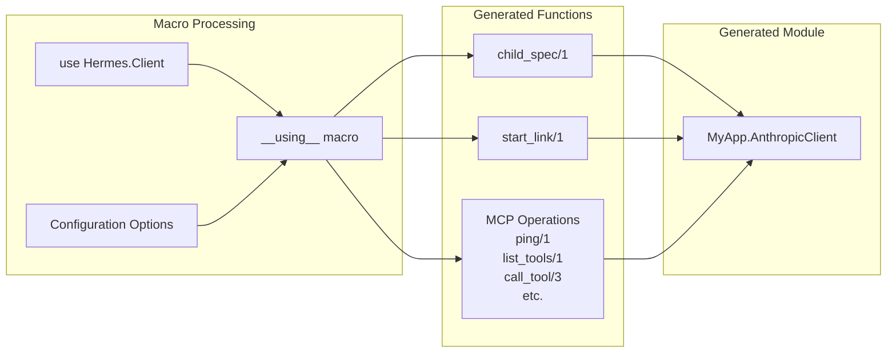
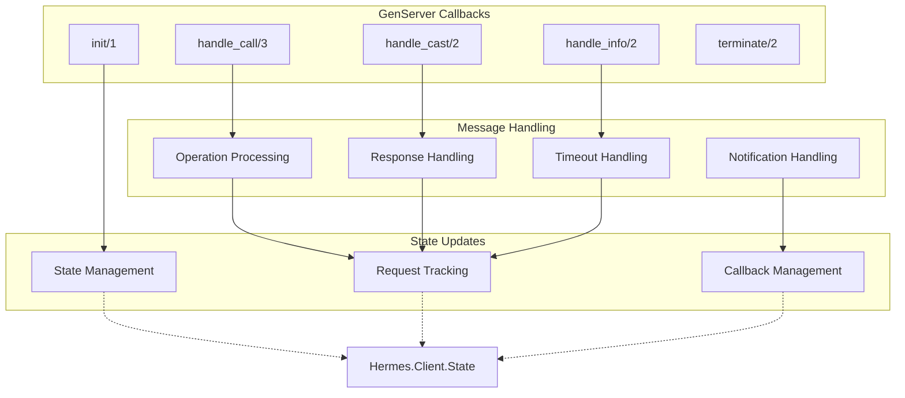
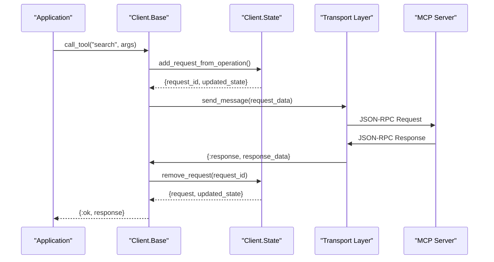
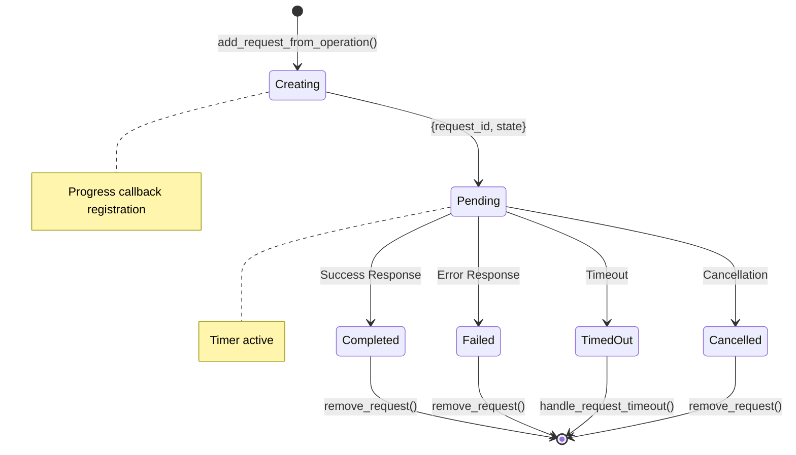
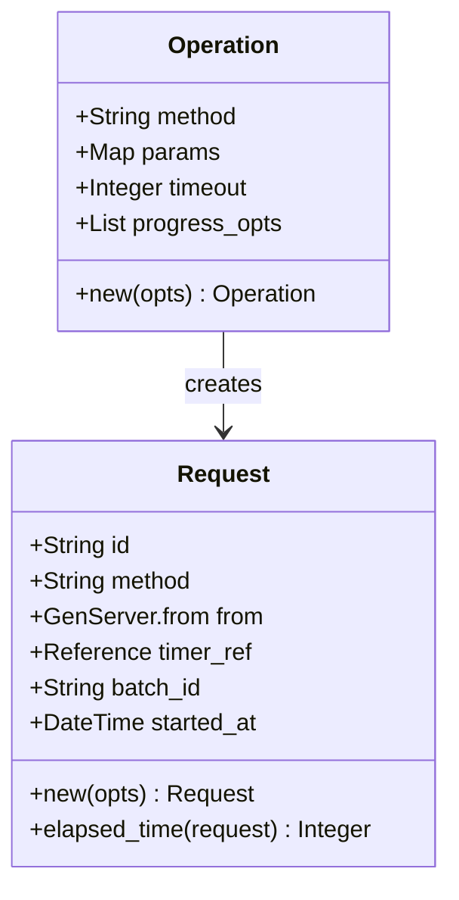
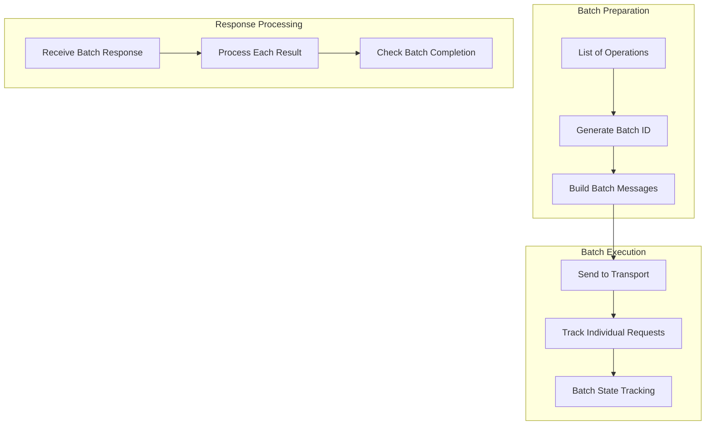
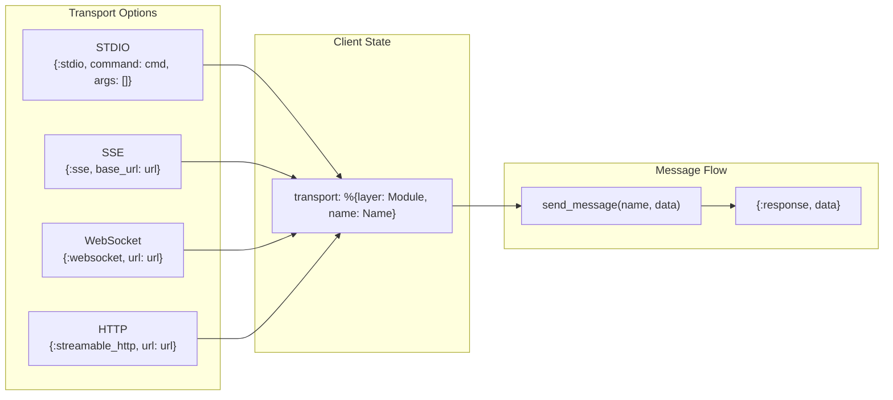

# Client Architecture

<details>
<summary>Relevant source files</summary>

The following files were used as context for generating this wiki page:

- [CLAUDE.md](https://github.com/cloudwalk/hermes-mcp/blob/8db7a927/CLAUDE.md)
- [lib/hermes/client.ex](https://github.com/cloudwalk/hermes-mcp/blob/8db7a927/lib/hermes/client.ex)
- [lib/hermes/client/base.ex](https://github.com/cloudwalk/hermes-mcp/blob/8db7a927/lib/hermes/client/base.ex)
- [lib/hermes/client/state.ex](https://github.com/cloudwalk/hermes-mcp/blob/8db7a927/lib/hermes/client/state.ex)
- [lib/hermes/server/base.ex](https://github.com/cloudwalk/hermes-mcp/blob/8db7a927/lib/hermes/server/base.ex)

</details>


This document describes the architecture of the MCP client implementation, including the DSL layer, core processes, state management, and request lifecycle. For information about transport protocols, see [Transport Layer](#3.2). For guidance on using clients in applications, see [Client Usage](#4.1).

## Overview

The client architecture is built around a layered design that separates concerns between the high-level DSL, core protocol handling, and state management. The architecture provides a GenServer-based foundation with automatic supervision, request tracking, and transport abstraction.

### Client Architecture Components



Sources: [lib/hermes/client.ex:1-381](https://github.com/cloudwalk/hermes-mcp/blob/8db7a927/lib/hermes/client.ex#L1-L381), [lib/hermes/client/base.ex:1-1531](https://github.com/cloudwalk/hermes-mcp/blob/8db7a927/lib/hermes/client/base.ex#L1-L1531), [lib/hermes/client/state.ex:1-705](https://github.com/cloudwalk/hermes-mcp/blob/8db7a927/lib/hermes/client/state.ex#L1-L705)

## DSL Layer

The `Hermes.Client` module provides a high-level DSL that generates fully functional MCP client modules with minimal boilerplate. This layer uses Elixir macros to create client modules that automatically include all MCP operations.

### Client Module Generation



The DSL accepts configuration options and generates a complete client module:

| Option | Type | Description |
|--------|------|-------------|
| `:name` | String | Client name advertised to server |
| `:version` | String | Client version |
| `:protocol_version` | String | MCP protocol version |
| `:capabilities` | List | Client capabilities |

Sources: [lib/hermes/client.ex:97-136](https://github.com/cloudwalk/hermes-mcp/blob/8db7a927/lib/hermes/client.ex#L97-L136), [lib/hermes/client.ex:367-380](https://github.com/cloudwalk/hermes-mcp/blob/8db7a927/lib/hermes/client.ex#L367-L380)

### Capability Parsing

The DSL processes capabilities from various formats into a normalized map structure:

```mermaid
graph TD
    subgraph "Capability Input Formats"
        AtomCap["Atom: :roots"]
        TupleCap["Tuple: {:sampling, opts}"]
        MapCap["Map: custom capabilities"]
    end
    
    subgraph "Parsing Process"
        ParseFn[parse_capability/2]
        Guards[Guard Functions]
    end
    
    subgraph "Normalized Output"
        CapMap["Capabilities Map<br/>%{\"roots\" => %{},<br/> \"sampling\" => %{}}"]
    end
    
    AtomCap --> ParseFn
    TupleCap --> ParseFn
    MapCap --> ParseFn
    ParseFn --> Guards
    Guards --> CapMap
```

Sources: [lib/hermes/client.ex:368-379](https://github.com/cloudwalk/hermes-mcp/blob/8db7a927/lib/hermes/client.ex#L368-L379), [lib/hermes/client.ex:80-94](https://github.com/cloudwalk/hermes-mcp/blob/8db7a927/lib/hermes/client.ex#L80-L94)

## Core Client Process

The `Hermes.Client.Base` module implements the core client functionality as a GenServer. This process handles the MCP protocol lifecycle, message routing, and maintains client state.

### Client Process Structure



Sources: [lib/hermes/client/base.ex:682-723](https://github.com/cloudwalk/hermes-mcp/blob/8db7a927/lib/hermes/client/base.ex#L682-L723), [lib/hermes/client/base.ex:725-871](https://github.com/cloudwalk/hermes-mcp/blob/8db7a927/lib/hermes/client/base.ex#L725-L871), [lib/hermes/client/base.ex:915-931](https://github.com/cloudwalk/hermes-mcp/blob/8db7a927/lib/hermes/client/base.ex#L915-L931)

### Message Flow Patterns

The client handles different types of MCP messages through distinct pathways:



Sources: [lib/hermes/client/base.ex:725-746](https://github.com/cloudwalk/hermes-mcp/blob/8db7a927/lib/hermes/client/base.ex#L725-L746), [lib/hermes/client/base.ex:1232-1241](https://github.com/cloudwalk/hermes-mcp/blob/8db7a927/lib/hermes/client/base.ex#L1232-L1241), [lib/hermes/client/base.ex:1427-1451](https://github.com/cloudwalk/hermes-mcp/blob/8db7a927/lib/hermes/client/base.ex#L1427-L1451)

## State Management

The `Hermes.Client.State` module provides centralized state management for client operations, tracking requests, capabilities, server information, and callbacks.

### State Structure

The client state contains multiple concerns organized in a single struct:

| Field | Type | Purpose |
|-------|------|---------|
| `client_info` | Map | Client metadata (name, version) |
| `capabilities` | Map | Client capabilities |
| `server_capabilities` | Map | Server capabilities from initialization |
| `server_info` | Map | Server information from initialization |
| `protocol_version` | String | MCP protocol version |
| `transport` | Map | Transport configuration |
| `pending_requests` | Map | Active requests with timers |
| `progress_callbacks` | Map | Progress notification callbacks |
| `log_callback` | Function | Log message callback |
| `roots` | Map | Root directories (URI -> root data) |

Sources: [lib/hermes/client/state.ex:53-78](https://github.com/cloudwalk/hermes-mcp/blob/8db7a927/lib/hermes/client/state.ex#L53-L78)

### Request Lifecycle Management



The state module manages the complete request lifecycle, including timer management and cleanup:

Sources: [lib/hermes/client/state.ex:145-164](https://github.com/cloudwalk/hermes-mcp/blob/8db7a927/lib/hermes/client/state.ex#L145-L164), [lib/hermes/client/state.ex:231-243](https://github.com/cloudwalk/hermes-mcp/blob/8db7a927/lib/hermes/client/state.ex#L231-L243), [lib/hermes/client/state.ex:258-267](https://github.com/cloudwalk/hermes-mcp/blob/8db7a927/lib/hermes/client/state.ex#L258-L267)

## Request Processing Models

The client uses structured models to represent operations and track requests throughout their lifecycle.

### Operation Model

The `Hermes.Client.Operation` struct encapsulates request configuration:



Sources: [lib/hermes/client/operation.ex](https://github.com/cloudwalk/hermes-mcp/blob/8db7a927/lib/hermes/client/operation.ex), [lib/hermes/client/request.ex](https://github.com/cloudwalk/hermes-mcp/blob/8db7a927/lib/hermes/client/request.ex)

### Batch Operations

For protocol versions supporting JSON-RPC batching, the client can process multiple operations together:



Sources: [lib/hermes/client/base.ex:849-871](https://github.com/cloudwalk/hermes-mcp/blob/8db7a927/lib/hermes/client/base.ex#L849-L871), [lib/hermes/client/base.ex:1467-1529](https://github.com/cloudwalk/hermes-mcp/blob/8db7a927/lib/hermes/client/base.ex#L1467-L1529)

## Transport Integration

The client integrates with the transport layer through a consistent interface, allowing different transport mechanisms while maintaining the same client API.

### Transport Configuration



Sources: [lib/hermes/client/base.ex:42-50](https://github.com/cloudwalk/hermes-mcp/blob/8db7a927/lib/hermes/client/base.ex#L42-L50), [lib/hermes/client/base.ex:1448-1452](https://github.com/cloudwalk/hermes-mcp/blob/8db7a927/lib/hermes/client/base.ex#L1448-L1452)

## Supervision and Process Management

The client architecture includes proper OTP supervision to ensure reliability and fault tolerance.

### Supervision Tree

```mermaid
graph TB
    subgraph "Application Supervision"
        AppSup[Application Supervisor]
    end
    
    subgraph "Client Supervision"
        ClientSup[Hermes.Client.Supervisor]
        ClientProcess[Client.Base GenServer]  
        TransportProcess[Transport Process]
    end
    
    subgraph "Process Registration"
        Registry[Process Registry]
        Names["Named Processes"]
    end
    
    AppSup --> ClientSup
    ClientSup --> ClientProcess
    ClientSup --> TransportProcess
    
    ClientProcess --> Registry
    TransportProcess --> Registry
    Registry --> Names
    
    note right of ClientSup: Supervisor strategy
    note right of Registry: Via tuples or atoms
```

The client supports flexible process naming strategies for distributed systems:

| Naming Strategy | Example | Use Case |
|----------------|---------|----------|
| Atom | `MyClient` | Simple applications |
| Via Registry | `{:via, Registry, {MyRegistry, key}}` | Local registries |
| Via Horde | `{:via, Horde.Registry, {MyCluster, key}}` | Distributed systems |