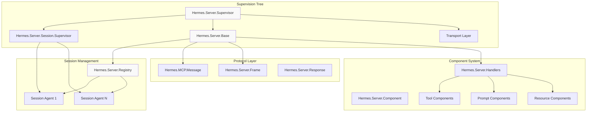
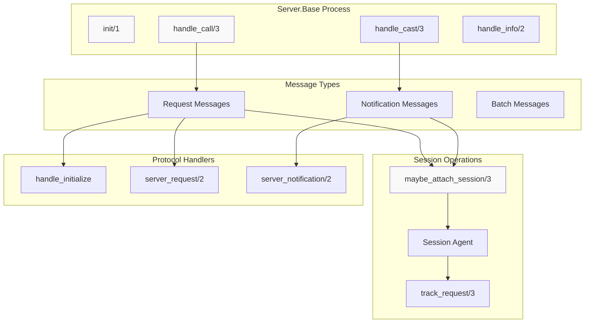
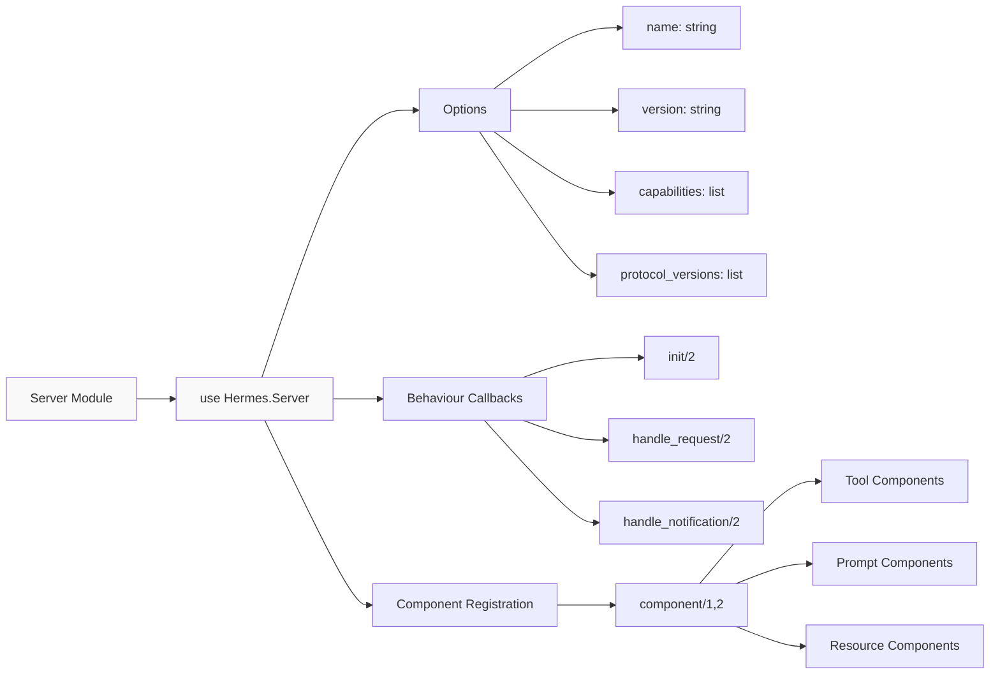
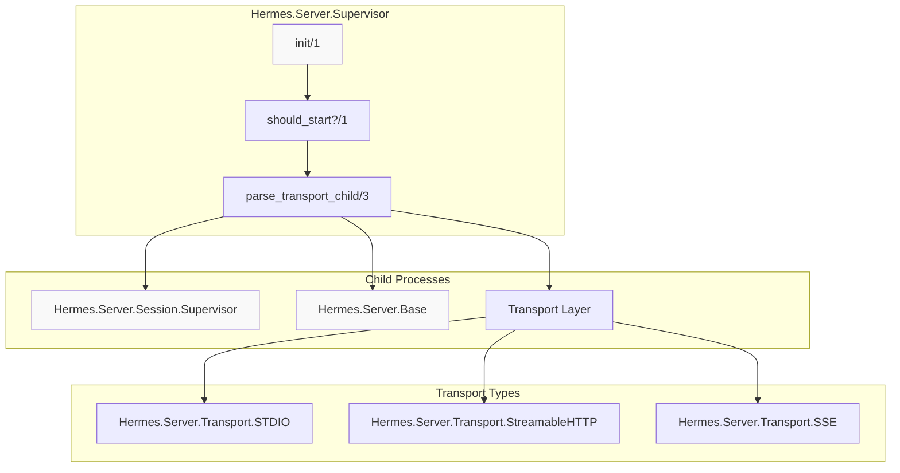
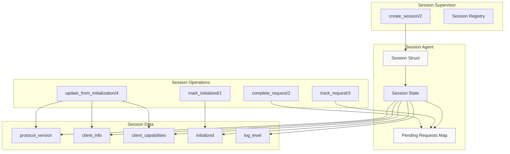
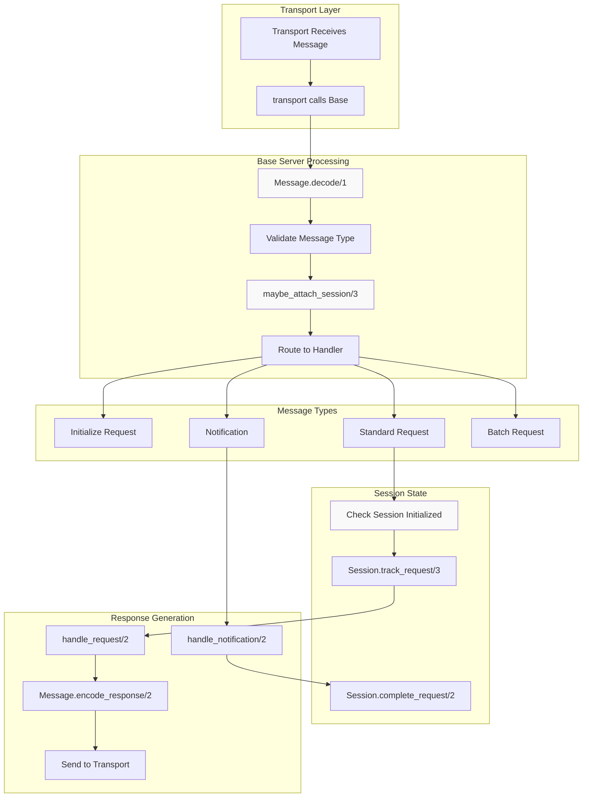
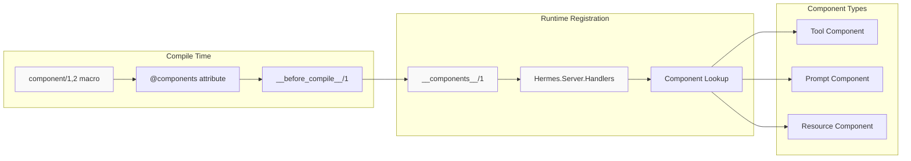

# Server Architecture

Relevant source files

The following files were used as context for generating this wiki page:

- [justfile](https://github.com/cloudwalk/hermes-mcp/blob/8db7a927/justfile)
- [lib/hermes/client/base.ex](https://github.com/cloudwalk/hermes-mcp/blob/8db7a927/lib/hermes/client/base.ex)
- [lib/hermes/server.ex](https://github.com/cloudwalk/hermes-mcp/blob/8db7a927/lib/hermes/server.ex)
- [lib/hermes/server/base.ex](https://github.com/cloudwalk/hermes-mcp/blob/8db7a927/lib/hermes/server/base.ex)
- [lib/hermes/server/session.ex](https://github.com/cloudwalk/hermes-mcp/blob/8db7a927/lib/hermes/server/session.ex)
- [lib/hermes/server/supervisor.ex](https://github.com/cloudwalk/hermes-mcp/blob/8db7a927/lib/hermes/server/supervisor.ex)
- [lib/hermes/telemetry.ex](https://github.com/cloudwalk/hermes-mcp/blob/8db7a927/lib/hermes/telemetry.ex)
- [priv/dev/echo-elixir/mix.lock](https://github.com/cloudwalk/hermes-mcp/blob/8db7a927/priv/dev/echo-elixir/mix.lock)
- [priv/dev/echo-elixir/rel/overlays/bin/server](https://github.com/cloudwalk/hermes-mcp/blob/8db7a927/priv/dev/echo-elixir/rel/overlays/bin/server)
- [priv/dev/echo-elixir/rel/overlays/bin/server.bat](https://github.com/cloudwalk/hermes-mcp/blob/8db7a927/priv/dev/echo-elixir/rel/overlays/bin/server.bat)

This document explains the server-side architecture of hermes-mcp, covering the supervision hierarchy, core server components, session management, and message processing flow. For client-side architecture details, see [Client Architecture](#3.3). For transport layer specifics, see [Transport Layer](#3.2).

## Architecture Overview

The hermes-mcp server architecture follows an OTP (Open Telecom Platform) supervision pattern with multiple layers handling different concerns. The architecture separates protocol handling, session management, component registration, and transport communication into distinct, supervised processes.

### Server Architecture Diagram

Sources: [lib/hermes/server/supervisor.ex:1-184](https://github.com/cloudwalk/hermes-mcp/blob/8db7a927/lib/hermes/server/supervisor.ex#L1-L184), [lib/hermes/server/base.ex:1-786](https://github.com/cloudwalk/hermes-mcp/blob/8db7a927/lib/hermes/server/base.ex#L1-L786), [lib/hermes/server/session.ex:1-228](https://github.com/cloudwalk/hermes-mcp/blob/8db7a927/lib/hermes/server/session.ex#L1-L228)

## Core Server Components

### Server Base Process

The `Hermes.Server.Base` module serves as the central message processor and protocol handler. It implements a GenServer that manages the complete MCP protocol lifecycle.

#### Key Responsibilities

- **Protocol Negotiation**: Handles initialization and version negotiation with clients
- **Message Processing**: Decodes, validates, and routes MCP messages
- **Session Coordination**: Manages per-client session state through Session agents
- **Transport Integration**: Communicates with various transport layers
- **Error Handling**: Processes protocol violations and system errors

Sources: [lib/hermes/server/base.ex:53-395](https://github.com/cloudwalk/hermes-mcp/blob/8db7a927/lib/hermes/server/base.ex#L53-L395), [lib/hermes/server/base.ex:396-500](https://github.com/cloudwalk/hermes-mcp/blob/8db7a927/lib/hermes/server/base.ex#L396-L500)

### Server DSL and Configuration

The `Hermes.Server` module provides a high-level DSL for defining MCP servers with declarative configuration.

#### Server Definition

Sources: [lib/hermes/server.ex:101-166](https://github.com/cloudwalk/hermes-mcp/blob/8db7a927/lib/hermes/server.ex#L101-L166), [lib/hermes/server.ex:200-243](https://github.com/cloudwalk/hermes-mcp/blob/8db7a927/lib/hermes/server.ex#L200-L243)

## Supervision Hierarchy

The `Hermes.Server.Supervisor` orchestrates the startup and management of all server processes with a `:one_for_all` strategy, ensuring consistency across the system.

### Supervision Tree Structure

Sources: [lib/hermes/server/supervisor.ex:103-134](https://github.com/cloudwalk/hermes-mcp/blob/8db7a927/lib/hermes/server/supervisor.ex#L103-L134), [lib/hermes/server/supervisor.ex:144-171](https://github.com/cloudwalk/hermes-mcp/blob/8db7a927/lib/hermes/server/supervisor.ex#L144-L171)

### Conditional Startup Logic

The supervisor implements intelligent startup logic based on transport type and environment configuration:

| Transport Type | Startup Condition |
|----------------|-------------------|
| `:stdio` | Always starts |
| `:streamable_http` | Based on environment variables or explicit config |
| `:sse` | Based on environment variables or explicit config |

Environment variables checked in order:
1. `HERMES_MCP_SERVER` (highest priority)
2. `PHX_SERVER` (for Phoenix releases)
3. Phoenix `:serve_endpoints` config (for `mix phx.server`)

Sources: [lib/hermes/server/supervisor.ex:166-183](https://github.com/cloudwalk/hermes-mcp/blob/8db7a927/lib/hermes/server/supervisor.ex#L166-L183)

## Session Management

The session management system handles per-client state for transports that support multiple concurrent connections, such as StreamableHTTP and SSE.

### Session Agent Structure

Sources: [lib/hermes/server/session.ex:20-41](https://github.com/cloudwalk/hermes-mcp/blob/8db7a927/lib/hermes/server/session.ex#L20-L41), [lib/hermes/server/session.ex:154-210](https://github.com/cloudwalk/hermes-mcp/blob/8db7a927/lib/hermes/server/session.ex#L154-L210)

### Session Lifecycle

Each session follows a specific lifecycle managed by the Base server:

1. **Creation**: Session agent created when first message arrives
2. **Initialization**: Protocol negotiation and capability exchange
3. **Request Tracking**: Monitor pending requests and cancellations
4. **Cleanup**: Session termination and resource cleanup

Sources: [lib/hermes/server/base.ex:719-745](https://github.com/cloudwalk/hermes-mcp/blob/8db7a927/lib/hermes/server/base.ex#L719-L745), [lib/hermes/server/base.ex:356-381](https://github.com/cloudwalk/hermes-mcp/blob/8db7a927/lib/hermes/server/base.ex#L356-L381)

## Message Processing Flow

The server processes messages through a structured pipeline that handles different message types and maintains protocol compliance.

### Message Flow Diagram

Sources: [lib/hermes/server/base.ex:300-325](https://github.com/cloudwalk/hermes-mcp/blob/8db7a927/lib/hermes/server/base.ex#L300-L325), [lib/hermes/server/base.ex:396-417](https://github.com/cloudwalk/hermes-mcp/blob/8db7a927/lib/hermes/server/base.ex#L396-L417), [lib/hermes/server/base.ex:502-557](https://github.com/cloudwalk/hermes-mcp/blob/8db7a927/lib/hermes/server/base.ex#L502-L557)

### Request Handling Pipeline

The Base server implements a comprehensive request handling pipeline:

1. **Message Validation**: Ensures message conforms to JSON-RPC 2.0
2. **Session Attachment**: Retrieves or creates session state
3. **Initialization Check**: Verifies session is properly initialized
4. **Request Tracking**: Monitors pending requests for cancellation
5. **Handler Delegation**: Routes to implementation module
6. **Response Generation**: Encodes and sends response through transport

Sources: [lib/hermes/server/base.ex:663-701](https://github.com/cloudwalk/hermes-mcp/blob/8db7a927/lib/hermes/server/base.ex#L663-L701), [lib/hermes/server/base.ex:703-717](https://github.com/cloudwalk/hermes-mcp/blob/8db7a927/lib/hermes/server/base.ex#L703-L717)

## Component System Integration

The server integrates with the component system through the `Hermes.Server.Handlers` module, which routes requests to registered tools, prompts, and resources.

### Component Registration Flow

Sources: [lib/hermes/server.ex:200-212](https://github.com/cloudwalk/hermes-mcp/blob/8db7a927/lib/hermes/server.ex#L200-L212), [lib/hermes/server.ex:223-243](https://github.com/cloudwalk/hermes-mcp/blob/8db7a927/lib/hermes/server.ex#L223-L243)

### Request Routing

When the Base server receives component-related requests (tools/list, prompts/get, resources/read), it delegates to the `Handlers` module, which:

1. **Identifies Component Type**: Extracts component type from method name
2. **Looks Up Component**: Uses `__components__/1` to find registered components
3. **Invokes Component**: Calls component-specific handlers
4. **Returns Response**: Formats and returns component output

Sources: [lib/hermes/server.ex:236-242](https://github.com/cloudwalk/hermes-mcp/blob/8db7a927/lib/hermes/server.ex#L236-L242)