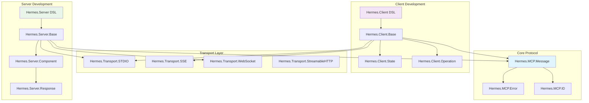
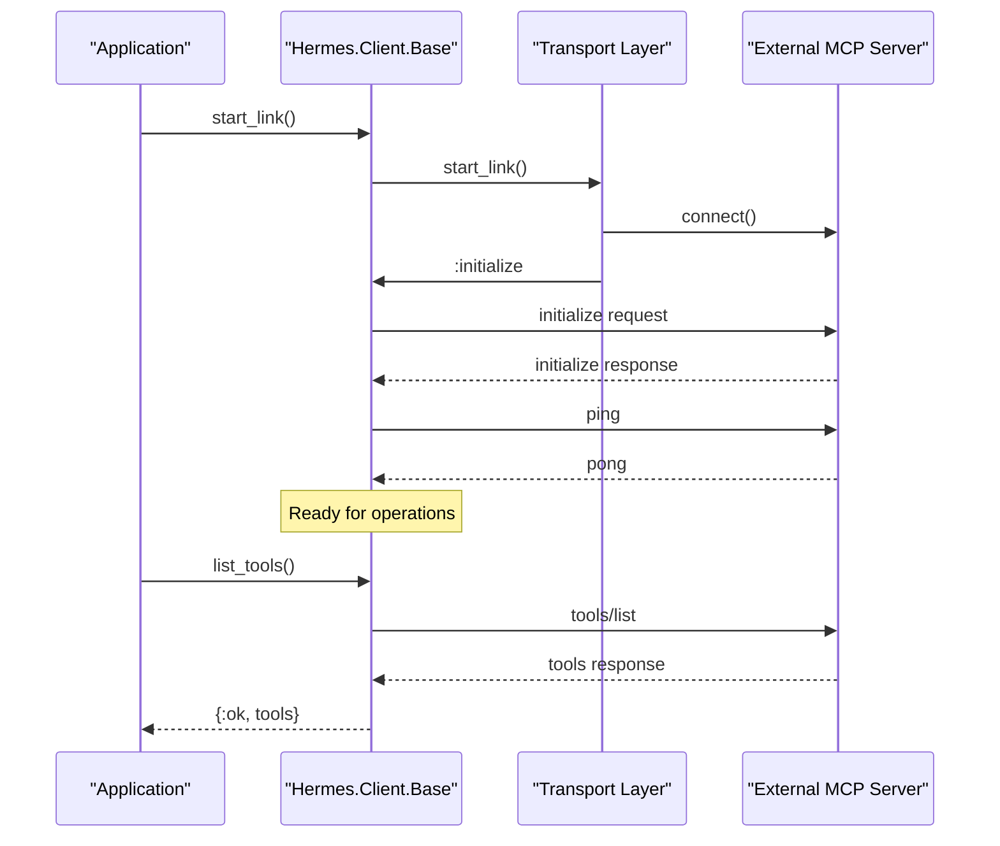
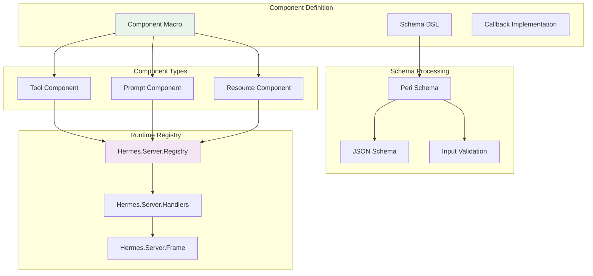
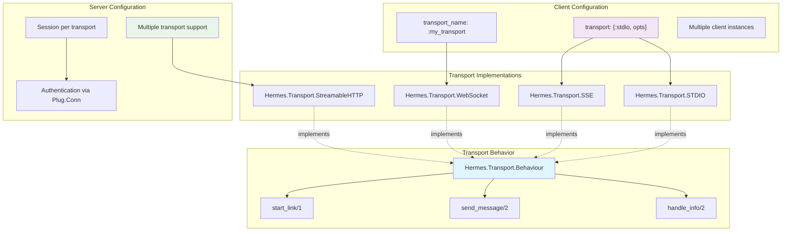
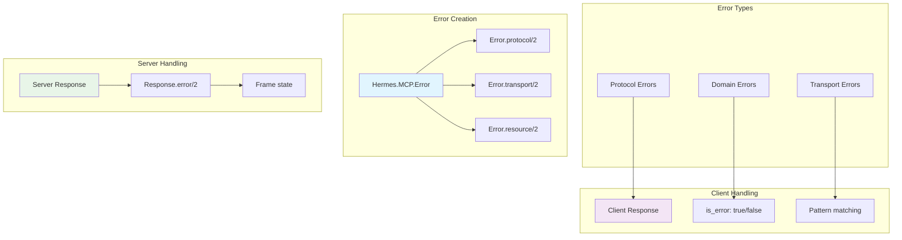

# Usage Guide

<details>
<summary>Relevant source files</summary>

The following files were used as context for generating this wiki page:

- [.formatter.exs](https://github.com/cloudwalk/hermes-mcp/blob/8db7a927/.formatter.exs)
- [lib/hermes/server/component/schema.ex](https://github.com/cloudwalk/hermes-mcp/blob/8db7a927/lib/hermes/server/component/schema.ex)
- [pages/client_usage.md](https://github.com/cloudwalk/hermes-mcp/blob/8db7a927/pages/client_usage.md)
- [pages/error_handling.md](https://github.com/cloudwalk/hermes-mcp/blob/8db7a927/pages/error_handling.md)
- [pages/progress_tracking.md](https://github.com/cloudwalk/hermes-mcp/blob/8db7a927/pages/progress_tracking.md)
- [pages/server_components.md](https://github.com/cloudwalk/hermes-mcp/blob/8db7a927/pages/server_components.md)
- [test/hermes/client/state_test.exs](https://github.com/cloudwalk/hermes-mcp/blob/8db7a927/test/hermes/client/state_test.exs)
- [test/hermes/server/component_field_macro_test.exs](https://github.com/cloudwalk/hermes-mcp/blob/8db7a927/test/hermes/server/component_field_macro_test.exs)
- [test/support/test_tools.ex](https://github.com/cloudwalk/hermes-mcp/blob/8db7a927/test/support/test_tools.ex)

</details>


This guide provides comprehensive documentation for building MCP (Model Context Protocol) applications using hermes-mcp. It covers both client and server development, transport configuration, and common usage patterns.

For specific implementation details, see [Client Usage](#4.1) for client-side development, [Server Components](#4.2) for building server components, and [Interactive Development](#4.3) for testing and debugging workflows. For architectural concepts, see [Architecture](#3).

## Development Patterns Overview

The hermes-mcp SDK provides two main development patterns: building MCP clients that connect to external servers, and building MCP servers that expose tools, prompts, and resources to client applications.



Sources: [lib/hermes/client.ex](https://github.com/cloudwalk/hermes-mcp/blob/8db7a927/lib/hermes/client.ex), [lib/hermes/server.ex](https://github.com/cloudwalk/hermes-mcp/blob/8db7a927/lib/hermes/server.ex), [lib/hermes/transport](https://github.com/cloudwalk/hermes-mcp/blob/8db7a927/lib/hermes/transport), [lib/hermes/mcp](https://github.com/cloudwalk/hermes-mcp/blob/8db7a927/lib/hermes/mcp)

## Quick Start

### Client Setup

Define a client module using the `Hermes.Client` DSL and add it to your supervision tree:

```elixir
defmodule MyApp.MCPClient do
  use Hermes.Client,
    name: "MyApp Client",
    version: "1.0.0",
    transport: {:stdio, command: "python", args: ["-m", "mcp.server"]}
end

# In your application supervisor
children = [
  MyApp.MCPClient
]
```

Use the client to interact with the MCP server:

```elixir
# Check connection
MyApp.MCPClient.ping()

# List available tools
{:ok, response} = MyApp.MCPClient.list_tools()

# Call a tool
{:ok, result} = MyApp.MCPClient.call_tool("calculator", %{expr: "2+2"})
```

### Server Setup

Define a server module with components:

```elixir
defmodule MyApp.MCPServer do
  use Hermes.Server,
    name: "MyApp Server", 
    version: "1.0.0",
    capabilities: [:tools, :prompts, :resources]

  component MyApp.Tools.Calculator
  component MyApp.Prompts.Assistant
  component MyApp.Resources.Config
end

# Define a tool component
defmodule MyApp.Tools.Calculator do
  use Hermes.Server.Component, type: :tool
  
  alias Hermes.Server.Response
  
  schema do
    %{expr: {:required, :string}}
  end
  
  @impl true
  def execute(%{expr: expr}, frame) do
    result = Code.eval_string(expr)
    {:reply, Response.text(Response.tool(), "Result: #{result}"), frame}
  end
end
```

Sources: [pages/client_usage.md:7-24](https://github.com/cloudwalk/hermes-mcp/blob/8db7a927/pages/client_usage.md#L7-L24), [pages/server_components.md:380-397](https://github.com/cloudwalk/hermes-mcp/blob/8db7a927/pages/server_components.md#L380-L397), [pages/server_components.md:11-31](https://github.com/cloudwalk/hermes-mcp/blob/8db7a927/pages/server_components.md#L11-L31)

## Client Development Workflow

### Connection Management



Sources: [lib/hermes/client/base.ex](https://github.com/cloudwalk/hermes-mcp/blob/8db7a927/lib/hermes/client/base.ex), [lib/hermes/transport](https://github.com/cloudwalk/hermes-mcp/blob/8db7a927/lib/hermes/transport), [pages/client_usage.md:7-24](https://github.com/cloudwalk/hermes-mcp/blob/8db7a927/pages/client_usage.md#L7-L24)

### Operation Handling

The `Hermes.Client.Operation` struct standardizes request handling across all client methods:

```elixir
# Standard operation structure
operation = Operation.new(%{
  method: "tools/call",
  params: %{"name" => "calculator", "arguments" => %{"expr" => "2+2"}},
  progress_opts: [token: token, callback: callback],
  timeout: 30_000
})
```

All client methods (`list_tools/2`, `call_tool/3`, `read_resource/2`, etc.) create operations internally and handle timeouts, progress tracking, and error responses consistently.

Sources: [lib/hermes/client/operation.ex](https://github.com/cloudwalk/hermes-mcp/blob/8db7a927/lib/hermes/client/operation.ex), [test/hermes/client/state_test.exs:30-53](https://github.com/cloudwalk/hermes-mcp/blob/8db7a927/test/hermes/client/state_test.exs#L30-L53), [pages/progress_tracking.md:24-47](https://github.com/cloudwalk/hermes-mcp/blob/8db7a927/pages/progress_tracking.md#L24-L47)

## Server Component System

### Component Types and Registration



Sources: [lib/hermes/server/component.ex](https://github.com/cloudwalk/hermes-mcp/blob/8db7a927/lib/hermes/server/component.ex), [lib/hermes/server/component/schema.ex](https://github.com/cloudwalk/hermes-mcp/blob/8db7a927/lib/hermes/server/component/schema.ex), [lib/hermes/server/registry.ex](https://github.com/cloudwalk/hermes-mcp/blob/8db7a927/lib/hermes/server/registry.ex), [lib/hermes/server/handlers.ex](https://github.com/cloudwalk/hermes-mcp/blob/8db7a927/lib/hermes/server/handlers.ex)

### Schema Definition Patterns

The component system supports both traditional Peri schemas and the enhanced field macro syntax:

```elixir
# Traditional Peri schema
schema do
  %{
    name: {:required, :string},
    age: {:integer, {:default, 25}},
    tags: {:list, :string}
  }
end

# Enhanced field macro with JSON Schema metadata
schema do
  field :email, {:required, :string}, format: "email", description: "User email"
  field :preferences do
    field :theme, {:enum, ["light", "dark"]}, type: :string
    field :notifications, :boolean
  end
end
```

The `Hermes.Server.Component.Schema` module converts these definitions to JSON Schema format for MCP protocol compliance.

Sources: [pages/server_components.md:478-546](https://github.com/cloudwalk/hermes-mcp/blob/8db7a927/pages/server_components.md#L478-L546), [lib/hermes/server/component/schema.ex:1-208](https://github.com/cloudwalk/hermes-mcp/blob/8db7a927/lib/hermes/server/component/schema.ex#L1-L208), [test/hermes/server/component_field_macro_test.exs:146-176](https://github.com/cloudwalk/hermes-mcp/blob/8db7a927/test/hermes/server/component_field_macro_test.exs#L146-L176)

## Transport Configuration

### Transport Layer Architecture



Sources: [lib/hermes/transport](https://github.com/cloudwalk/hermes-mcp/blob/8db7a927/lib/hermes/transport), [pages/client_usage.md:192-216](https://github.com/cloudwalk/hermes-mcp/blob/8db7a927/pages/client_usage.md#L192-L216), [pages/server_components.md:427-461](https://github.com/cloudwalk/hermes-mcp/blob/8db7a927/pages/server_components.md#L427-L461)

### Common Transport Patterns

```elixir
# STDIO transport for external processes
transport: {:stdio, command: "python", args: ["-m", "mcp.server"]}

# SSE transport for HTTP-based servers  
transport: {:sse, base_url: "http://localhost:8080", path: "/mcp"}

# WebSocket transport for real-time connections
transport: {:websocket, url: "ws://localhost:8080/mcp"}

# Multiple client instances
children = [
  {MyApp.MCPClient, name: :client_one, transport: stdio_config},
  {MyApp.MCPClient, name: :client_two, transport: sse_config}
]
```

Sources: [pages/client_usage.md:190-216](https://github.com/cloudwalk/hermes-mcp/blob/8db7a927/pages/client_usage.md#L190-L216), [lib/hermes/transport/stdio.ex](https://github.com/cloudwalk/hermes-mcp/blob/8db7a927/lib/hermes/transport/stdio.ex), [lib/hermes/transport/sse.ex](https://github.com/cloudwalk/hermes-mcp/blob/8db7a927/lib/hermes/transport/sse.ex)

## Error Handling and Progress Tracking

### Error Response Patterns



Sources: [lib/hermes/mcp/error.ex](https://github.com/cloudwalk/hermes-mcp/blob/8db7a927/lib/hermes/mcp/error.ex), [pages/error_handling.md:1-113](https://github.com/cloudwalk/hermes-mcp/blob/8db7a927/pages/error_handling.md#L1-L113), [lib/hermes/server/response.ex](https://github.com/cloudwalk/hermes-mcp/blob/8db7a927/lib/hermes/server/response.ex)

### Progress Tracking Integration

Progress tracking uses the `Hermes.Client.Operation` system to provide consistent progress callbacks across all client methods:

```elixir
# Generate progress token
token = Hermes.MCP.ID.generate_progress_token()

# Set up progress callback
callback = fn ^token, progress, total ->
  IO.puts("Progress: #{progress}/#{total || "unknown"}")
end

# Use with any client method
MyApp.MCPClient.call_tool("slow_tool", %{}, 
  progress: [token: token, callback: callback],
  timeout: 60_000
)
```

The progress system integrates with the client state management in `Hermes.Client.State` to track progress callbacks per token.

Sources: [pages/progress_tracking.md:1-62](https://github.com/cloudwalk/hermes-mcp/blob/8db7a927/pages/progress_tracking.md#L1-L62), [lib/hermes/client/state.ex](https://github.com/cloudwalk/hermes-mcp/blob/8db7a927/lib/hermes/client/state.ex), [test/hermes/client/state_test.exs:132-171](https://github.com/cloudwalk/hermes-mcp/blob/8db7a927/test/hermes/client/state_test.exs#L132-L171)

## Development and Testing Workflow

### Interactive Development Tools

The hermes-mcp library includes interactive development tools for testing MCP implementations:

```elixir
# Interactive shell for testing clients
Mix.Interactive.SupervisedShell.start()

# CLI tools for standalone testing
mix hermes.cli --help
```

These tools provide real-time testing capabilities for both STDIO and SSE transports, allowing developers to test their MCP implementations during development.

Sources: [lib/mix/interactive](https://github.com/cloudwalk/hermes-mcp/blob/8db7a927/lib/mix/interactive), [lib/hermes/cli.ex](https://github.com/cloudwalk/hermes-mcp/blob/8db7a927/lib/hermes/cli.ex), [pages/client_usage.md:218-259](https://github.com/cloudwalk/hermes-mcp/blob/8db7a927/pages/client_usage.md#L218-L259)

### Component Testing Patterns

```elixir
# Test component schema generation
schema = MyComponent.input_schema()
assert schema["properties"]["field"]["type"] == "string"

# Test component validation  
assert {:ok, validated} = MyComponent.mcp_schema(%{field: "value"})

# Test component execution
frame = %Hermes.Server.Frame{}
assert {:reply, response, _frame} = MyComponent.execute(params, frame)
```

The component system provides introspection methods like `input_schema/0` and `mcp_schema/1` for testing schema definitions and validation logic.