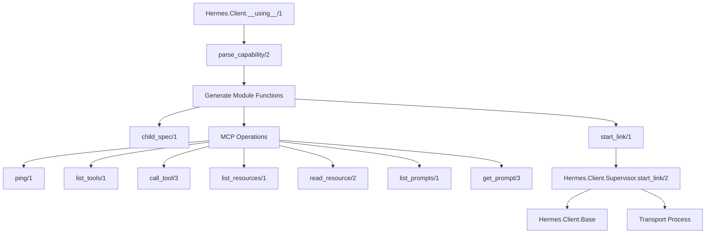
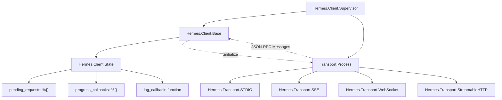
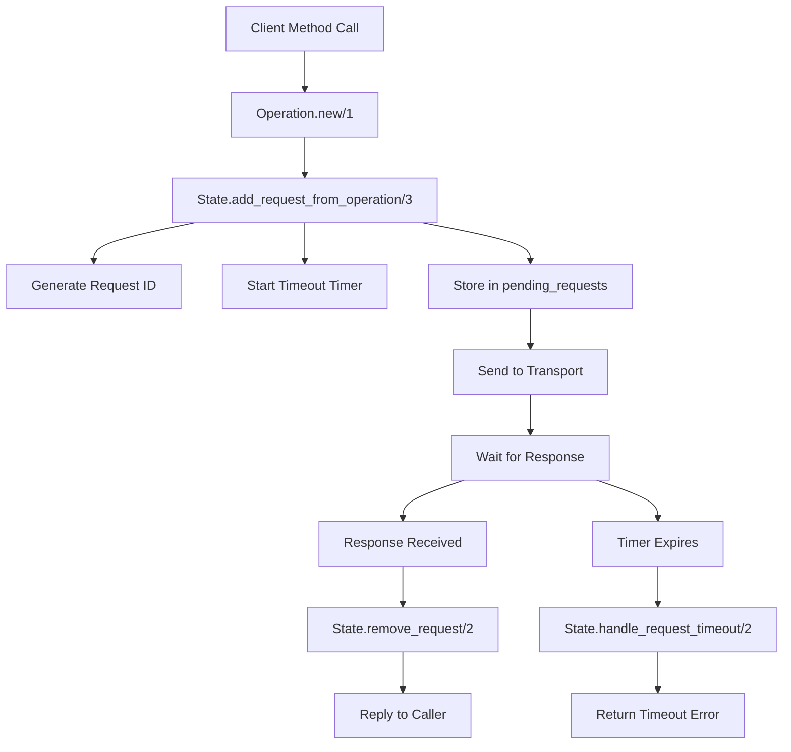

# Client Usage

<details>
<summary>Relevant source files</summary>

The following files were used as context for generating this wiki page:

- [lib/hermes/client.ex](https://github.com/cloudwalk/hermes-mcp/blob/8db7a927/lib/hermes/client.ex)
- [pages/client_usage.md](https://github.com/cloudwalk/hermes-mcp/blob/8db7a927/pages/client_usage.md)
- [pages/error_handling.md](https://github.com/cloudwalk/hermes-mcp/blob/8db7a927/pages/error_handling.md)
- [pages/progress_tracking.md](https://github.com/cloudwalk/hermes-mcp/blob/8db7a927/pages/progress_tracking.md)
- [test/hermes/client/state_test.exs](https://github.com/cloudwalk/hermes-mcp/blob/8db7a927/test/hermes/client/state_test.exs)

</details>


This document covers how to create and use MCP (Model Context Protocol) clients using the Hermes DSL and client API. It includes client definition, transport configuration, operation execution, error handling, and progress tracking.

For server-side component development, see [Server Components](#4.2). For interactive development and testing, see [Interactive Development](#4.3).

## Client Definition

The `Hermes.Client` module provides a DSL for defining MCP clients with minimal boilerplate. Using this module generates a fully functional MCP client with automatic supervision, transport management, and all standard MCP operations.

### Basic Client Module

```elixir
defmodule MyApp.MCPClient do
  use Hermes.Client,
    name: "MyApp",
    version: "1.0.0", 
    protocol_version: "2024-11-05",
    capabilities: [:roots, {:sampling, list_changed?: true}]
end
```

### Client Definition Options

| Option | Type | Required | Description |
|--------|------|----------|-------------|
| `:name` | String | Yes | Client name advertised to server |
| `:version` | String | Yes | Client version |
| `:protocol_version` | String | Yes | MCP protocol version |
| `:capabilities` | List | No | Client capabilities (defaults to empty) |

### Capability Configuration

```elixir
# Atom capabilities
capabilities: [:roots, :sampling]

# Capabilities with options  
capabilities: [{:roots, list_changed?: true}, {:sampling, list_changed?: false}]

# Mixed capabilities
capabilities: [:roots, {:sampling, list_changed?: true}, %{"custom" => %{"feature" => true}}]
```

**Client Module Generation Flow**



Sources: [lib/hermes/client.ex:113-366](https://github.com/cloudwalk/hermes-mcp/blob/8db7a927/lib/hermes/client.ex#L113-L366)

## Transport Configuration

When starting a client, you must provide transport configuration specifying how to connect to the MCP server.

### Supervision Tree Integration

```elixir
children = [
  {MyApp.MCPClient, 
   transport: {:stdio, command: "uvx", args: ["mcp-server-anthropic"]}}
]

Supervisor.start_link(children, strategy: :one_for_one)
```

### Transport Types

| Transport | Configuration | Use Case |
|-----------|---------------|----------|
| STDIO | `{:stdio, command: "cmd", args: ["arg1"]}` | External processes |
| SSE | `{:sse, base_url: "http://localhost:8000"}` | HTTP + Server-Sent Events |
| WebSocket | `{:websocket, url: "ws://localhost:8000/ws"}` | Real-time bidirectional |
| HTTP | `{:streamable_http, url: "http://localhost:8000/mcp"}` | HTTP streaming |

### Process Naming

```elixir
# Default naming (uses module name)
{MyApp.MCPClient, transport: {...}}

# Custom atom name
{MyApp.MCPClient, name: :my_custom_client, transport: {...}}

# Distributed systems with registries
{MyApp.MCPClient,
 name: {:via, Horde.Registry, {MyCluster, "client_1"}},
 transport_name: {:via, Horde.Registry, {MyCluster, "transport_1"}},
 transport: {...}}
```

**Client Process Architecture**



Sources: [lib/hermes/client.ex:21-76](https://github.com/cloudwalk/hermes-mcp/blob/8db7a927/lib/hermes/client.ex#L21-L76), [test/hermes/client/state_test.exs:9-28](https://github.com/cloudwalk/hermes-mcp/blob/8db7a927/test/hermes/client/state_test.exs#L9-L28)

## Basic Operations

Once the client is started and connected, it provides methods for all standard MCP operations.

### Connection Management

```elixir
# Test server connectivity
case MyApp.MCPClient.ping() do
  {:ok, :pong} -> IO.puts("Server is responsive")
  {:error, reason} -> IO.puts("Connection error: #{inspect(reason)}")
end

# Get server information
{:ok, capabilities} = MyApp.MCPClient.get_server_capabilities()
{:ok, server_info} = MyApp.MCPClient.get_server_info()
```

### Working with Tools

```elixir
# List available tools
{:ok, %{result: %{"tools" => tools}}} = MyApp.MCPClient.list_tools()

for tool <- tools do
  IO.puts("#{tool["name"]}: #{tool["description"]}")
end

# Call a tool
case MyApp.MCPClient.call_tool("calculator", %{expr: "2+2"}) do
  {:ok, %{is_error: false, result: result}} ->
    IO.puts("Result: #{inspect(result)}")
    
  {:ok, %{is_error: true, result: error}} ->
    IO.puts("Tool error: #{error["message"]}")
    
  {:error, error} ->
    IO.puts("Protocol error: #{inspect(error)}")
end
```

### Working with Resources

```elixir
# List resources with pagination
{:ok, %{result: result}} = MyApp.MCPClient.list_resources()
resources = result["resources"]
cursor = result["nextCursor"]

# Next page if available
if cursor do
  {:ok, %{result: more}} = MyApp.MCPClient.list_resources(cursor: cursor)
end

# Read resource content
{:ok, %{result: %{"contents" => contents}}} = 
  MyApp.MCPClient.read_resource("file:///data.txt")

for content <- contents do
  case content do
    %{"text" => text} -> IO.puts(text)
    %{"blob" => blob} -> IO.puts("Binary: #{byte_size(blob)} bytes")
  end
end
```

### Working with Prompts

```elixir
# List available prompts
{:ok, %{result: %{"prompts" => prompts}}} = MyApp.MCPClient.list_prompts()

# Get prompt with arguments
args = %{"language" => "elixir", "task" => "refactor"}
{:ok, %{result: %{"messages" => messages}}} = 
  MyApp.MCPClient.get_prompt("code_review", args)

for msg <- messages do
  IO.puts("#{msg["role"]}: #{msg["content"]}")
end
```

Sources: [lib/hermes/client.ex:144-365](https://github.com/cloudwalk/hermes-mcp/blob/8db7a927/lib/hermes/client.ex#L144-L365), [pages/client_usage.md:15-175](https://github.com/cloudwalk/hermes-mcp/blob/8db7a927/pages/client_usage.md#L15-L175)

## Operation Configuration

All client operations support configuration options for timeouts, progress tracking, and other parameters.

### Operation Structure

Each client method internally creates an `Operation` struct that standardizes request handling:

```elixir
# Internal operation creation (example from call_tool)
operation = Operation.new(%{
  method: "tools/call",
  params: %{"name" => name, "arguments" => args},
  progress_opts: progress_opts,
  timeout: timeout
})
```

### Timeout Configuration

```elixir
# Default timeout (30 seconds)
MyApp.MCPClient.call_tool("tool_name", %{})

# Custom timeout
MyApp.MCPClient.call_tool("slow_tool", %{}, timeout: 60_000)

# All operations support timeout option
MyApp.MCPClient.list_resources(timeout: 10_000)
MyApp.MCPClient.read_resource("uri", timeout: 45_000)
```

### Request Lifecycle

**Operation Processing Flow**



Sources: [test/hermes/client/state_test.exs:30-53](https://github.com/cloudwalk/hermes-mcp/blob/8db7a927/test/hermes/client/state_test.exs#L30-L53), [pages/progress_tracking.md:22-48](https://github.com/cloudwalk/hermes-mcp/blob/8db7a927/pages/progress_tracking.md#L22-L48)

## Error Handling

Hermes MCP distinguishes between different types of errors and provides structured error handling.

### Error Types

1. **Protocol Errors** - JSON-RPC standard errors
2. **Domain Errors** - Application-level errors (tool returns `isError: true`)  
3. **Transport Errors** - Network/connection failures

### Error Response Patterns

```elixir
case MyApp.MCPClient.call_tool("search", %{query: "test"}) do
  # Success
  {:ok, %{is_error: false, result: result}} ->
    handle_success(result)
    
  # Domain error (tool returned isError: true)
  {:ok, %{is_error: true, result: result}} ->
    handle_tool_error(result["message"])
    
  # Protocol/transport error
  {:error, %Hermes.MCP.Error{reason: reason}} ->
    handle_protocol_error(reason)
end
```

### Common Error Scenarios

```elixir
# Timeout handling
{:error, %Hermes.MCP.Error{reason: :timeout}} ->
  IO.puts("Request timed out")

# Transport errors
{:error, %Hermes.MCP.Error{reason: reason}} when reason in [
  :connection_refused,
  :connection_closed,
  :timeout
] ->
  handle_network_error(reason)

# Method not supported
{:error, %Hermes.MCP.Error{reason: :method_not_found}} ->
  IO.puts("Server doesn't support this method")
```

### Capability Validation

The client automatically validates server capabilities before making requests:

```elixir
# This validation happens in State.validate_capability/2
case State.validate_capability(state, "tools/list") do
  :ok -> 
    # Method is supported
  {:error, %Error{reason: :method_not_found}} ->
    # Server doesn't support this capability
end
```

Sources: [pages/error_handling.md:1-113](https://github.com/cloudwalk/hermes-mcp/blob/8db7a927/pages/error_handling.md#L1-L113), [test/hermes/client/state_test.exs:285-321](https://github.com/cloudwalk/hermes-mcp/blob/8db7a927/test/hermes/client/state_test.exs#L285-L321)

## Progress Tracking

Long-running operations can provide progress updates using the MCP progress notification mechanism.

### Progress Token Generation

```elixir
# Generate unique progress token
progress_token = Hermes.MCP.ID.generate_progress_token()
```

### Progress Callbacks

```elixir
# Register progress callback before making request
token = Hermes.MCP.ID.generate_progress_token()

callback = fn ^token, progress, total ->
  percentage = if total, do: Float.round(progress / total * 100, 1), else: "unknown"
  IO.puts("Progress: #{progress}/#{total || "unknown"} (#{percentage}%)")
end

MyApp.MCPClient.register_progress_callback(token, callback)

# Make request with progress tracking
MyApp.MCPClient.call_tool("long_running_tool", %{}, progress: [token: token])
```

### Combined Progress Configuration

```elixir
# Token and callback in single request
token = Hermes.MCP.ID.generate_progress_token()

MyApp.MCPClient.list_tools(
  progress: [
    token: token, 
    callback: fn ^token, progress, total ->
      IO.puts("Loading tools: #{progress}/#{total || "?"}")
    end
  ]
)
```

### Progress Callback Management

```elixir
# Register callback
MyApp.MCPClient.register_progress_callback(token, callback)

# Send progress update (server-side)
MyApp.MCPClient.send_progress(token, 50, 100)

# Unregister callback
MyApp.MCPClient.unregister_progress_callback(token)
```

Sources: [pages/progress_tracking.md:1-62](https://github.com/cloudwalk/hermes-mcp/blob/8db7a927/pages/progress_tracking.md#L1-L62), [test/hermes/client/state_test.exs:132-171](https://github.com/cloudwalk/hermes-mcp/blob/8db7a927/test/hermes/client/state_test.exs#L132-L171)

## Advanced Usage Patterns

### Multiple Client Instances

```elixir
# Different servers with same client module
children = [
  {MyApp.MCPClient, 
   name: :anthropic_client,
   transport: {:stdio, command: "uvx", args: ["mcp-server-anthropic"]}},
  {MyApp.MCPClient, 
   name: :filesystem_client,
   transport: {:stdio, command: "uvx", args: ["mcp-server-filesystem", "/tmp"]}}
]

# Use specific instances
MyApp.MCPClient.list_tools(:anthropic_client)
MyApp.MCPClient.list_resources(:filesystem_client)
```

### Request Cancellation

```elixir
# Cancel specific request
MyApp.MCPClient.cancel_request("req-123", "user_cancelled")

# Cancel all pending requests
MyApp.MCPClient.cancel_all_requests("shutting_down")
```

### Root Management (for clients with :roots capability)

```elixir
# Add root directory
MyApp.MCPClient.add_root("file:///project", "My Project")

# List registered roots
{:ok, roots} = MyApp.MCPClient.list_roots()

# Remove root
MyApp.MCPClient.remove_root("file:///project")

# Clear all roots
MyApp.MCPClient.clear_roots()
```

### Batch Operations

```elixir
# Send multiple operations in batch
operations = [
  %Operation{method: "ping", params: %{}},
  %Operation{method: "tools/list", params: %{}},
  %Operation{method: "resources/list", params: %{}}
]

MyApp.MCPClient.send_batch(operations)
```

### Manual Client Setup

For advanced use cases requiring manual process management:

```elixir
# Start client process manually
{:ok, client_pid} = Hermes.Client.Base.start_link(
  name: :manual_client,
  transport: [layer: Hermes.Transport.STDIO, name: :manual_transport],
  client_info: %{"name" => "ManualClient", "version" => "1.0.0"},
  capabilities: %{"roots" => %{}, "sampling" => %{}},
  protocol_version: "2024-11-05"
)

# Start transport (will send :initialize to client)
{:ok, transport_pid} = Hermes.Transport.STDIO.start_link(
  name: :manual_transport,
  client: :manual_client,
  command: "python",
  args: ["-m", "mcp.server"]
)

# Use client directly
Hermes.Client.Base.ping(:manual_client)
```