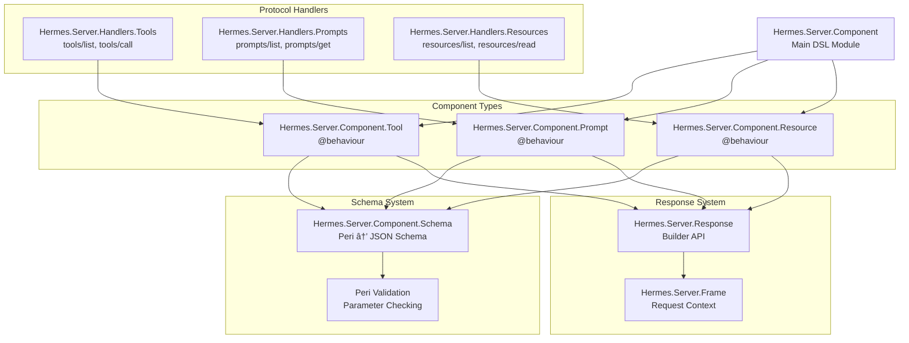
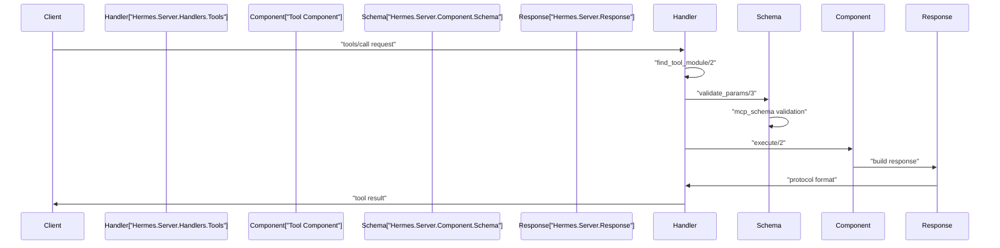
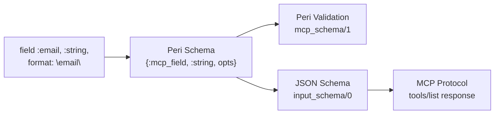
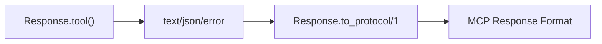

# Server Components

<details>
<summary>Relevant source files</summary>

The following files were used as context for generating this wiki page:

- [.formatter.exs](https://github.com/cloudwalk/hermes-mcp/blob/8db7a927/.formatter.exs)
- [.github/workflows/release-please.yml](https://github.com/cloudwalk/hermes-mcp/blob/8db7a927/.github/workflows/release-please.yml)
- [.github/workflows/release.yml](https://github.com/cloudwalk/hermes-mcp/blob/8db7a927/.github/workflows/release.yml)
- [lib/hermes/server/component.ex](https://github.com/cloudwalk/hermes-mcp/blob/8db7a927/lib/hermes/server/component.ex)
- [lib/hermes/server/component/schema.ex](https://github.com/cloudwalk/hermes-mcp/blob/8db7a927/lib/hermes/server/component/schema.ex)
- [lib/hermes/server/component/tool.ex](https://github.com/cloudwalk/hermes-mcp/blob/8db7a927/lib/hermes/server/component/tool.ex)
- [lib/hermes/server/handlers/tools.ex](https://github.com/cloudwalk/hermes-mcp/blob/8db7a927/lib/hermes/server/handlers/tools.ex)
- [pages/server_components.md](https://github.com/cloudwalk/hermes-mcp/blob/8db7a927/pages/server_components.md)
- [test/hermes/server/component/schema_test.exs](https://github.com/cloudwalk/hermes-mcp/blob/8db7a927/test/hermes/server/component/schema_test.exs)
- [test/hermes/server/component_field_macro_test.exs](https://github.com/cloudwalk/hermes-mcp/blob/8db7a927/test/hermes/server/component_field_macro_test.exs)
- [test/hermes/server/component_prompt_test.exs](https://github.com/cloudwalk/hermes-mcp/blob/8db7a927/test/hermes/server/component_prompt_test.exs)
- [test/support/test_tools.ex](https://github.com/cloudwalk/hermes-mcp/blob/8db7a927/test/support/test_tools.ex)

</details>


This page covers the server-side component system in hermes-mcp, including Tools, Prompts, and Resources. These components provide the core functionality that MCP clients can interact with through the protocol.

For information about client-side usage, see [Client Usage](#4.1). For server architecture details, see [Server Architecture](#3.4).

## Component System Overview

The hermes-mcp server component system provides a DSL for defining three types of MCP components:

- **Tools** - Executable functions that clients can invoke with parameters
- **Prompts** - Message templates that generate conversation contexts  
- **Resources** - Data providers identified by URIs

All components use the `Hermes.Server.Component` module and support automatic schema validation, JSON Schema generation, and protocol compliance.

### Component Architecture



Sources: [lib/hermes/server/component.ex:1-393](https://github.com/cloudwalk/hermes-mcp/blob/8db7a927/lib/hermes/server/component.ex#L1-L393), [lib/hermes/server/component/tool.ex:1-178](https://github.com/cloudwalk/hermes-mcp/blob/8db7a927/lib/hermes/server/component/tool.ex#L1-L178), [lib/hermes/server/component/schema.ex:1-208](https://github.com/cloudwalk/hermes-mcp/blob/8db7a927/lib/hermes/server/component/schema.ex#L1-L208), [lib/hermes/server/handlers/tools.ex:1-126](https://github.com/cloudwalk/hermes-mcp/blob/8db7a927/lib/hermes/server/handlers/tools.ex#L1-L126)

## Tools

Tools are executable functions that MCP clients can invoke. They define input schemas, implement execution logic, and return structured responses.

### Basic Tool Definition

```elixir
defmodule MyServer.Tools.Calculator do
  @moduledoc "Add two numbers"
  
  use Hermes.Server.Component, type: :tool
  
  schema do
    %{
    }
  end
  
  @impl true
  def execute(%{a: a, b: b}, frame) do
    {:reply, Response.text(Response.tool(), "Result: #{a + b}"), frame}
  end
end
```

### Tool Execution Flow



Sources: [lib/hermes/server/handlers/tools.ex:70-81](https://github.com/cloudwalk/hermes-mcp/blob/8db7a927/lib/hermes/server/handlers/tools.ex#L70-L81), [lib/hermes/server/handlers/tools.ex:107-112](https://github.com/cloudwalk/hermes-mcp/blob/8db7a927/lib/hermes/server/handlers/tools.ex#L107-L112), [lib/hermes/server/component.ex:18-38](https://github.com/cloudwalk/hermes-mcp/blob/8db7a927/lib/hermes/server/component.ex#L18-L38)

### Tool Registration and Discovery

Tools are registered with servers and exposed through the `tools/list` protocol method:

```elixir
# In server module
defmodule MyServer do
  use Hermes.Server, capabilities: [:tools]
  
  component MyServer.Tools.Calculator
  component MyServer.Tools.FileManager
end
```

The `Hermes.Server.Handlers.Tools.handle_list/2` function processes tool discovery requests and generates protocol-compliant tool definitions with JSON Schema.

Sources: [lib/hermes/server/handlers/tools.ex:46-54](https://github.com/cloudwalk/hermes-mcp/blob/8db7a927/lib/hermes/server/handlers/tools.ex#L46-L54), [lib/hermes/server/handlers/tools.ex:92-105](https://github.com/cloudwalk/hermes-mcp/blob/8db7a927/lib/hermes/server/handlers/tools.ex#L92-L105)

## Prompts

Prompts provide reusable message templates for AI conversations. They accept arguments and generate structured message arrays.

### Prompt Component Structure

```elixir
defmodule MyServer.Prompts.CodeReview do
  @moduledoc "Generate code review prompts"
  
  use Hermes.Server.Component, type: :prompt
  
  schema do
    field :language, {:required, :string}, description: "Programming language"
    field :focus_areas, :string, description: "Areas to focus on"
  end
  
  @impl true
  def get_messages(%{language: lang, focus_areas: focus}, frame) do
    response = 
      Response.prompt()
      |> Response.system_message("You are an expert #{lang} code reviewer.")
      |> Response.user_message("Please review focusing on #{focus}.")
    
    {:reply, response, frame}
  end
end
```

Prompts implement the `Hermes.Server.Component.Prompt` behaviour and use `arguments/0` instead of `input_schema/0` for parameter definition.

Sources: [lib/hermes/server/component.ex:167-173](https://github.com/cloudwalk/hermes-mcp/blob/8db7a927/lib/hermes/server/component.ex#L167-L173), [pages/server_components.md:119-179](https://github.com/cloudwalk/hermes-mcp/blob/8db7a927/pages/server_components.md#L119-L179)

## Resources

Resources represent data that clients can read, identified by URIs. They support both text and binary content with MIME type specification.

### Resource Definition

```elixir
defmodule MyServer.Resources.Config do
  @moduledoc "Application configuration"
  
  use Hermes.Server.Component,
    type: :resource,
    uri: "config://app",
    mime_type: "application/json"
  
  @impl true
  def read(_params, frame) do
    config = %{version: "1.0.0", env: Mix.env()}
    {:reply, Response.json(Response.resource(), config), frame}
  end
end
```

Resources can optionally define schemas for query parameters when reading dynamic content.

Sources: [lib/hermes/server/component.ex:68-105](https://github.com/cloudwalk/hermes-mcp/blob/8db7a927/lib/hermes/server/component.ex#L68-L105), [pages/server_components.md:255-302](https://github.com/cloudwalk/hermes-mcp/blob/8db7a927/pages/server_components.md#L255-L302)

## Schema Definition System

The component schema system supports both traditional Peri schemas and an enhanced field macro syntax with JSON Schema metadata.

### Schema Conversion Pipeline



Sources: [lib/hermes/server/component.ex:218-241](https://github.com/cloudwalk/hermes-mcp/blob/8db7a927/lib/hermes/server/component.ex#L218-L241), [lib/hermes/server/component/schema.ex:26-40](https://github.com/cloudwalk/hermes-mcp/blob/8db7a927/lib/hermes/server/component/schema.ex#L26-L40)

### Field Macro Features

The `field` macro enhances standard Peri schemas with JSON Schema metadata:

| Feature | Example | JSON Schema Output |
|---------|---------|-------------------|
| Basic field | `field :name, :string` | `{"type": "string"}` |
| Format hint | `field :email, :string, format: "email"` | `{"type": "string", "format": "email"}` |
| Description | `field :age, :integer, description: "Age in years"` | `{"type": "integer", "description": "Age in years"}` |
| Nested object | `field :user do ... end` | `{"type": "object", "properties": {...}}` |
| Enum with type | `field :status, {:enum, ["on", "off"]}, type: :string` | `{"type": "string", "enum": ["on", "off"]}` |

The system processes both field macros and traditional Peri schemas through `__clean_schema_for_peri__/1`.

Sources: [lib/hermes/server/component.ex:266-299](https://github.com/cloudwalk/hermes-mcp/blob/8db7a927/lib/hermes/server/component.ex#L266-L299), [lib/hermes/server/component.ex:384-392](https://github.com/cloudwalk/hermes-mcp/blob/8db7a927/lib/hermes/server/component.ex#L384-L392), [lib/hermes/server/component/schema.ex:80-96](https://github.com/cloudwalk/hermes-mcp/blob/8db7a927/lib/hermes/server/component/schema.ex#L80-L96)

## Response Building

Components use the `Hermes.Server.Response` module to build protocol-compliant responses through a fluent API.

### Response Types by Component

| Component Type | Response Builder | Content Methods |
|----------------|------------------|-----------------|
| Tool | `Response.tool()` | `text/2`, `json/2`, `error/2` |
| Prompt | `Response.prompt()` | `system_message/2`, `user_message/2`, `assistant_message/2` |
| Resource | `Response.resource()` | `text/2`, `blob/2`, `name/2`, `description/2` |

### Response Builder Chain



Sources: [pages/server_components.md:305-373](https://github.com/cloudwalk/hermes-mcp/blob/8db7a927/pages/server_components.md#L305-L373)

## Component Lifecycle and Frame Management

### Frame Structure and Usage

The `Hermes.Server.Frame` carries request context through component execution:

```elixir
def execute(params, frame) do
  # Access request context
  user_id = frame.assigns[:current_user]
  session_id = frame.private.session_id
  
  # Update frame state
  new_frame = assign(frame, :last_tool_call, DateTime.utc_now())
  
  {:reply, response, new_frame}
end
```

Frame components:
- `assigns` - User data from authentication/authorization layers
- `transport` - Request metadata (headers, query params, IP)
- `private` - MCP session data (session ID, client info, protocol version)
- `request` - Current MCP request being processed

Sources: [pages/server_components.md:399-461](https://github.com/cloudwalk/hermes-mcp/blob/8db7a927/pages/server_components.md#L399-L461)

### Component Return Types

All component callbacks must return one of:

| Return Type | Description | Frame Updates |
|-------------|-------------|---------------|
| `{:reply, response, frame}` | Success with response | Optional |
| `{:noreply, frame}` | Success without immediate response | Optional |
| `{:error, error, frame}` | Error response | Optional |

Sources: [pages/server_components.md:464-474](https://github.com/cloudwalk/hermes-mcp/blob/8db7a927/pages/server_components.md#L464-L474)

## Validation and Error Handling

### Schema Validation Flow

```mermaid
graph TB
    Request["MCP Request<br/>tools/call"]
    FindTool["find_tool_module/2"]
    ValidateParams["validate_params/3"]
    PeriValidation["module.mcp_schema/1"]
    FormatErrors["Schema.format_errors/1"]
    Execute["module.execute/2"]
    
    Request --> FindTool
    FindTool --> ValidateParams
    ValidateParams --> PeriValidation
    PeriValidation -->|{:error, errors}| FormatErrors
    PeriValidation -->|{:ok, params}| Execute
    FormatErrors --> Request
```

The validation system uses Peri schemas and converts validation errors to human-readable messages through `Hermes.Server.Component.Schema.format_errors/1`.

Sources: [lib/hermes/server/handlers/tools.ex:107-112](https://github.com/cloudwalk/hermes-mcp/blob/8db7a927/lib/hermes/server/handlers/tools.ex#L107-L112), [lib/hermes/server/component/schema.ex:68-78](https://github.com/cloudwalk/hermes-mcp/blob/8db7a927/lib/hermes/server/component/schema.ex#L68-L78)

### Error Response Patterns

Components can return errors in multiple formats:

```elixir
# String error
{:error, "Cannot divide by zero", frame}

# MCP Error struct  
{:error, Error.protocol(:invalid_params, %{message: "Invalid input"}), frame}

# Tool error response
{:reply, Response.error(Response.tool(), "Processing failed"), frame}
```