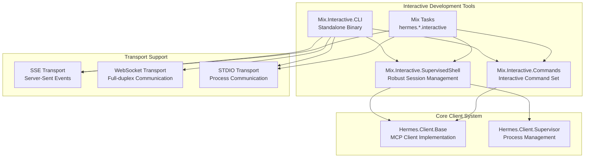
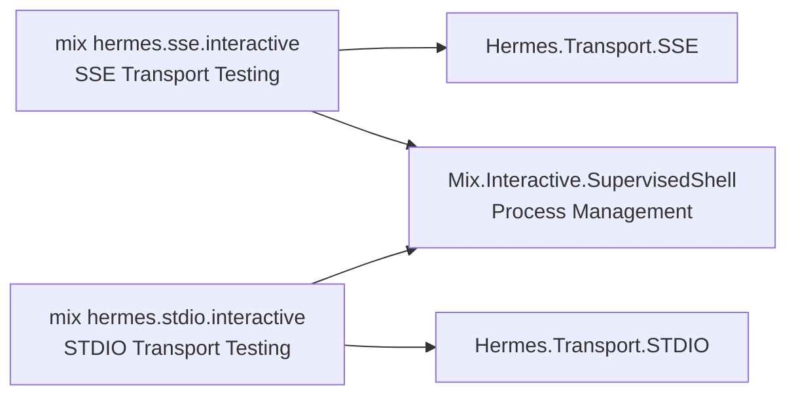
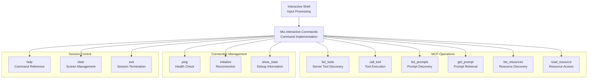
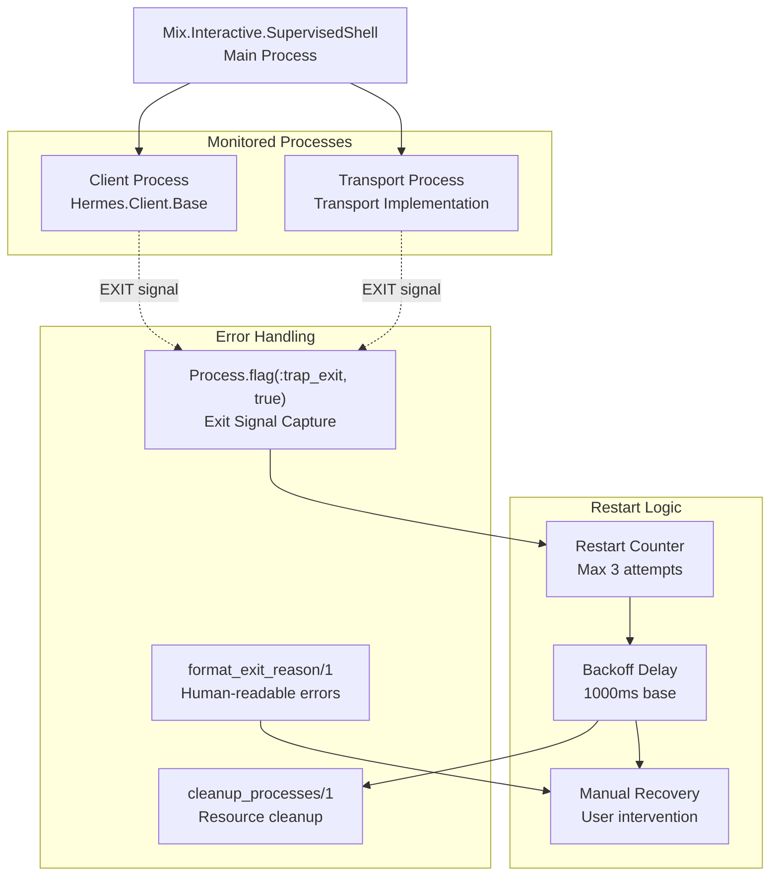

# Interactive Development

<details>
<summary>Relevant source files</summary>

The following files were used as context for generating this wiki page:

- [.credo.exs](https://github.com/cloudwalk/hermes-mcp/blob/8db7a927/.credo.exs)
- [.env.dev](https://github.com/cloudwalk/hermes-mcp/blob/8db7a927/.env.dev)
- [config/config.exs](https://github.com/cloudwalk/hermes-mcp/blob/8db7a927/config/config.exs)
- [lib/hermes/client/supervisor.ex](https://github.com/cloudwalk/hermes-mcp/blob/8db7a927/lib/hermes/client/supervisor.ex)
- [lib/hermes/http.ex](https://github.com/cloudwalk/hermes-mcp/blob/8db7a927/lib/hermes/http.ex)
- [lib/hermes/sse.ex](https://github.com/cloudwalk/hermes-mcp/blob/8db7a927/lib/hermes/sse.ex)
- [lib/mix/interactive/cli.ex](https://github.com/cloudwalk/hermes-mcp/blob/8db7a927/lib/mix/interactive/cli.ex)
- [lib/mix/interactive/commands.ex](https://github.com/cloudwalk/hermes-mcp/blob/8db7a927/lib/mix/interactive/commands.ex)
- [lib/mix/interactive/supervised_shell.ex](https://github.com/cloudwalk/hermes-mcp/blob/8db7a927/lib/mix/interactive/supervised_shell.ex)
- [lib/mix/tasks/sse.interactive.ex](https://github.com/cloudwalk/hermes-mcp/blob/8db7a927/lib/mix/tasks/sse.interactive.ex)
- [lib/mix/tasks/stdio.interactive.ex](https://github.com/cloudwalk/hermes-mcp/blob/8db7a927/lib/mix/tasks/stdio.interactive.ex)

</details>


This document covers the interactive development tools provided by hermes-mcp for testing, debugging, and exploring MCP implementations. These tools enable developers to manually interact with MCP servers through various transport protocols, inspect server capabilities, and troubleshoot connection issues during development.

For information about building MCP servers themselves, see [Server Components](#4.2). For details about the underlying client architecture, see [Client Architecture](#3.3).

## Overview

The hermes-mcp project provides several interactive development tools designed to facilitate testing and debugging of MCP implementations:

- **Standalone CLI Binary**: A compiled executable for interactive MCP client sessions
- **Mix Tasks**: Development tasks for testing specific transport implementations  
- **Interactive Commands**: A comprehensive set of commands for exploring server capabilities
- **Supervised Shell**: Robust shell with automatic restart capabilities for handling connection failures



Sources: [lib/mix/interactive/cli.ex:1-287](https://github.com/cloudwalk/hermes-mcp/blob/8db7a927/lib/mix/interactive/cli.ex#L1-L287), [lib/mix/interactive/commands.ex:1-389](https://github.com/cloudwalk/hermes-mcp/blob/8db7a927/lib/mix/interactive/commands.ex#L1-L389), [lib/mix/interactive/supervised_shell.ex:1-231](https://github.com/cloudwalk/hermes-mcp/blob/8db7a927/lib/mix/interactive/supervised_shell.ex#L1-L231)

## Standalone CLI Application

The standalone CLI application provides a self-contained executable for interactive MCP sessions. It supports all transport types and can be distributed as a single binary using Burrito packaging.

### Command Line Interface

The CLI accepts various options to configure transport and connection parameters:

| Option | Description | Default |
|--------|-------------|---------|
| `--transport` | Transport type (sse\|websocket\|stdio) | sse |
| `--base-url` | Base URL for HTTP-based transports | http://localhost:8000 |
| `--command` | Command for STDIO transport | mcp |
| `--args` | Arguments for STDIO command | run,priv/dev/echo/index.py |
| `-v` | Verbose logging levels | error level |

### Transport-Specific Usage

**SSE Transport:**
```bash
hermes-mcp --transport sse --base-url http://localhost:8000
hermes-mcp --transport sse --base-url https://remote-server.com --base-path /api/mcp
```

**WebSocket Transport:**
```bash
hermes-mcp --transport websocket --base-url http://localhost:8000 --ws-path /mcp/ws
```

**STDIO Transport:**
```bash
hermes-mcp --transport stdio --command ./my-mcp-server --args arg1,arg2
hermes-mcp --transport stdio --command mcp --args run,server.py
```

The CLI automatically handles connection establishment, capability negotiation, and provides detailed feedback about the connection process.

Sources: [lib/mix/interactive/cli.ex:14-287](https://github.com/cloudwalk/hermes-mcp/blob/8db7a927/lib/mix/interactive/cli.ex#L14-L287)

## Mix Tasks for Development

Development-specific Mix tasks provide targeted testing capabilities for individual transport implementations during development workflows.

### Available Mix Tasks



### SSE Interactive Task

The SSE interactive task [lib/mix/tasks/sse.interactive.ex:1-100]() enables testing of Server-Sent Events transport:

```bash
mix hermes.sse.interactive --base-url http://localhost:8000
mix hermes.sse.interactive --base-url https://remote.com --base-path /api --sse-path /events
```

Options:
- `--base-url`: SSE server base URL
- `--base-path`: Base path to append to URL  
- `--sse-path`: Specific SSE endpoint path
- `-v`: Verbose logging

### STDIO Interactive Task

The STDIO interactive task [lib/mix/tasks/stdio.interactive.ex:1-95]() enables testing of process-based transport:

```bash
mix hermes.stdio.interactive --command mcp --args run,server.py
mix hermes.stdio.interactive --command ./custom-server --args --config,config.json
```

Options:
- `--command`: Executable command for MCP server
- `--args`: Comma-separated command arguments
- `-v`: Verbose logging

Sources: [lib/mix/tasks/sse.interactive.ex:1-100](https://github.com/cloudwalk/hermes-mcp/blob/8db7a927/lib/mix/tasks/sse.interactive.ex#L1-L100), [lib/mix/tasks/stdio.interactive.ex:1-95](https://github.com/cloudwalk/hermes-mcp/blob/8db7a927/lib/mix/tasks/stdio.interactive.ex#L1-L95)

## Interactive Commands

The interactive shell provides a comprehensive set of commands for exploring, testing, and debugging MCP server functionality.

### Command Architecture



### Available Commands

| Command | Description | Usage |
|---------|-------------|-------|
| `help` | Show available commands | Interactive help system |
| `ping` | Test server connectivity | Health check with response time |
| `list_tools` | Discover available tools | Displays tool names and descriptions |
| `call_tool` | Execute a server tool | Prompts for tool name and JSON arguments |
| `list_prompts` | Discover available prompts | Shows prompt templates |
| `get_prompt` | Retrieve a prompt | Prompts for name and arguments |
| `list_resources` | Show available resources | Lists resource URIs |
| `read_resource` | Access resource content | Prompts for resource URI |
| `initialize` | Retry server connection | Reconnection with detailed error info |
| `show_state` | Display internal state | Debug client and transport state |
| `clear` | Clear terminal screen | Screen management |
| `exit` | Close connection and exit | Clean shutdown |

### Command Implementation Details

The command system [lib/mix/interactive/commands.ex:27-40]() provides a mapping from command strings to their descriptions and implementations. Each command follows a consistent pattern:

1. **Input Processing**: Commands that require parameters prompt the user interactively
2. **JSON Validation**: Arguments are validated as JSON where required
3. **Error Handling**: Comprehensive error reporting with context
4. **Result Formatting**: Structured output with color coding
5. **Loop Continuation**: Automatic return to command prompt

### Error Reporting and Debugging

The command system provides detailed error context when `HERMES_VERBOSE=1` is set [lib/mix/interactive/commands.ex:259-281]():

- **Connection Errors**: Transport-specific connection details
- **Timeout Errors**: Protocol version and pending request information  
- **Server Errors**: Server error data and capability information
- **State Information**: Complete client and transport state dumps

Sources: [lib/mix/interactive/commands.ex:1-389](https://github.com/cloudwalk/hermes-mcp/blob/8db7a927/lib/mix/interactive/commands.ex#L1-L389)

## Supervised Shell

The supervised shell provides robust session management with automatic restart capabilities for handling connection failures and transport errors.

### Supervision Architecture



### Automatic Restart Behavior

The supervised shell [lib/mix/interactive/supervised_shell.ex:112-138]() implements automatic restart with the following behavior:

1. **Process Monitoring**: Both client and transport processes are monitored for crashes
2. **Restart Attempts**: Up to 3 automatic restart attempts with exponential backoff
3. **Cleanup**: Proper cleanup of crashed processes before restart
4. **Manual Recovery**: User intervention options when automatic restart fails

### Configuration Options

| Option | Description | Default |
|--------|-------------|---------|
| `:transport_module` | Transport module class | Required |
| `:transport_opts` | Transport configuration | Required |
| `:client_opts` | Client configuration | Required |
| `:max_restarts` | Maximum restart attempts | 3 |

### Error Recovery Flow

When a process crashes, the supervised shell:

1. **Detects Exit**: Captures process exit signals
2. **Formats Error**: Provides human-readable error descriptions
3. **Attempts Restart**: Automatic restart within limits
4. **Offers Options**: Manual restart or quit when auto-restart fails
5. **Cleans Resources**: Ensures proper process cleanup

The restart process includes full re-initialization of both transport and client connections, ensuring a clean state after recovery.

Sources: [lib/mix/interactive/supervised_shell.ex:1-231](https://github.com/cloudwalk/hermes-mcp/blob/8db7a927/lib/mix/interactive/supervised_shell.ex#L1-L231)

## Configuration and Environment

### Environment Variables

| Variable | Purpose | Default |
|----------|---------|---------|
| `HERMES_VERBOSE` | Enable detailed error reporting | 0 (disabled) |
| `HERMES_MCP_COMPILE_CLI` | Include CLI in compilation | false |

### Logging Configuration

The interactive tools support configurable logging levels [config/config.exs:9-11]():

- Error level (default): Critical errors only
- Warning level (`-v`): Connection warnings and errors  
- Info level (`-vv`): Detailed connection information
- Debug level (`-vvv`): Full protocol message tracing

### Build Integration

The interactive CLI can be compiled as a standalone binary using the Burrito packaging system. This is controlled by the `HERMES_MCP_COMPILE_CLI` environment variable during build time.