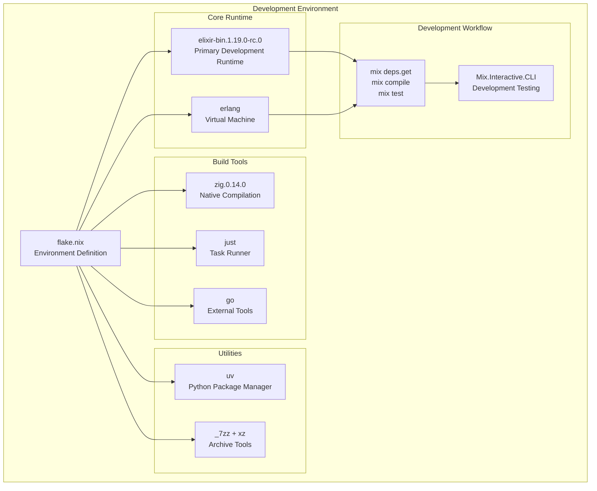
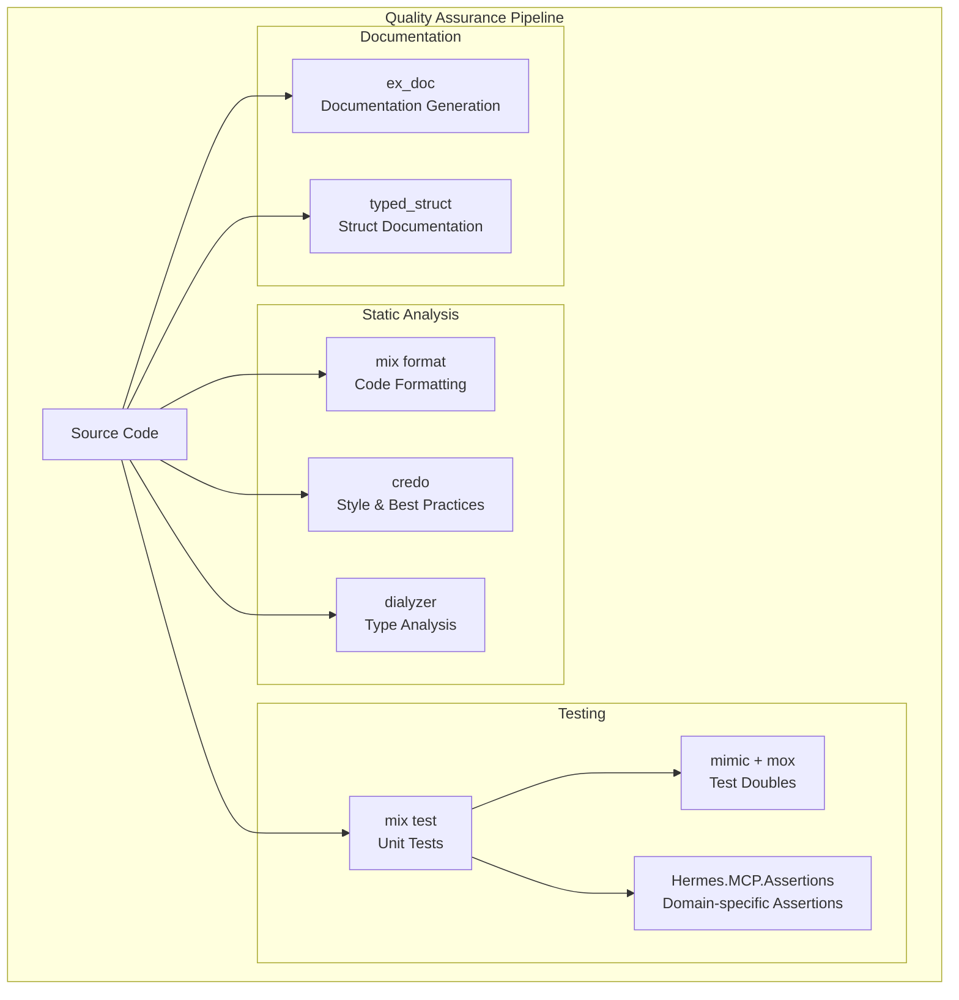

# Development

Relevant source files

The following files were used as context for generating this wiki page:

- [.gitignore](https://github.com/cloudwalk/hermes-mcp/blob/8db7a927/.gitignore)
- [flake.lock](https://github.com/cloudwalk/hermes-mcp/blob/8db7a927/flake.lock)
- [flake.nix](https://github.com/cloudwalk/hermes-mcp/blob/8db7a927/flake.nix)
- [mix.lock](https://github.com/cloudwalk/hermes-mcp/blob/8db7a927/mix.lock)
- [test/support/mcp/assertions.ex](https://github.com/cloudwalk/hermes-mcp/blob/8db7a927/test/support/mcp/assertions.ex)

This page provides information for developers working on the hermes-mcp codebase itself, including development environment setup, build system configuration, testing infrastructure, and contribution guidelines. For information about using hermes-mcp as a library or CLI tool, see [Getting Started](#2) and [Usage Guide](#4). For details about specific build system components, see [Build System](#5.1).

## Development Environment

The hermes-mcp project uses Nix flakes to provide a reproducible development environment with all necessary dependencies. The development environment is configured in [flake.nix:36-50]() and includes multiple toolchains for cross-platform development.

### Nix Development Shell

The project provides a `devShells.default` configuration that includes:

| Tool | Version | Purpose |
|------|---------|---------|  
| `elixir-bin` | 1.19.0-rc.0 | Primary development runtime |
| `erlang` | Latest | Erlang virtual machine |
| `uv` | Latest | Python package manager |
| `just` | Latest | Command runner |
| `go` | Latest | Go toolchain for external tools |
| `zig` | 0.14.0 | Systems programming for native extensions |
| `_7zz` | Latest | Archive management |
| `xz` | Latest | Compression utilities |

**Development Environment Setup**
Sources: [flake.nix:36-50](https://github.com/cloudwalk/hermes-mcp/blob/8db7a927/flake.nix#L36-L50)

### Interactive Development Tools

The project includes specialized interactive development tools for testing MCP implementations:

- `Mix.Interactive.CLI` - Interactive command-line interface for development
- `Mix.Interactive.SupervisedShell` - Supervised shell environment for testing client/server interactions
- Support for testing STDIO, SSE, and WebSocket transports in development

Sources: [flake.nix:1-120](https://github.com/cloudwalk/hermes-mcp/blob/8db7a927/flake.nix#L1-L120)

## Build System Architecture

The build system uses Nix for reproducible builds and Burrito for creating self-contained executables. The build process is defined in [flake.nix:52-111]() and supports cross-platform binary generation.

```mermaid
graph TB
    subgraph "Build Pipeline"
        Source["Source Code<br/>lib/, test/, mix.exs"]
        
        subgraph "Nix Build Environment"
            NixPkg["packages.default<br/>stdenv.mkDerivation"]
            BuildInputs["Build Dependencies<br/>elixir-bin.latest<br/>erlang, zig, _7zz, xz, git"]
        end
        
        subgraph "Mix Build Process"
            DepsGet["mix deps.get<br/>Dependency Resolution"]
            Compile["mix compile<br/>Elixir Compilation"]
            Release["mix release hermes_mcp<br/>Release Assembly"]
        end
        
        subgraph "Binary Packaging"
            Burrito["Burrito Packaging<br/>burrito_out/"]
            CrossPlatform["Cross-platform Binaries<br/>macOS, Linux, Windows"]
        end
        
        subgraph "Output"
            Binary["hermes_mcp<br/>Self-contained Executable"]
            NixApp["apps.default<br/>Nix Application"]
        end
    end
    
    Source --> NixPkg
    NixPkg --> BuildInputs
    BuildInputs --> DepsGet
    DepsGet --> Compile
    Compile --> Release
    Release --> Burrito
    Burrito --> CrossPlatform
    CrossPlatform --> Binary
    Binary --> NixApp
```

**Build System Components**
Sources: [flake.nix:52-111](https://github.com/cloudwalk/hermes-mcp/blob/8db7a927/flake.nix#L52-L111), [mix.lock:1-42](https://github.com/cloudwalk/hermes-mcp/blob/8db7a927/mix.lock#L1-L42)

### Build Environment Variables

The build process uses specific environment variables to configure compilation:

| Variable | Value | Purpose |
|----------|-------|---------|
| `MIX_ENV` | `prod` | Production build configuration |
| `HERMES_MCP_COMPILE_CLI` | `true` | Enable CLI binary compilation |
| `HOME` | `$TMPDIR` | Isolate build environment |

The build process includes automatic detection of output binaries in [flake.nix:82-91](), checking both `burrito_out/` and standard `bin/` directories.

Sources: [flake.nix:67-75](https://github.com/cloudwalk/hermes-mcp/blob/8db7a927/flake.nix#L67-L75)

## Development Workflow

### Code Quality Tools

The project uses several Elixir ecosystem tools for maintaining code quality:

**Code Quality and Testing Infrastructure**
Sources: [mix.lock:8-40](https://github.com/cloudwalk/hermes-mcp/blob/8db7a927/mix.lock#L8-L40), [test/support/mcp/assertions.ex:1-18](https://github.com/cloudwalk/hermes-mcp/blob/8db7a927/test/support/mcp/assertions.ex#L1-L18)

### Testing Infrastructure

The testing system includes specialized assertions for MCP protocol testing in [test/support/mcp/assertions.ex:1-18]():

- `assert_client_initialized/1` - Validates client initialization state
- `assert_server_initialized/1` - Validates server initialization and session state  
- Integration with `Hermes.Server.Registry` for session management testing

The project uses `mimic` and `mox` for creating test doubles, particularly important for testing transport layer components without external dependencies.

Sources: [test/support/mcp/assertions.ex:1-18](https://github.com/cloudwalk/hermes-mcp/blob/8db7a927/test/support/mcp/assertions.ex#L1-L18), [mix.lock:25-27](https://github.com/cloudwalk/hermes-mcp/blob/8db7a927/mix.lock#L25-L27)

## Dependency Management

### Core Dependencies

| Category | Package | Purpose |
|----------|---------|---------|
| **Protocol** | `jason` | JSON encoding/decoding |
| **HTTP/Transport** | `req`, `finch`, `gun` | HTTP client implementations |
| **Server** | `plug`, `plug_cowboy` | HTTP server for SSE transport |
| **Build** | `burrito` | Binary packaging |
| **Testing** | `bypass`, `mimic`, `mox` | HTTP mocking and test doubles |
| **Quality** | `credo`, `dialyxir`, `styler` | Code analysis and formatting |

### Development Dependencies

The Nix overlay system provides Elixir versions through `elixir-overlay` from the `zoedsoupe/elixir-overlay` repository, ensuring consistent Elixir versions across development environments.

Sources: [mix.lock:1-42](https://github.com/cloudwalk/hermes-mcp/blob/8db7a927/mix.lock#L1-L42), [flake.nix:4-7](https://github.com/cloudwalk/hermes-mcp/blob/8db7a927/flake.nix#L4-L7)

## File Organization

### Build Artifacts

The `.gitignore` configuration in [.gitignore:1-49]() shows the project's build artifact structure:

- `/_build/` - Mix compilation outputs
- `/deps/` - Elixir dependencies  
- `/burrito_out/` - Burrito binary outputs
- `/priv/plts/` - Dialyzer type analysis cache
- `/priv/dev/` - Development utilities (Python, Go)

### Development Tools Integration

The project supports multiple development environments:
- Python tooling in `/priv/dev/` with virtual environments
- Go tooling with workspace in `/.gopath/`
- Nix build outputs in `result/`