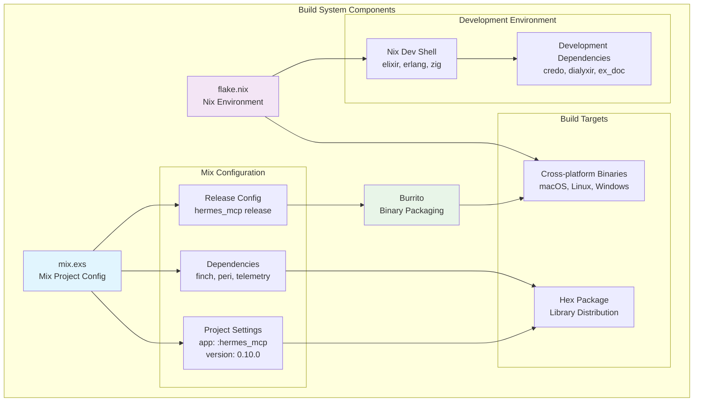
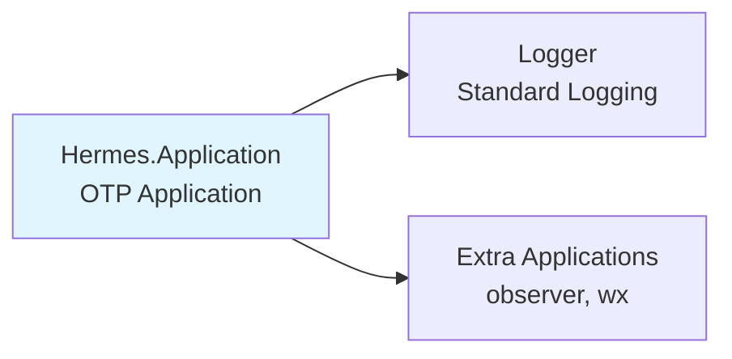
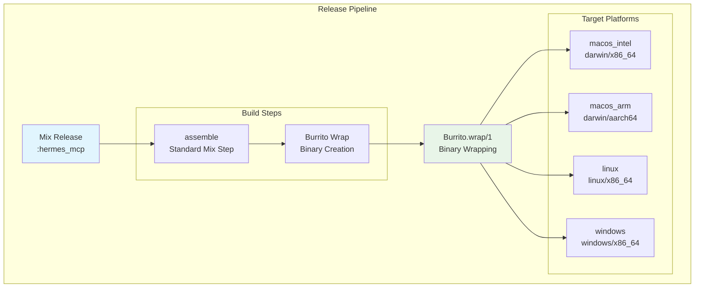
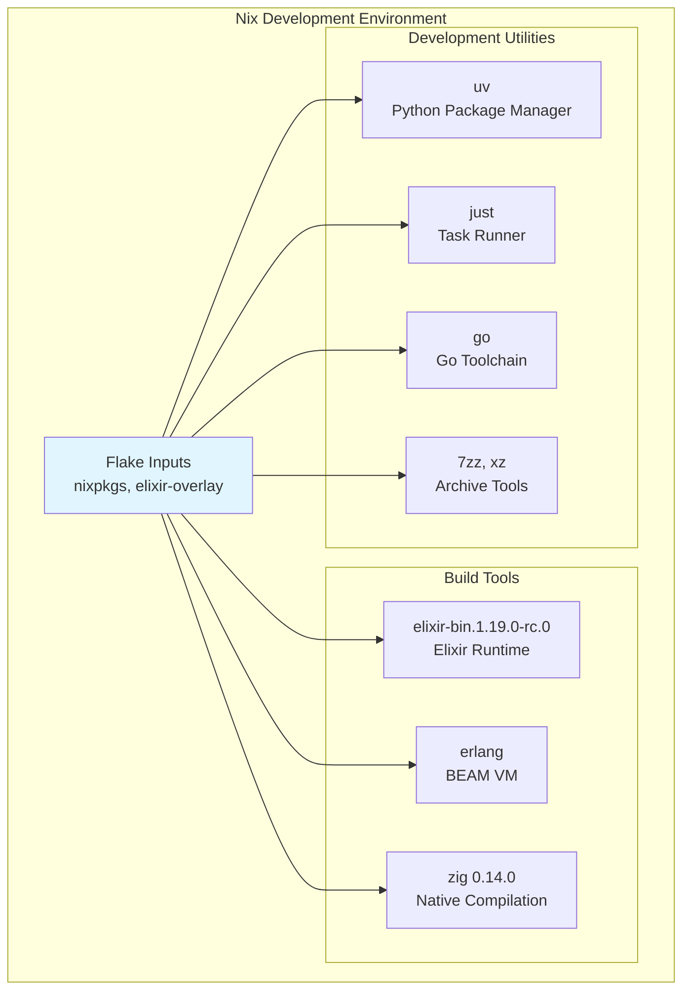
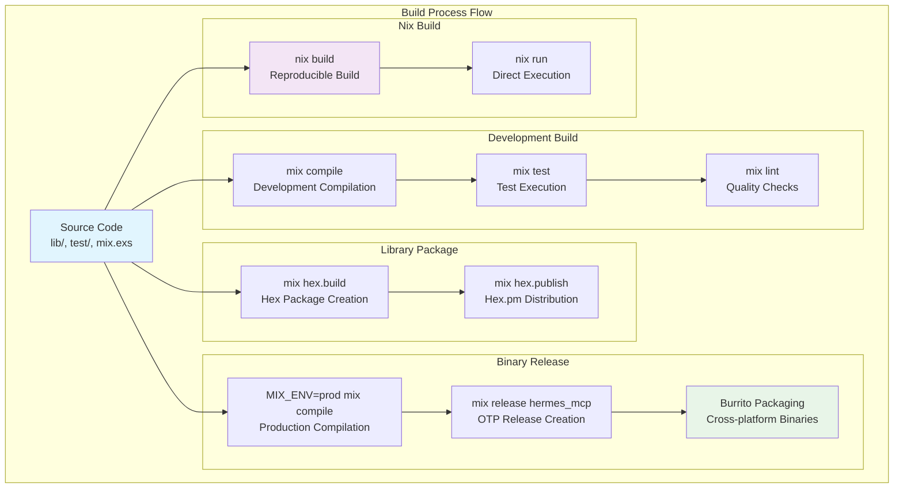

# Build System

Relevant source files

The following files were used as context for generating this wiki page:

- [CHANGELOG.md](https://github.com/cloudwalk/hermes-mcp/blob/8db7a927/CHANGELOG.md)
- [flake.nix](https://github.com/cloudwalk/hermes-mcp/blob/8db7a927/flake.nix)
- [mix.exs](https://github.com/cloudwalk/hermes-mcp/blob/8db7a927/mix.exs)

## Purpose and Scope

The hermes-mcp project employs a sophisticated multi-layered build system that combines Elixir's Mix build tool with Nix for reproducible environments and Burrito for cross-platform binary packaging. This system enables both library distribution via Hex packages and standalone CLI binary distribution across multiple platforms.

This page covers the build configuration, dependency management, binary packaging, and development environment setup. For information about automated release management and CI/CD pipeline, see [Release Process](#5.3).

## Build System Architecture

The build system consists of several interconnected components that work together to produce both library artifacts and standalone binaries:

Sources: [mix.exs:1-166](https://github.com/cloudwalk/hermes-mcp/blob/8db7a927/mix.exs#L1-L166), [flake.nix:1-120](https://github.com/cloudwalk/hermes-mcp/blob/8db7a927/flake.nix#L1-L120)

## Mix Project Configuration

The core build configuration is defined in `Hermes.MixProject`, which manages compilation, dependencies, and release settings:

### Project Settings

The project function defines the fundamental build parameters:

| Setting | Value | Purpose |
|---------|-------|---------|
| `app` | `:hermes_mcp` | Application name |
| `version` | `"0.10.0"` | Current version from module attribute |
| `elixir` | `"~> 1.18"` | Required Elixir version |
| `start_permanent` | `Mix.env() == :prod` | Production startup mode |

Sources: [mix.exs:7-27](https://github.com/cloudwalk/hermes-mcp/blob/8db7a927/mix.exs#L7-L27)

### Application Configuration

The application is configured as a standard OTP application with structured supervision:

Sources: [mix.exs:33-38](https://github.com/cloudwalk/hermes-mcp/blob/8db7a927/mix.exs#L33-L38)

## Dependency Management

Dependencies are organized into several categories based on their usage context:

### Core Runtime Dependencies

| Dependency | Version | Purpose |
|------------|---------|---------|
| `finch` | `~> 0.19` | HTTP client for transport |
| `peri` | `~> 0.4` | JSON-RPC protocol handling |
| `telemetry` | `~> 1.2` | Event emission and metrics |

### Optional Dependencies

| Dependency | Version | Context | Purpose |
|------------|---------|---------|---------|
| `gun` | `~> 2.2` | optional | WebSocket transport |
| `burrito` | `~> 1.0` | optional | Binary packaging |
| `plug` | `~> 1.18` | optional | HTTP server integration |

### Development and Test Dependencies

Development tooling is extensively configured for code quality and documentation:

| Tool | Purpose |
|------|---------|
| `styler` | Code formatting and style |
| `credo` | Static code analysis |
| `dialyxir` | Type checking via Dialyzer |
| `ex_doc` | Documentation generation |
| `mox` | Test mocking |
| `bypass` | HTTP test utilities |

Sources: [mix.exs:41-58](https://github.com/cloudwalk/hermes-mcp/blob/8db7a927/mix.exs#L41-L58)

## Binary Packaging with Burrito

The standalone CLI binary is created using Burrito, which wraps the Erlang release in a self-contained executable:

### Release Configuration

The release configuration specifies `Hermes.CLI` as the main module entry point and includes executables for both Unix and Windows platforms.

Sources: [mix.exs:61-82](https://github.com/cloudwalk/hermes-mcp/blob/8db7a927/mix.exs#L61-L82)

## Nix-based Reproducible Builds

The Nix flake provides reproducible development environments and build processes:

### Development Shell

The development environment includes all necessary tools with pinned versions:

Sources: [flake.nix:36-50](https://github.com/cloudwalk/hermes-mcp/blob/8db7a927/flake.nix#L36-L50)

### Build Package

The Nix package definition handles the complete build process including dependency fetching and binary creation:

The build process sets specific environment variables to enable CLI compilation and configures the build for production mode. The installation phase searches for Burrito output binaries and installs them to the Nix store.

Sources: [flake.nix:52-111](https://github.com/cloudwalk/hermes-mcp/blob/8db7a927/flake.nix#L52-L111)

## Development Workflow Integration

The build system provides several convenience commands and aliases for development workflows:

### Mix Aliases

| Alias | Commands | Purpose |
|-------|----------|---------|
| `setup` | `["deps.get", "compile --force"]` | Initial project setup |
| `lint` | `["format --check-formatted", "credo --strict", "dialyzer"]` | Code quality checks |

### Quality Assurance Tools

The build system integrates several quality assurance tools with specific configurations:

- **Dialyzer**: Configured with local PLT storage and extended application analysis
- **Credo**: Provides static code analysis with strict rules
- **ExDoc**: Generates comprehensive documentation with organized page groups

Sources: [mix.exs:96-101](https://github.com/cloudwalk/hermes-mcp/blob/8db7a927/mix.exs#L96-L101), [mix.exs:19-23](https://github.com/cloudwalk/hermes-mcp/blob/8db7a927/mix.exs#L19-L23), [mix.exs:103-159](https://github.com/cloudwalk/hermes-mcp/blob/8db7a927/mix.exs#L103-L159)

## Build Process Flow

The complete build process follows this sequence for different deployment targets:

