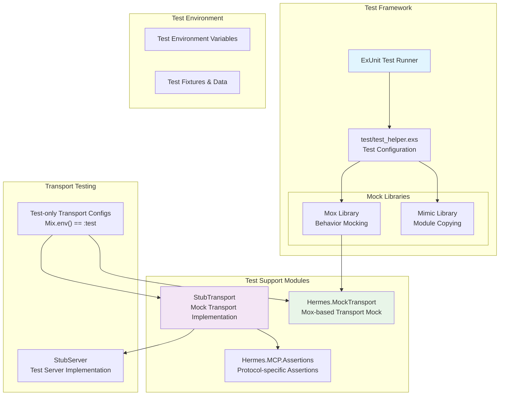
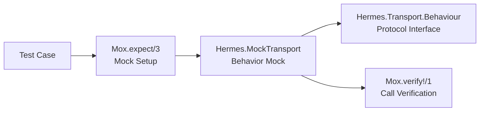
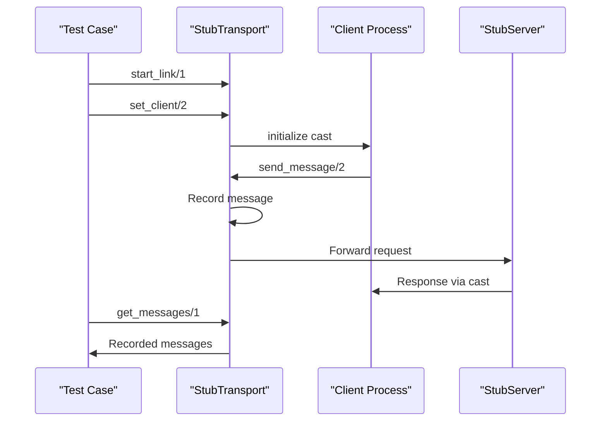
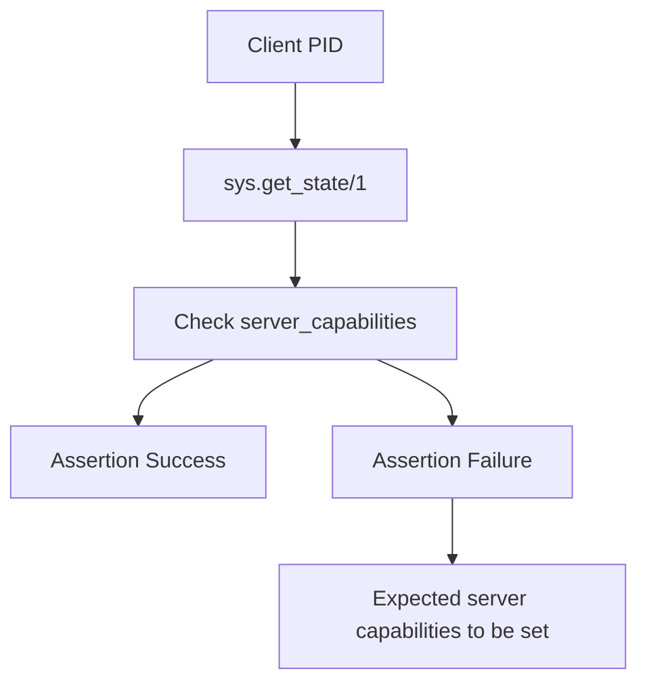
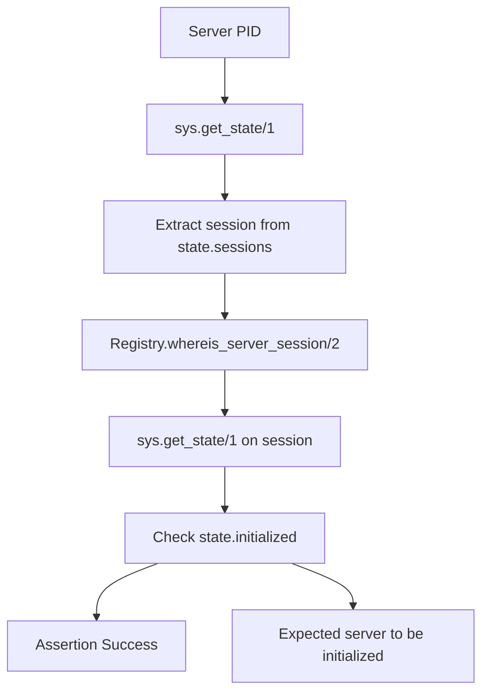

# Testing

<details>
<summary>Relevant source files</summary>

The following files were used as context for generating this wiki page:

- [.gitignore](https://github.com/cloudwalk/hermes-mcp/blob/8db7a927/.gitignore)
- [flake.lock](https://github.com/cloudwalk/hermes-mcp/blob/8db7a927/flake.lock)
- [lib/hermes.ex](https://github.com/cloudwalk/hermes-mcp/blob/8db7a927/lib/hermes.ex)
- [mix.lock](https://github.com/cloudwalk/hermes-mcp/blob/8db7a927/mix.lock)
- [test/support/mcp/assertions.ex](https://github.com/cloudwalk/hermes-mcp/blob/8db7a927/test/support/mcp/assertions.ex)
- [test/support/stub_transport.ex](https://github.com/cloudwalk/hermes-mcp/blob/8db7a927/test/support/stub_transport.ex)
- [test/test_helper.exs](https://github.com/cloudwalk/hermes-mcp/blob/8db7a927/test/test_helper.exs)

</details>


This document covers the testing infrastructure and strategies used in the hermes-mcp codebase. It focuses on the mock transport systems, test helpers, and specialized testing utilities for validating MCP protocol compliance and transport layer functionality.

For information about the build system and CI/CD pipeline, see [Build System](#5.1). For details about the release process including automated testing, see [Release Process](#5.3).

## Testing Infrastructure Overview

The hermes-mcp testing system is built on ExUnit and employs a multi-layered approach to testing MCP protocol implementations. The system includes mock transports, stub implementations, and specialized assertions for validating both client and server behavior across different transport layers.

**Testing Infrastructure Architecture**



Sources: [test/test_helper.exs:1-8](https://github.com/cloudwalk/hermes-mcp/blob/8db7a927/test/test_helper.exs#L1-L8), [test/support/stub_transport.ex:1-154](https://github.com/cloudwalk/hermes-mcp/blob/8db7a927/test/support/stub_transport.ex#L1-L154), [test/support/mcp/assertions.ex:1-18](https://github.com/cloudwalk/hermes-mcp/blob/8db7a927/test/support/mcp/assertions.ex#L1-L18), [lib/hermes.ex:13-19](https://github.com/cloudwalk/hermes-mcp/blob/8db7a927/lib/hermes.ex#L13-L19)

## Mock and Stub Systems

The testing infrastructure provides two primary approaches for mocking transport behavior: behavior-based mocks using Mox and stub implementations that record interactions.

### MockTransport (Mox-based)

The `Hermes.MockTransport` is defined using the Mox library and implements the `Hermes.Transport.Behaviour`. This mock is configured in the test helper and allows for precise control over transport behavior in tests.



Sources: [test/test_helper.exs:3](https://github.com/cloudwalk/hermes-mcp/blob/8db7a927/test/test_helper.exs#L3)

### StubTransport Implementation

The `StubTransport` module provides a GenServer-based mock transport that records all messages and interactions for later inspection. It implements the full `Hermes.Transport.Behaviour` interface.

**StubTransport Message Flow**



Key `StubTransport` functions:
- `start_link/1` - Initialize transport with optional process name
- `send_message/2` - Record and forward messages to server
- `get_messages/1` - Retrieve all recorded messages for inspection
- `get_last_message/1` - Get most recent message
- `set_client/2` - Configure client process for responses
- `clear/1` - Reset recorded messages
- `count/1` - Get message count

Sources: [test/support/stub_transport.ex:1-154](https://github.com/cloudwalk/hermes-mcp/blob/8db7a927/test/support/stub_transport.ex#L1-L154)

## Test Helpers and Assertions

### MCP Protocol Assertions

The `Hermes.MCP.Assertions` module provides specialized assertions for validating MCP protocol compliance and state verification.

| Function | Purpose |
|----------|---------|
| `assert_client_initialized/1` | Verify client has received server capabilities |
| `assert_server_initialized/1` | Verify server session is properly initialized |

**Client Initialization Verification**



**Server Initialization Verification**



Sources: [test/support/mcp/assertions.ex:1-18](https://github.com/cloudwalk/hermes-mcp/blob/8db7a927/test/support/mcp/assertions.ex#L1-L18)

## Test Environment Configuration

### Transport Configuration for Testing

The main `Hermes` module includes test-specific transport configurations that add mock transports to the available transport lists when running in test environment.

**Test Transport Lists**

```elixir
# Client transports in test environment
@client_transports [
  ClientSTDIO,
  ClientSSE, 
  ClientStreamableHTTP,
  StubTransport,
  Hermes.MockTransport
]

# Server transports in test environment  
@server_transports [
  ServerSTDIO,
  ServerStreamableHTTP,
  ServerSSE,
  StubTransport
]
```

This configuration allows tests to use mock transports alongside real transport implementations, enabling both unit testing with mocks and integration testing with stub implementations.

Sources: [lib/hermes.ex:13-19](https://github.com/cloudwalk/hermes-mcp/blob/8db7a927/lib/hermes.ex#L13-L19)

### Test Helper Setup

The test helper configures the essential testing libraries and mock definitions:

```elixir
Application.ensure_all_started(:mimic)
Mox.defmock(Hermes.MockTransport, for: Hermes.Transport.Behaviour)
if Code.ensure_loaded?(:gun), do: Mimic.copy(:gun)
ExUnit.start()
```

Key setup components:
- **Mimic** - Enables copying and stubbing of existing modules (particularly `:gun` for WebSocket testing)
- **Mox** - Defines behavior-based mocks for transport layer
- **MockTransport** - Implements `Hermes.Transport.Behaviour` for controlled testing

Sources: [test/test_helper.exs:1-8](https://github.com/cloudwalk/hermes-mcp/blob/8db7a927/test/test_helper.exs#L1-L8)

## Testing Dependencies

The testing infrastructure relies on several external libraries for comprehensive test coverage:

| Library | Purpose | Usage |
|---------|---------|-------|
| `bypass` | HTTP server mocking | Testing HTTP/SSE transport layers |
| `mimic` | Module copying/stubbing | Stubbing external dependencies like `:gun` |
| `mox` | Behavior-based mocking | Creating transport behavior mocks |
| `ham` | Test data generation | Supporting mimic functionality |

These dependencies enable testing across different transport protocols while maintaining isolation between test cases.

Sources: [mix.lock:4](https://github.com/cloudwalk/hermes-mcp/blob/8db7a927/mix.lock#L4), [mix.lock:25](https://github.com/cloudwalk/hermes-mcp/blob/8db7a927/mix.lock#L25), [mix.lock:27](https://github.com/cloudwalk/hermes-mcp/blob/8db7a927/mix.lock#L27), [mix.lock:18](https://github.com/cloudwalk/hermes-mcp/blob/8db7a927/mix.lock#L18)

## Testing Strategy

The hermes-mcp testing approach combines multiple strategies:

1. **Unit Testing** - Using `Hermes.MockTransport` for isolated component testing
2. **Integration Testing** - Using `StubTransport` to test full message flows
3. **Protocol Compliance** - Using custom assertions to verify MCP protocol adherence
4. **Transport Testing** - Using bypass and mimic for external transport validation

This multi-layered approach ensures both individual component correctness and end-to-end system functionality while maintaining fast test execution and reliable CI/CD integration.