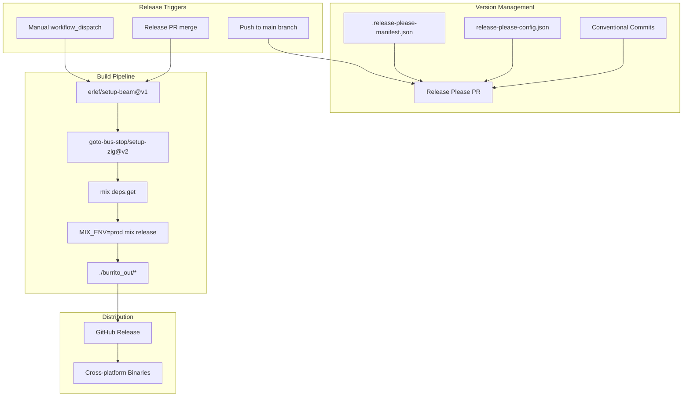
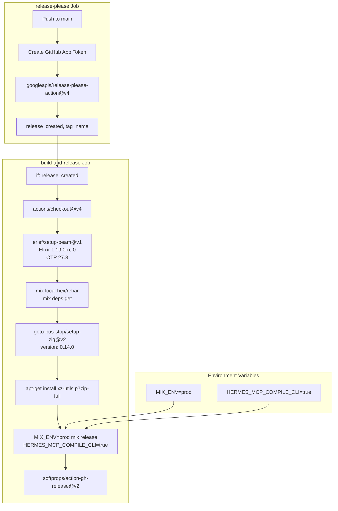
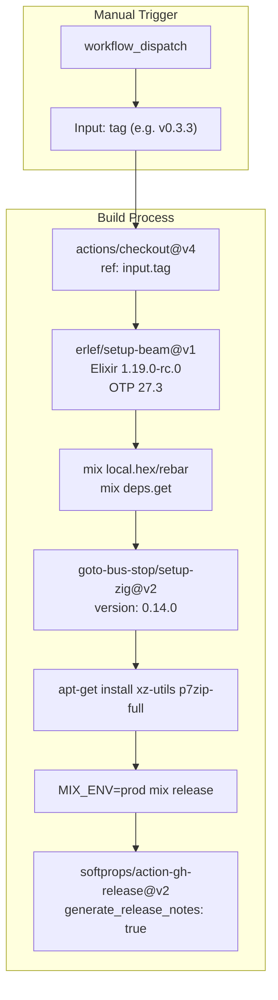
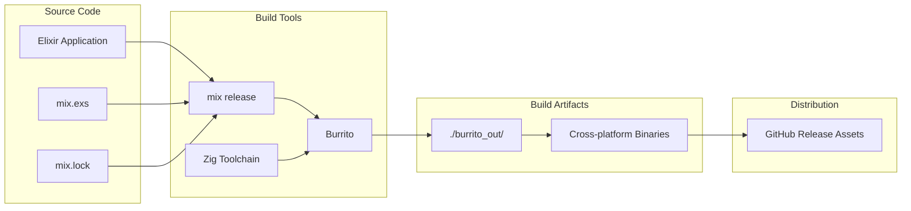

# Release Process

<details>
<summary>Relevant source files</summary>

The following files were used as context for generating this wiki page:

- [.github/.release-please-manifest.json](https://github.com/cloudwalk/hermes-mcp/blob/8db7a927/.github/.release-please-manifest.json)
- [.github/release-please-config.json](https://github.com/cloudwalk/hermes-mcp/blob/8db7a927/.github/release-please-config.json)
- [.github/workflows/release-please.yml](https://github.com/cloudwalk/hermes-mcp/blob/8db7a927/.github/workflows/release-please.yml)
- [.github/workflows/release.yml](https://github.com/cloudwalk/hermes-mcp/blob/8db7a927/.github/workflows/release.yml)
- [priv/dev/upcase/mix.lock](https://github.com/cloudwalk/hermes-mcp/blob/8db7a927/priv/dev/upcase/mix.lock)
- [test/hermes/server/component/schema_test.exs](https://github.com/cloudwalk/hermes-mcp/blob/8db7a927/test/hermes/server/component/schema_test.exs)
- [test/hermes/server/component_prompt_test.exs](https://github.com/cloudwalk/hermes-mcp/blob/8db7a927/test/hermes/server/component_prompt_test.exs)

</details>


This document covers the automated release management system for hermes-mcp, including version control, binary building, and distribution through GitHub Releases. The system uses Release Please for semantic versioning and GitHub Actions for CI/CD automation.

For information about the build system and cross-platform compilation, see [Build System](#5.1). For testing procedures before releases, see [Testing](#5.2).

## Overview

The hermes-mcp project uses an automated release process that combines Release Please for semantic versioning with GitHub Actions for building and distributing cross-platform binaries. The system supports both automated releases triggered by commits to the main branch and manual releases for hotfixes or special deployments.



Sources: [.github/release-please-config.json:1-85](https://github.com/cloudwalk/hermes-mcp/blob/8db7a927/.github/release-please-config.json#L1-L85), [.github/.release-please-manifest.json:1-3](https://github.com/cloudwalk/hermes-mcp/blob/8db7a927/.github/.release-please-manifest.json#L1-L3), [.github/workflows/release-please.yml:1-82](https://github.com/cloudwalk/hermes-mcp/blob/8db7a927/.github/workflows/release-please.yml#L1-L82)

## Release Please Configuration

The project uses Release Please to automatically manage versions and generate changelogs based on conventional commit messages. The configuration defines how commits are categorized and which files are updated during releases.

### Commit Type Mapping

The system recognizes several commit types and maps them to changelog sections:

| Commit Type | Changelog Section | Visibility |
|-------------|------------------|------------|
| `feat`, `feature` | Features | Visible |
| `fix` | Bug Fixes | Visible |
| `perf` | Performance Improvements | Visible |
| `docs` | Documentation | Visible |
| `refactor` | Code Refactoring | Visible |
| `test` | Tests | Visible |
| `build` | Build System | Visible |
| `ci` | Continuous Integration | Visible |
| `chore` | Miscellaneous Chores | Visible |

### Tracked Files

Release Please automatically updates version numbers in the following files:

- `flake.nix` - Nix flake configuration
- `README.md` - Project documentation  
- `pages/installation.md` - Installation guide

Sources: [.github/release-please-config.json:5-78](https://github.com/cloudwalk/hermes-mcp/blob/8db7a927/.github/release-please-config.json#L5-L78)

## Automated Release Workflow

The main release workflow (`release-please.yml`) runs on every push to the main branch and handles both pull request creation and release execution.



### Authentication

The workflow uses a GitHub App token for authentication instead of the default `GITHUB_TOKEN`. This allows Release Please to trigger subsequent workflows when release PRs are merged.

```yaml
- name: Create GitHub App Token
  uses: tibdex/github-app-token@v2
  with:
    app_id: ${{ secrets.APP_ID }}
    private_key: ${{ secrets.APP_PRIVATE_KEY }}
```

Sources: [.github/workflows/release-please.yml:20-32](https://github.com/cloudwalk/hermes-mcp/blob/8db7a927/.github/workflows/release-please.yml#L20-L32), [.github/workflows/release-please.yml:34-82](https://github.com/cloudwalk/hermes-mcp/blob/8db7a927/.github/workflows/release-please.yml#L34-L82)

## Manual Release Workflow

The manual release workflow (`release.yml`) allows developers to create releases for specific tags without going through the automated Release Please process. This is useful for hotfixes or releasing from feature branches.



### Key Differences from Automated Workflow

The manual workflow differs from the automated one in several ways:

- Requires manual tag specification as input
- Checks out the specific tag rather than the release commit
- Automatically generates release notes from commits
- Does not depend on Release Please state

Sources: [.github/workflows/release.yml:1-61](https://github.com/cloudwalk/hermes-mcp/blob/8db7a927/.github/workflows/release.yml#L1-L61)

## Binary Build Process

Both release workflows use an identical binary build process that creates cross-platform executables using Burrito packaging.

### Build Environment Setup

The build process requires several tools and runtime environments:

| Component | Version | Purpose |
|-----------|---------|---------|
| Elixir | 1.19.0-rc.0 | Language runtime |
| OTP | 27.3 | Erlang platform |
| Zig | 0.14.0 | Cross-compilation toolchain |
| xz-utils | Latest | Archive extraction |
| p7zip-full | Latest | Archive creation |

### Environment Variables

Critical environment variables that control the build:

- `MIX_ENV=prod` - Production build configuration
- `HERMES_MCP_COMPILE_CLI=true` - Enables CLI binary compilation

### Build Output

The build process generates cross-platform binaries in the `./burrito_out/` directory, which are then uploaded as GitHub Release assets.



Sources: [.github/workflows/release-please.yml:44-82](https://github.com/cloudwalk/hermes-mcp/blob/8db7a927/.github/workflows/release-please.yml#L44-L82), [.github/workflows/release.yml:21-61](https://github.com/cloudwalk/hermes-mcp/blob/8db7a927/.github/workflows/release.yml#L21-L61)

## Version Management

The project maintains version information across multiple files to ensure consistency between the Elixir application, Nix flake, and documentation.

### Current Version Tracking

The `.release-please-manifest.json` file tracks the current version:

```json
{
  ".": "0.10.0"
}
```

### File Synchronization

Release Please automatically updates version references in:

- `flake.nix` - For Nix-based installations
- `README.md` - Documentation and examples  
- `pages/installation.md` - Installation instructions

This ensures that all version references remain synchronized across releases without requiring manual updates.

Sources: [.github/.release-please-manifest.json:1-3](https://github.com/cloudwalk/hermes-mcp/blob/8db7a927/.github/.release-please-manifest.json#L1-L3), [.github/release-please-config.json:62-78](https://github.com/cloudwalk/hermes-mcp/blob/8db7a927/.github/release-please-config.json#L62-L78)

## Security and Permissions

The release workflows require specific GitHub permissions and secrets:

### Required Permissions

- `contents: write` - Create releases and upload assets
- `pull-requests: write` - Create and manage release PRs

### Required Secrets

- `APP_ID` - GitHub App identifier for authentication
- `APP_PRIVATE_KEY` - GitHub App private key for token generation

These secrets enable Release Please to operate with elevated permissions while maintaining security through GitHub App authentication rather than personal access tokens.