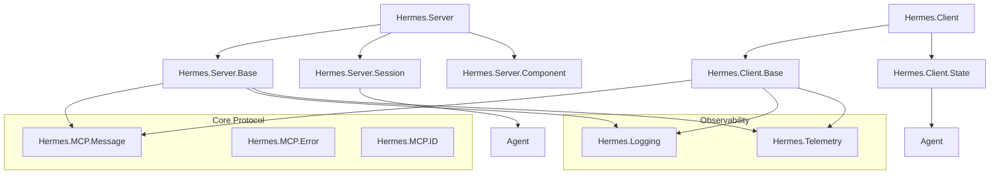
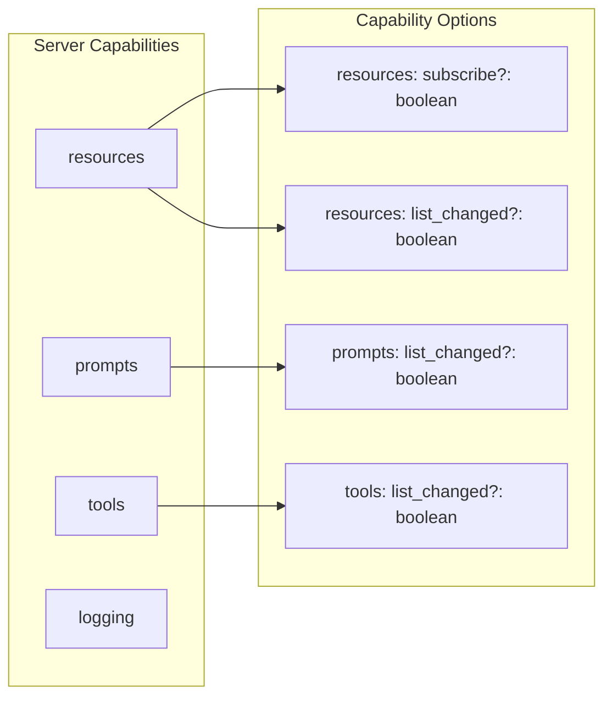
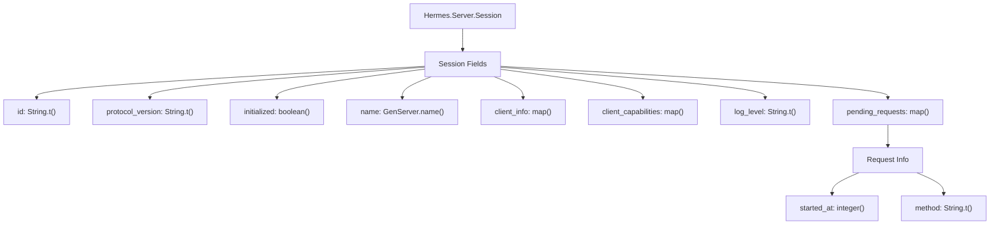
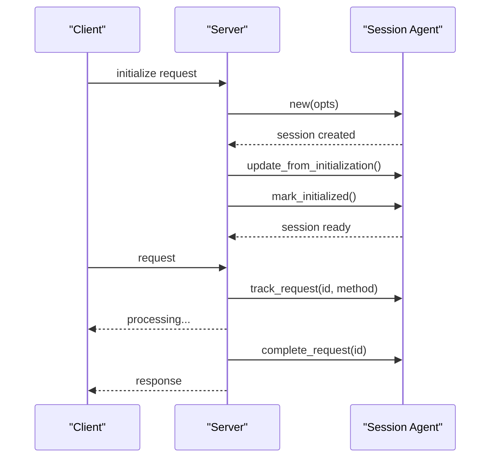
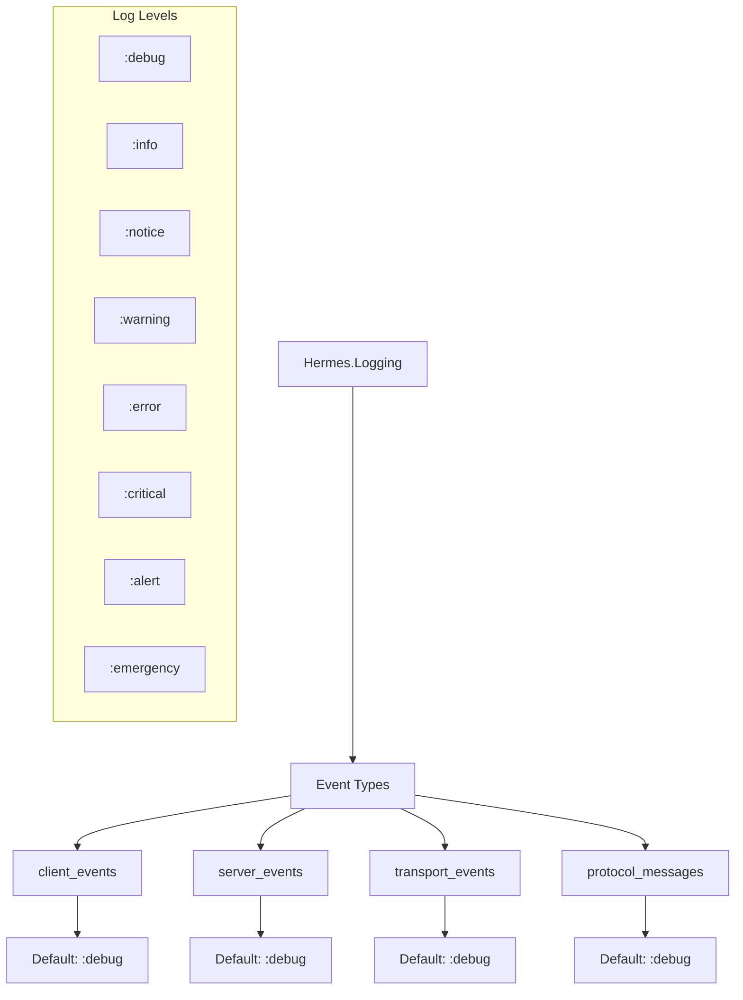
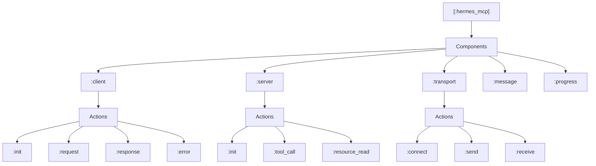
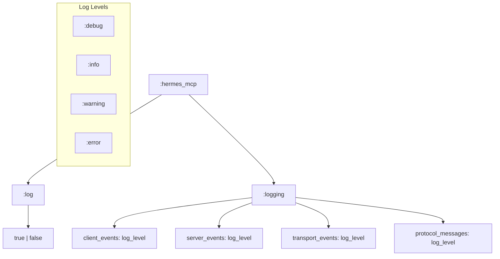

# Reference

<details>
<summary>Relevant source files</summary>

The following files were used as context for generating this wiki page:

- [lib/hermes/logging.ex](https://github.com/cloudwalk/hermes-mcp/blob/8db7a927/lib/hermes/logging.ex)
- [lib/hermes/server.ex](https://github.com/cloudwalk/hermes-mcp/blob/8db7a927/lib/hermes/server.ex)
- [lib/hermes/server/session.ex](https://github.com/cloudwalk/hermes-mcp/blob/8db7a927/lib/hermes/server/session.ex)
- [lib/hermes/telemetry.ex](https://github.com/cloudwalk/hermes-mcp/blob/8db7a927/lib/hermes/telemetry.ex)
- [test/hermes/logging_test.exs](https://github.com/cloudwalk/hermes-mcp/blob/8db7a927/test/hermes/logging_test.exs)

</details>


This page provides detailed API reference documentation for the Hermes MCP system. It covers core module interfaces, data structures, configuration formats, and protocol specifications that developers need when building with or extending Hermes.

For specific configuration options and environment variables, see [Configuration](#6.1). For logging and telemetry system details, see [Logging and Telemetry](#6.2).

## Core API Modules

The Hermes MCP system exposes several primary modules that form the foundation of client and server implementations.

### Core API Module Relationships



Sources: [lib/hermes/server.ex:1-244](https://github.com/cloudwalk/hermes-mcp/blob/8db7a927/lib/hermes/server.ex#L1-L244), [lib/hermes/server/session.ex:1-227](https://github.com/cloudwalk/hermes-mcp/blob/8db7a927/lib/hermes/server/session.ex#L1-L227), [lib/hermes/telemetry.ex:1-97](https://github.com/cloudwalk/hermes-mcp/blob/8db7a927/lib/hermes/telemetry.ex#L1-L97), [lib/hermes/logging.ex:1-183](https://github.com/cloudwalk/hermes-mcp/blob/8db7a927/lib/hermes/logging.ex#L1-L183)

### Server API Reference

The `Hermes.Server` module provides the primary DSL for implementing MCP servers.

#### Server Configuration Options

| Option | Type | Description | Default |
|--------|------|-------------|---------|
| `:name` | `String.t()` | Server name (required) | N/A |
| `:version` | `String.t()` | Server version (required) | N/A |
| `:capabilities` | `list(atom())` | Supported capabilities | `[]` |
| `:protocol_versions` | `list(String.t())` | Supported protocol versions | `["2025-03-26", "2024-10-07", "2024-05-11"]` |

#### Supported Capabilities



Sources: [lib/hermes/server.ex:57-58](https://github.com/cloudwalk/hermes-mcp/blob/8db7a927/lib/hermes/server.ex#L57-L58), [lib/hermes/server.ex:168-188](https://github.com/cloudwalk/hermes-mcp/blob/8db7a927/lib/hermes/server.ex#L168-L188)

#### Server Behaviour Callbacks

The `Hermes.Server.Behaviour` defines required callbacks:

- `init/2` - Initialize server state
- `handle_request/2` - Handle incoming MCP requests
- `handle_notification/2` - Handle incoming notifications
- `server_info/0` - Return server metadata
- `server_capabilities/0` - Return supported capabilities
- `supported_protocol_versions/0` - Return protocol versions

Sources: [lib/hermes/server.ex:16-31](https://github.com/cloudwalk/hermes-mcp/blob/8db7a927/lib/hermes/server.ex#L16-L31), [lib/hermes/server.ex:150-163](https://github.com/cloudwalk/hermes-mcp/blob/8db7a927/lib/hermes/server.ex#L150-L163)

## Session Management

The session system manages per-client state and request tracking for MCP servers.

### Session Data Structure



Sources: [lib/hermes/server/session.ex:20-40](https://github.com/cloudwalk/hermes-mcp/blob/8db7a927/lib/hermes/server/session.ex#L20-L40)

### Session API Functions

| Function | Parameters | Return Type | Description |
|----------|------------|-------------|-------------|
| `new/1` | `opts :: Enumerable.t()` | `t()` | Create new session |
| `get/1` | `session :: GenServer.name()` | `t()` | Get current session state |
| `mark_initialized/1` | `session :: GenServer.name()` | `:ok` | Mark session as initialized |
| `set_log_level/2` | `session, level :: String.t()` | `:ok` | Update log level |
| `track_request/3` | `session, id, method :: String.t()` | `:ok` | Track pending request |
| `complete_request/2` | `session, id :: String.t()` | `map() \| nil` | Complete request tracking |

Sources: [lib/hermes/server/session.ex:53-226](https://github.com/cloudwalk/hermes-mcp/blob/8db7a927/lib/hermes/server/session.ex#L53-L226)

### Session Lifecycle



Sources: [lib/hermes/server/session.ex:116-130](https://github.com/cloudwalk/hermes-mcp/blob/8db7a927/lib/hermes/server/session.ex#L116-L130), [lib/hermes/server/session.ex:154-189](https://github.com/cloudwalk/hermes-mcp/blob/8db7a927/lib/hermes/server/session.ex#L154-L189)

## Logging System Reference

The logging system provides structured, configurable logging across all Hermes components.

### Log Event Types



Sources: [lib/hermes/logging.ex:8-22](https://github.com/cloudwalk/hermes-mcp/blob/8db7a927/lib/hermes/logging.ex#L8-L22), [lib/hermes/logging.ex:114-122](https://github.com/cloudwalk/hermes-mcp/blob/8db7a927/lib/hermes/logging.ex#L114-L122)

### Logging API Functions

| Function | Parameters | Description |
|----------|------------|-------------|
| `message/5` | `direction, type, id, data, metadata` | Log protocol messages |
| `client_event/3` | `event, details, metadata` | Log client lifecycle events |
| `server_event/3` | `event, details, metadata` | Log server lifecycle events |
| `transport_event/3` | `event, details, metadata` | Log transport layer events |

Sources: [lib/hermes/logging.ex:26-102](https://github.com/cloudwalk/hermes-mcp/blob/8db7a927/lib/hermes/logging.ex#L26-L102)

## Telemetry System Reference

The telemetry system emits structured events for monitoring and observability.

### Telemetry Event Naming

All telemetry events follow the pattern: `[:hermes_mcp, component, action]`



Sources: [lib/hermes/telemetry.ex:8-37](https://github.com/cloudwalk/hermes-mcp/blob/8db7a927/lib/hermes/telemetry.ex#L8-L37), [lib/hermes/telemetry.ex:53-96](https://github.com/cloudwalk/hermes-mcp/blob/8db7a927/lib/hermes/telemetry.ex#L53-L96)

### Telemetry Event Constants

The telemetry module provides event name constants:

```elixir
# Client events
Hermes.Telemetry.event_client_init()      # [:client, :init]
Hermes.Telemetry.event_client_request()   # [:client, :request]
Hermes.Telemetry.event_client_response()  # [:client, :response]

# Server events  
Hermes.Telemetry.event_server_tool_call() # [:server, :tool_call]
Hermes.Telemetry.event_server_resource_read() # [:server, :resource_read]

# Transport events
Hermes.Telemetry.event_transport_connect() # [:transport, :connect]
Hermes.Telemetry.event_transport_send()    # [:transport, :send]
```

Sources: [lib/hermes/telemetry.ex:55-81](https://github.com/cloudwalk/hermes-mcp/blob/8db7a927/lib/hermes/telemetry.ex#L55-L81)

## Configuration Schema

The system supports configuration through application environment variables under the `:hermes_mcp` key.

### Configuration Structure



Sources: [lib/hermes/logging.ex:8-22](https://github.com/cloudwalk/hermes-mcp/blob/8db7a927/lib/hermes/logging.ex#L8-L22), [lib/hermes/logging.ex:112-122](https://github.com/cloudwalk/hermes-mcp/blob/8db7a927/lib/hermes/logging.ex#L112-L122)

### Global Configuration Options

| Key | Type | Default | Description |
|-----|------|---------|-------------|
| `:log` | `boolean()` | `true` | Enable/disable all Hermes logging |
| `:logging` | `keyword()` | `[]` | Per-event-type log level configuration |